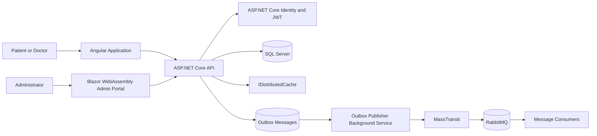
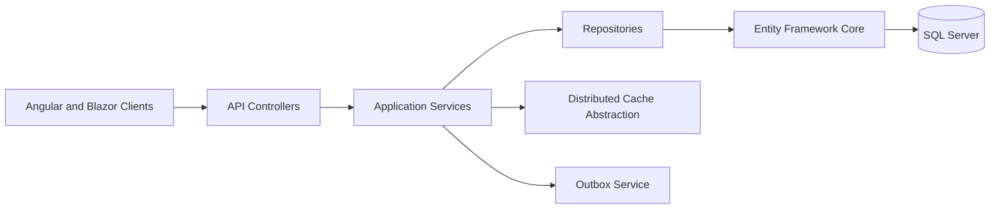
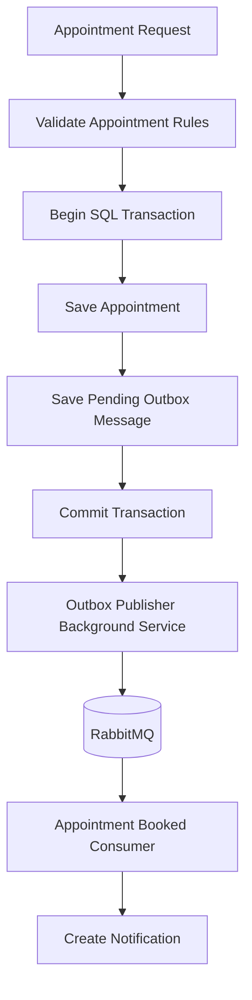
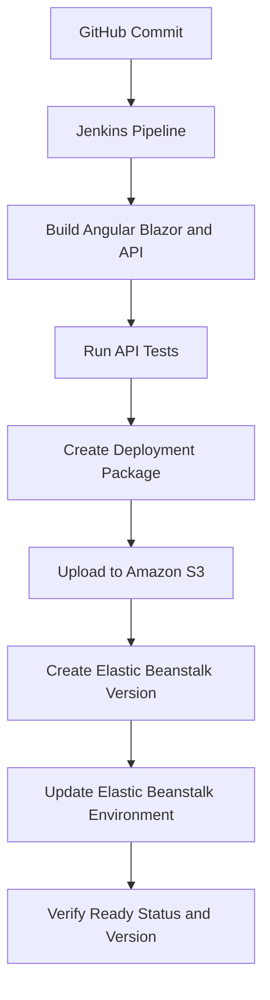

# HealthAxis

HealthAxis is a full-stack healthcare management and appointment platform implemented in the `HealthApp` solution. It combines an Angular application for patients and doctors, a Blazor WebAssembly administration portal, and an ASP.NET Core API in one deployable application.

## Table of Contents

- [Overview](#overview)
- [Core Features](#core-features)
- [User Roles](#user-roles)
- [Architecture](#architecture)
- [Technology Stack](#technology-stack)
- [Project Structure](#project-structure)
- [Authentication and Authorization](#authentication-and-authorization)
- [Database and Persistence](#database-and-persistence)
- [Messaging and Transactional Outbox](#messaging-and-transactional-outbox)
- [Caching](#caching)
- [Logging and Error Handling](#logging-and-error-handling)
- [Application Routing](#application-routing)
- [Local Setup](#local-setup)
- [Testing](#testing)
- [CI/CD and AWS Deployment](#cicd-and-aws-deployment)
- [Configuration](#configuration)

## Overview

HealthAxis provides a centralized healthcare experience for patients, doctors, and administrators.

The platform supports:

- User authentication and role-based access
- Doctor and patient management
- Doctor availability and leave workflows
- Appointment booking and appointment status management
- Health-record workflows
- Notifications
- Reliable event publishing through a transactional Outbox
- Angular and Blazor hosting from one ASP.NET Core deployment package

## Core Features

### Patient experience

- Authentication and patient profile access
- Doctor discovery and availability lookup
- Appointment booking and appointment visibility
- Health-record access based on authorization rules

### Doctor experience

- Authentication and doctor profile access
- Appointment and schedule workflows
- Availability management
- Doctor-leave workflows
- Authorized health-record operations

### Administrator portal

- Protected Blazor WebAssembly administrator portal
- Administrator dashboard
- Doctor directory, details, creation, and editing
- Doctor account activation and deactivation
- Doctor-leave visibility
- Temporary-password result after doctor creation
- Patient directory and patient details
- Appointment directory and appointment details
- Appointment management operations
- Administrator profile and password change
- Search, filtering, and pagination in supported pages

## User Roles

| Role | Application access |
|---|---|
| Admin | Blazor administrator portal and admin-authorized API operations |
| Doctor | Angular doctor experience and doctor-authorized API operations |
| Patient | Angular patient experience and patient-authorized API operations |

## Architecture



### Backend layering



## Technology Stack

### Frontend

- Angular
- TypeScript
- HTML and CSS
- Bootstrap and Bootstrap Icons
- Blazor WebAssembly
- Razor components

### Backend

- C#
- .NET 10
- ASP.NET Core Web API
- Entity Framework Core
- SQL Server
- ASP.NET Core Identity
- JWT bearer authentication
- AutoMapper
- Swagger and OpenAPI

### Messaging and background processing

- RabbitMQ
- MassTransit
- `AppointmentBookedConsumer`
- `AppointmentCancelledByDoctorLeaveConsumer`
- `OutboxPublisherBackgroundService`
- `HeartbeatService`
- `NotificationCleanupService`

### Testing and delivery

- xUnit
- Moq
- Coverlet
- Jenkins
- GitHub
- Amazon S3
- AWS Elastic Beanstalk

## Project Structure

```text
UST-Live-01/
├── HealthApp.slnx
├── HealthApp.Api/
│   ├── Controllers/
│   ├── Consumers/
│   ├── Data/
│   ├── Handler/
│   ├── HostedServices/
│   ├── Mapping/
│   ├── Models/
│   ├── Repositories/
│   ├── Services/
│   ├── Migrations/
│   ├── Program.cs
│   └── HealthApp.Api.csproj
├── HealthApp.Angular/
│   ├── src/
│   ├── angular.json
│   ├── package.json
│   └── package-lock.json
├── HealthApp.AdminPortal/
│   ├── Auth/
│   ├── Layout/
│   ├── Pages/
│   ├── Services/
│   ├── Shared/
│   ├── wwwroot/
│   └── HealthApp.AdminPortal.csproj
├── HealthApp.Shared/
│   └── HealthApp.Shared.csproj
├── HealthApp.Api.Tests/
│   └── HealthApp.Api.Tests.csproj
├── Jenkinsfile
└── README.md
```

| Project | Responsibility |
|---|---|
| `HealthApp.Api` | API endpoints, business services, repositories, EF Core, Identity, messaging, background services, and static frontend hosting |
| `HealthApp.Angular` | Main patient and doctor user experience |
| `HealthApp.AdminPortal` | Blazor WebAssembly administrator portal |
| `HealthApp.Shared` | Shared DTOs, enums, events, constants, and contracts |
| `HealthApp.Api.Tests` | Automated API tests using xUnit and Moq |
| `HealthApp.slnx` | Solution entry point |
| `Jenkinsfile` | Build, test, package, and AWS deployment pipeline |

## Authentication and Authorization

HealthAxis uses ASP.NET Core Identity with `ApplicationUser` and `IdentityRole`.

The configured password policy requires:

- Unique email addresses
- At least one digit
- At least one uppercase character
- At least one non-alphanumeric character
- Minimum password length of 8

JWT bearer validation includes:

- Issuer validation
- Audience validation
- Token lifetime validation
- Signing-key validation
- Zero clock skew

The verified roles are:

```text
Admin
Doctor
Patient
```

API controllers apply role-specific authorization. Blazor administrator pages use `[Authorize(Roles = "Admin")]` and the administrator navigation uses `AuthorizeView` for the Admin role.

Roles and the configured administrator account are seeded during API startup. Demo doctor and patient login users are also seeded for configured demo data.

## Database and Persistence

HealthAxis uses SQL Server through Entity Framework Core and `HealthAppDbContext`.

The same database context supports:

- Application entities
- ASP.NET Core Identity stores
- Doctors and patients
- Appointments
- Health records
- Doctor leave
- Notifications
- Outbox messages

The API uses repository and service layers for separation of responsibilities.

The connection string is read from:

```text
ConnectionStrings:DefaultConnection
```

Safe environment-variable example:

```text
ConnectionStrings__DefaultConnection=Server=<SQL_SERVER_HOST>,1433;Database=<DATABASE_NAME>;User Id=<DATABASE_USER>;Password=<DATABASE_PASSWORD>;Encrypt=True;TrustServerCertificate=True
```

Apply EF Core migrations with:

```powershell
dotnet ef database update `
    --project .\HealthApp.Api\HealthApp.Api.csproj `
    --startup-project .\HealthApp.Api\HealthApp.Api.csproj `
    --context HealthAppDbContext
```

## Messaging and Transactional Outbox

MassTransit connects the API to RabbitMQ and registers two verified consumers:

- `AppointmentBookedConsumer`
- `AppointmentCancelledByDoctorLeaveConsumer`

HealthAxis uses a transactional Outbox to prevent appointment events from being lost between SQL Server and RabbitMQ.



The `OutboxPublisherBackgroundService` reads eligible outbox records, publishes events through MassTransit, and updates publication status and retry information.

RabbitMQ configuration is supplied through the `RabbitMq` configuration section. Safe production examples:

```text
RabbitMq__Host=<RABBITMQ_HOST>
RabbitMq__Port=5672
RabbitMq__VirtualHost=/
RabbitMq__Username=<RABBITMQ_USERNAME>
RabbitMq__Password=<RABBITMQ_PASSWORD>
```

## Caching

The API registers:

```csharp
builder.Services.AddDistributedMemoryCache();
```

Services use the `IDistributedCache` abstraction. The current provider stores cache entries in the API process memory.

For a multi-instance production deployment, replace the in-memory provider with a shared distributed cache.

## Logging and Error Handling

HealthAxis uses:

- Serilog Console sink
- Serilog rolling File sink
- Structured HTTP request logging
- `GlobalExceptionHandler`
- ASP.NET Core Problem Details
- `CustomAuthorizationMiddlewareResultHandler`

Request logs include:

```text
HTTP method
Request path
Status code
Elapsed time
```

Swagger and OpenAPI are enabled only in the Development environment.

## Application Routing

The combined ASP.NET Core deployment serves:

```text
/          Angular application
/admin/    Blazor WebAssembly administrator portal
/api/...   API controllers
```

The Blazor administrator portal uses:

```html
<base href="/admin/" />
```

The API registers the Blazor fallback before the Angular fallback:

```text
/admin/{non-file route} -> admin/index.html
{remaining non-file route} -> index.html
```

Static-file configuration includes MIME mappings for Blazor `.wasm` and `.dat` assets.

## Local Setup

### Prerequisites

- .NET 10 SDK
- Node.js and npm
- Git
- SQL Server
- RabbitMQ
- Windows PowerShell

### 1. Clone the repository

```powershell
git clone https://github.com/bootcamp-hackerearth/UST-Live-01.git
cd UST-Live-01
git checkout <REPLACE_WITH_BRANCH>
```

### 2. Configure local secrets

Use environment variables or .NET User Secrets. Do not commit actual values.

```powershell
$env:ConnectionStrings__DefaultConnection = "<SQL_CONNECTION_STRING>"
$env:Jwt__Key = "<STRONG_JWT_SIGNING_KEY>"
$env:AdminUser__Email = "<ADMIN_EMAIL>"
$env:AdminUser__Password = "<ADMIN_PASSWORD>"
$env:RabbitMq__Host = "<RABBITMQ_HOST>"
$env:RabbitMq__Username = "<RABBITMQ_USERNAME>"
$env:RabbitMq__Password = "<RABBITMQ_PASSWORD>"
```

### 3. Restore dependencies

```powershell
dotnet restore .\HealthApp.Api\HealthApp.Api.csproj
dotnet restore .\HealthApp.AdminPortal\HealthApp.AdminPortal.csproj
dotnet restore .\HealthApp.Api.Tests\HealthApp.Api.Tests.csproj
```

### 4. Run Angular independently

```powershell
cd .\HealthApp.Angular
npm ci
npm start
```

### 5. Run Blazor independently

```powershell
dotnet run --project .\HealthApp.AdminPortal\HealthApp.AdminPortal.csproj
```

### 6. Run the API

```powershell
dotnet run --project .\HealthApp.Api\HealthApp.Api.csproj
```

The API CORS policy retains these verified development origins:

```text
http://localhost:4200
https://localhost:7028
```

For combined hosting, Angular artifacts must exist in `HealthApp.Api/wwwroot`, and Blazor artifacts must exist in `HealthApp.Api/wwwroot/admin`.

## Testing

The API test project targets .NET 10 and uses xUnit, Moq, Microsoft.NET.Test.Sdk, and Coverlet.

Run tests:

```powershell
dotnet test .\HealthApp.Api.Tests\HealthApp.Api.Tests.csproj
```

Generate coverage:

```powershell
dotnet test .\HealthApp.Api.Tests\HealthApp.Api.Tests.csproj `
    --collect:"XPlat Code Coverage"
```

A verified Jenkins run completed:

```text
Passed: 269
Failed: 0
Skipped: 0
```

The result applies to the referenced build and may change as the test suite evolves.

## CI/CD and AWS Deployment

GitHub provides source control. Jenkins performs the verified CI/CD workflow. No GitHub Actions workflow is currently present.

The Jenkins pipeline:

1. Checks out the configured branch
2. Cleans previous outputs
3. Verifies required tools and project files
4. Restores the .NET projects
5. Runs `npm ci` and builds Angular
6. Copies Angular output into API `wwwroot`
7. Publishes Blazor for `/admin/`
8. Copies Blazor output into API `wwwroot/admin`
9. Verifies combined frontend artifacts
10. Builds the API
11. Runs automated API tests
12. Publishes the API
13. Creates the Elastic Beanstalk `Procfile`
14. Creates and verifies `deploy-package.zip`
15. Uploads the bundle to Amazon S3
16. Creates an Elastic Beanstalk application version
17. Updates the Elastic Beanstalk environment
18. Waits for Ready status and the expected version
19. Archives the deployment package



Current deployment configuration:

```text
AWS region: ap-south-1
Elastic Beanstalk application: HealthAppApi
Elastic Beanstalk environment: HealthAppApi-dev
```

The Jenkins pipeline expects AWS credentials stored under this Jenkins credential ID:

```text
aws-deploy-creds
```

The deployment ZIP starts the API through this `Procfile` command:

```text
web: dotnet HealthApp.Api.dll
```

Elastic Beanstalk environment properties provide production configuration:

```text
ASPNETCORE_ENVIRONMENT=Production
ASPNETCORE_FORWARDEDHEADERS_ENABLED=true
ASPNETCORE_URLS=http://0.0.0.0:5000
PORT=5000
ConnectionStrings__DefaultConnection=<PRODUCTION_CONNECTION_STRING>
Jwt__Key=<STRONG_JWT_SIGNING_KEY>
AdminUser__Email=<ADMIN_EMAIL>
AdminUser__Password=<ADMIN_PASSWORD>
RabbitMq__Host=<RABBITMQ_HOST>
RabbitMq__Port=5672
RabbitMq__VirtualHost=/
RabbitMq__Username=<RABBITMQ_USERNAME>
RabbitMq__Password=<RABBITMQ_PASSWORD>
```

The Elastic Beanstalk instance must be able to reach SQL Server on TCP 1433 and RabbitMQ on TCP 5672 through private networking and appropriate security-group rules.

## Configuration

| Key | Purpose | Production source |
|---|---|---|
| `ConnectionStrings__DefaultConnection` | SQL Server connection | Elastic Beanstalk environment property |
| `Jwt__Key` | JWT signing key | Elastic Beanstalk environment property |
| `Jwt__Issuer` | JWT issuer | Base configuration or environment property |
| `Jwt__Audience` | JWT audience | Base configuration or environment property |
| `Jwt__AccessTokenExpirationMinutes` | Access-token lifetime | Base configuration or environment property |
| `AdminUser__Email` | Seed administrator email | Elastic Beanstalk environment property |
| `AdminUser__Password` | Seed administrator password | Elastic Beanstalk environment property |
| `RabbitMq__Host` | RabbitMQ host | Elastic Beanstalk environment property |
| `RabbitMq__Port` | RabbitMQ AMQP port | Production configuration or environment property |
| `RabbitMq__VirtualHost` | RabbitMQ virtual host | Production configuration or environment property |
| `RabbitMq__Username` | RabbitMQ username | Elastic Beanstalk environment property |
| `RabbitMq__Password` | RabbitMQ password | Elastic Beanstalk environment property |

ASP.NET Core converts double underscores in environment-variable names into nested configuration separators.

Sensitive values are stored in the deployed Elastic Beanstalk environment and must not be committed to Git.