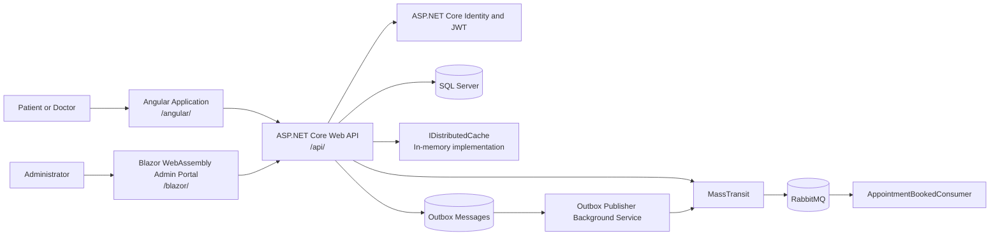
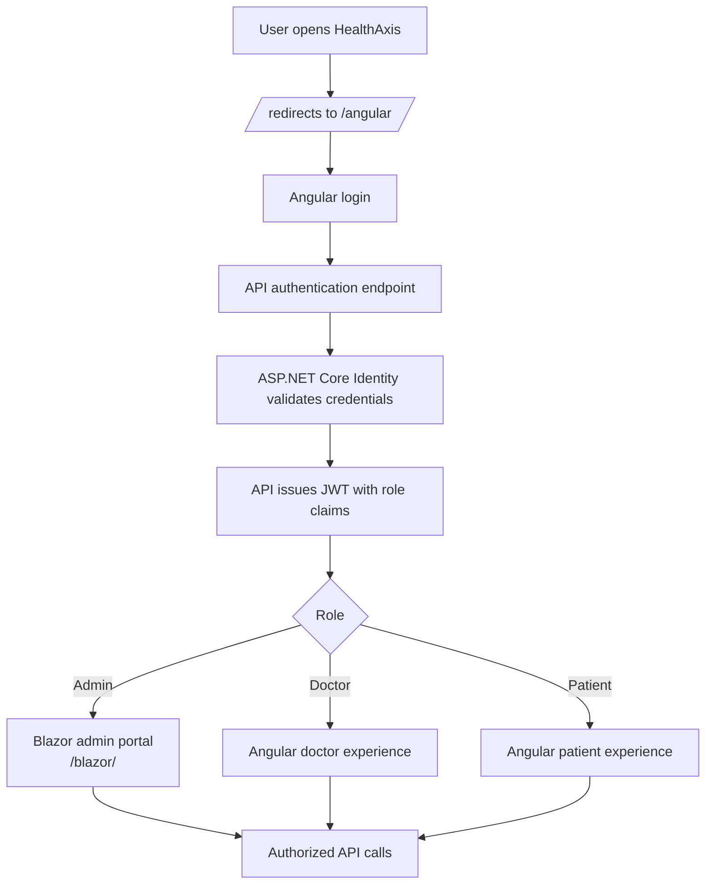
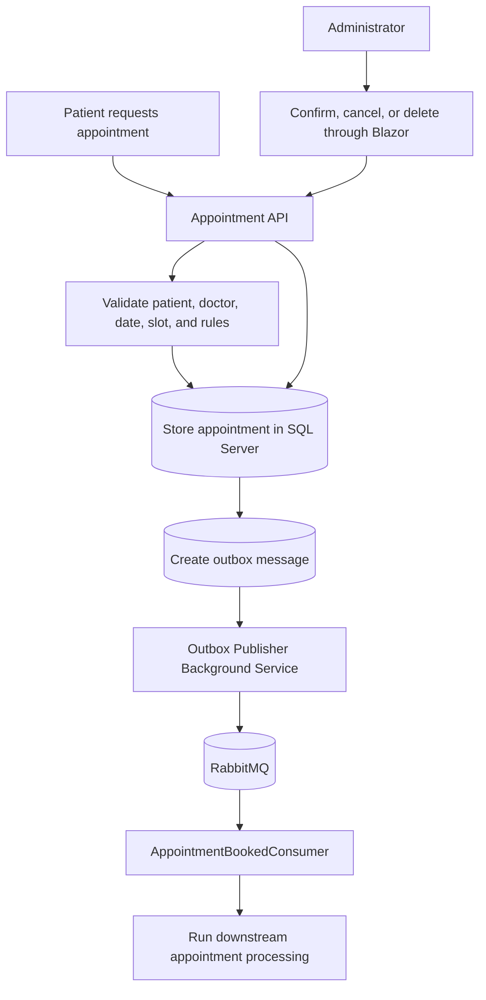
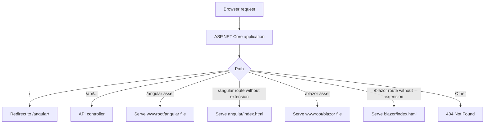
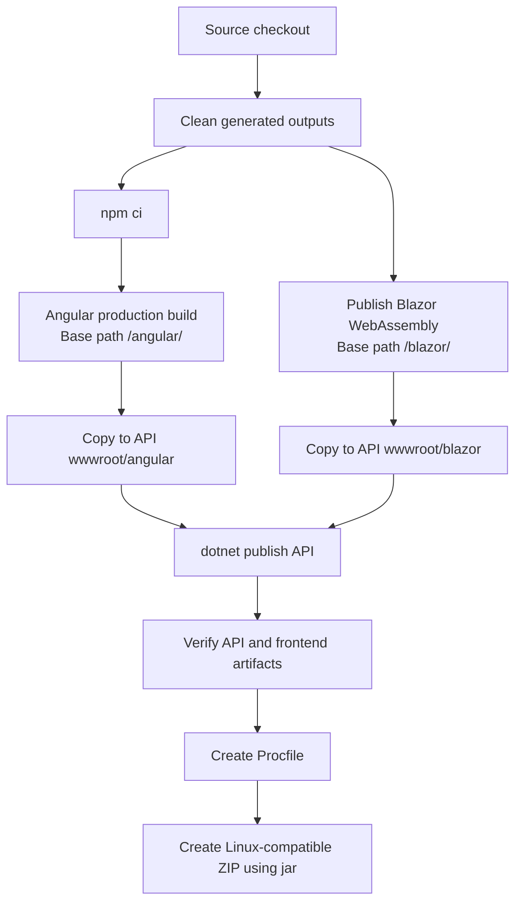
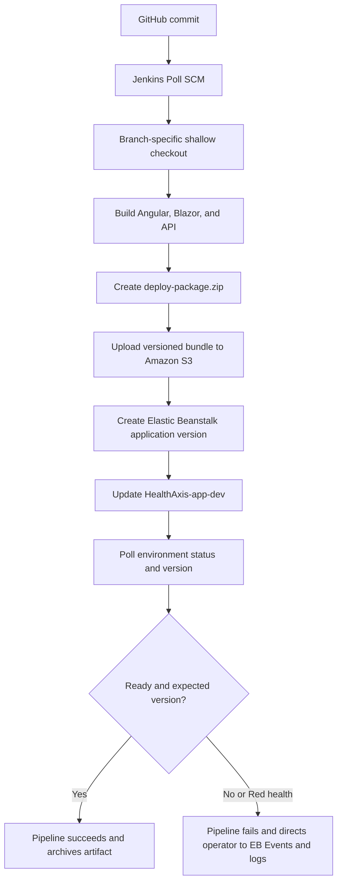
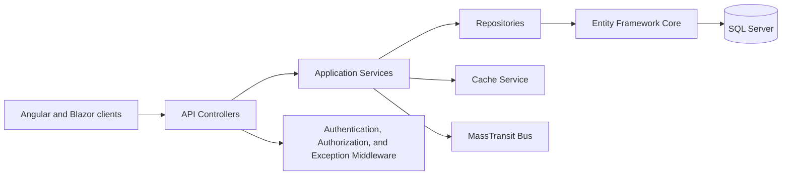

# HealthAxis

Full-stack healthcare management and appointment platform with an ASP.NET Core API, Angular user application, Blazor WebAssembly administrator portal, SQL Server persistence, RabbitMQ messaging, background processing, and Jenkins to AWS Elastic Beanstalk deployment.

## Table of Contents

- [Overview](#overview)
- [Security Notice](#security-notice)
- [Quick Start](#quick-start)
- [Problem Statement](#problem-statement)
- [Solution](#solution)
- [Key Features](#key-features)
- [User Roles](#user-roles)
- [Architecture](#architecture)
- [Flow Diagrams](#flow-diagrams)
- [Technology Stack](#technology-stack)
- [Repository Structure](#repository-structure)
- [Authentication and Authorization](#authentication-and-authorization)
- [Routing and Frontend Hosting](#routing-and-frontend-hosting)
- [Database and Persistence](#database-and-persistence)
- [Messaging and Background Processing](#messaging-and-background-processing)
- [Caching](#caching)
- [Error Handling and Logging](#error-handling-and-logging)
- [Prerequisites](#prerequisites)
- [Configuration](#configuration)
- [Local Setup](#local-setup)
- [Build and Publish](#build-and-publish)
- [Testing](#testing)
- [CI/CD Pipeline](#cicd-pipeline)
- [AWS Deployment](#aws-deployment)
- [Security](#security)
- [Troubleshooting](#troubleshooting)
- [Known Limitations](#known-limitations)
- [Roadmap](#roadmap)
- [Contributing](#contributing)
- [Repository Hygiene](#repository-hygiene)
- [License](#license)
- [Acknowledgements](#acknowledgements)
- [Project Status](#project-status)

---

## Overview

HealthAxis is a full-stack healthcare management and appointment platform. The system provides:

- An Angular application for the main patient and doctor-facing experience.
- A Blazor WebAssembly administrator portal for administrative workflows.
- An ASP.NET Core Web API that hosts API endpoints and serves both frontend bundles from one deployment package.
- SQL Server persistence through Entity Framework Core.
- ASP.NET Core Identity and JWT bearer authentication.
- RabbitMQ messaging through MassTransit.
- Background services for operational workflows such as outbox publishing, heartbeat logging, and notification cleanup.
- Jenkins CI/CD deployment to AWS Elastic Beanstalk through Amazon S3 application bundles.

The application is designed so one ASP.NET Core deployment can serve:

```text
/api/...       API controllers
/angular/...   Angular application
/blazor/...    Blazor WebAssembly administrator portal
```

Current project identity values that may change after branch merging or environment migration:

| Item | Current value |
|---|---|
| Repository | `https://github.com/bootcamp-hackerearth/UST-Live-01.git` |
| Current pipeline branch | `Feature/Sprint5_Pod1_RickyJoywinRobinson` |
| AWS region | `ap-southeast-2` |
| Elastic Beanstalk application | `HealthAxis-app` |
| Elastic Beanstalk environment | `HealthAxis-app-dev` |

Update branch names, Jenkins configuration, AWS environment names, and deployment identifiers when the project merges to `main` or moves to another environment.

---

## Security Notice

Do not commit secrets to source control.

The following values must be stored in environment variables, Jenkins Credentials, AWS Elastic Beanstalk environment properties, AWS Secrets Manager, or AWS Systems Manager Parameter Store:

- SQL Server host, username, password, and connection string.
- RabbitMQ username and password.
- JWT signing key.
- Seed administrator password.
- AWS access keys.
- Jenkins credential values.
- Private IP addresses or internal infrastructure addresses.
- Certificate bundles and private keys.

Use placeholders in committed configuration files:

```text
<SQL_SERVER_HOST>
<DATABASE_NAME>
<DATABASE_USER>
<DATABASE_PASSWORD>
<RABBITMQ_HOST>
<RABBITMQ_USERNAME>
<RABBITMQ_PASSWORD>
<STRONG_JWT_SIGNING_KEY>
<ADMIN_EMAIL>
<ADMIN_PASSWORD>
```

Production configuration should be injected through Elastic Beanstalk environment properties using double underscores for nested ASP.NET Core configuration keys, for example:

```text
ConnectionStrings__DbCon
RabbitMQ__Password
Jwt__Key
SeedAdmin__Password
```

---

## Quick Start

This quick start assumes the required local dependencies and external services are available.

```powershell
git clone https://github.com/bootcamp-hackerearth/UST-Live-01.git
cd UST-Live-01
git checkout Feature/Sprint5_Pod1_RickyJoywinRobinson
```

Configure secrets locally using environment variables, user secrets, or an uncommitted local settings file.

Example PowerShell environment variables:

```powershell
$env:ASPNETCORE_ENVIRONMENT = "Development"
$env:ConnectionStrings__DbCon = "Server=<SQL_SERVER_HOST>,1433;Database=<DATABASE_NAME>;User Id=<DATABASE_USER>;Password=<DATABASE_PASSWORD>;Encrypt=True;TrustServerCertificate=True"
$env:Jwt__Issuer = "HealthCareApp"
$env:Jwt__Audience = "HealthCareApp"
$env:Jwt__Key = "<STRONG_JWT_SIGNING_KEY>"
$env:RabbitMQ__Host = "<RABBITMQ_HOST>"
$env:RabbitMQ__Port = "5672"
$env:RabbitMQ__Username = "<RABBITMQ_USERNAME>"
$env:RabbitMQ__Password = "<RABBITMQ_PASSWORD>"
$env:SeedAdmin__Email = "<ADMIN_EMAIL>"
$env:SeedAdmin__Password = "<ADMIN_PASSWORD>"
```

Restore and build:

```powershell
dotnet restore .\HealthAxisApi\HealthAxisCore_Api.csproj
powershell.exe -NoProfile -ExecutionPolicy Bypass -File .\build-frontends.ps1
dotnet run --project .\HealthAxisApi\HealthAxisCore_Api.csproj
```

Open:

```text
/           redirects to /angular/
/angular/   Angular application
/blazor/    Blazor administrator portal
/swagger    Development Swagger UI, if the environment is Development
```

---

## Problem Statement

Healthcare administration and appointment workflows can become fragmented across disconnected tools and interfaces. HealthAxis addresses the following problems:

- Patients need a clear experience for authentication, doctor discovery, appointment booking, and appointment visibility.
- Doctors need access to schedules and healthcare workflows relevant to their role.
- Administrators need a secure operational portal for managing doctors, patients, appointments, account status, and related data.
- Backend workflows must remain maintainable, role-aware, observable, and deployable.
- The complete system should be delivered as one Elastic Beanstalk application while preserving separate Angular and Blazor client experiences.

---

## Solution

HealthAxis combines:

- Angular frontend for the main user-facing experience.
- Blazor WebAssembly administrator portal.
- ASP.NET Core Web API.
- Shared .NET project for DTOs, enums, and contracts.
- SQL Server persistence through Entity Framework Core.
- ASP.NET Core Identity and JWT bearer authentication.
- RabbitMQ messaging through MassTransit.
- Custom outbox publisher background service for reliable publishing.
- Distributed cache abstraction currently using in-memory distributed caching.
- Serilog structured logging.
- Swagger/OpenAPI in Development.
- Jenkins CI/CD deployment to AWS Elastic Beanstalk through S3 application bundles.

The ASP.NET Core API is the single deployment unit. Angular and Blazor static files are generated during the build and copied into the API project under `wwwroot`.

---

## Key Features

Only features supported by the provided project information are documented here. Items requiring final source verification are marked with `<REPLACE_WITH_VALUE>`.

### Administrator Portal

The Blazor WebAssembly administrator portal supports administrator workflows such as:

- Secure administrator access.
- Admin dashboard.
- Doctor directory.
- Add and edit doctors.
- Activate and deactivate doctor accounts.
- Temporary password display after doctor creation, if implemented in the source.
- Copy temporary password or login details through browser clipboard integration, if implemented in the source.
- View appointments associated with a selected doctor, if implemented in the source.
- Patient directory and details.
- Appointment directory.
- Search, filtering, date filtering, status filtering, and pagination, where implemented.
- Confirm pending appointments, where implemented.
- Cancel eligible appointments with a reason, where implemented.
- Delete appointments, where implemented.
- Appointment status legend and visual status indicators, where implemented.
- On-leave visibility, if verified in source.

### Angular Experience

The Angular application supports the user-facing experience. Based on the provided project information, the Angular application includes:

- Authentication and role-based navigation.
- Patient and doctor experiences.
- Routing under `/angular/`.
- Administrator redirect from the Angular authentication flow to the Blazor admin portal, when the user role is Admin.
- Patient and doctor dashboard routes, where implemented.
- Appointment booking and appointment visibility, where implemented.
- Health record visibility or workflows, where implemented.
- Doctor discovery, where implemented.

### Backend Capabilities

The ASP.NET Core API provides:

- REST API endpoints.
- Role-aware authorization.
- Repository and service layers.
- Entity Framework Core persistence.
- ASP.NET Core Identity integration.
- JWT token authentication.
- Domain validation through services.
- Appointment state operations.
- Doctor availability and leave handling, if verified in source.
- Health record workflows, if verified in source.
- Structured exception handling through `GlobalExceptionHandler`.
- Structured request logging through Serilog.
- RabbitMQ integration through MassTransit.
- Outbox-based publishing for appointment-related messages.
- Background services for operational workflows.

---

## User Roles

| Role | Primary interface | Responsibilities |
|---|---|---|
| Patient | Angular | Authentication, appointment booking, appointment visibility, profile and health workflows where implemented |
| Doctor | Angular | Schedule and appointment workflow access, health record workflows where implemented |
| Admin | Blazor WebAssembly | Manage doctors, patients, appointments, and operational data |
| System | API and background services | Messaging, outbox publishing, cleanup, logging, persistence, and static hosting |

---

## Architecture

HealthAxis follows a layered full-stack architecture:

- Frontend applications are separated by user audience:
  - Angular for patient and doctor-facing experiences.
  - Blazor WebAssembly for administrators.
- API controllers expose backend operations under `/api`.
- Application services contain business logic.
- Repositories encapsulate persistence operations.
- Entity Framework Core communicates with SQL Server.
- ASP.NET Core Identity manages users, roles, and password handling.
- JWT bearer authentication protects API access.
- MassTransit integrates with RabbitMQ for asynchronous workflows.
- An outbox table and background publisher reduce event loss risk between SQL Server and RabbitMQ.
- Static files from Angular and Blazor are served by the same ASP.NET Core API deployment.

---

## Flow Diagrams

### 1. High-level System Architecture



### 2. Authentication and Role-routing Flow



### 3. Appointment Workflow



### 4. Static Hosting and Request Routing



### 5. Local Build and Packaging Flow



### 6. Jenkins to Elastic Beanstalk Deployment Flow



### 7. Backend Layering



---

## Technology Stack

### Backend

| Category | Technology |
|---|---|
| Language | C# |
| Runtime | .NET 10 |
| API framework | ASP.NET Core Web API |
| ORM | Entity Framework Core |
| Database | SQL Server |
| Identity | ASP.NET Core Identity |
| Authentication | JWT bearer authentication |
| Mapping | AutoMapper |
| Logging | Serilog |
| API documentation | Swagger/OpenAPI in Development |

### Frontend

| Category | Technology |
|---|---|
| Main client | Angular |
| Language | TypeScript |
| Markup and styling | HTML, CSS |
| Admin client | Blazor WebAssembly |
| UI components | Razor components |
| Browser integration | JavaScript interop where required |

### Messaging and Background Processing

| Category | Technology or component |
|---|---|
| Broker | RabbitMQ |
| Messaging library | MassTransit |
| Consumer | `AppointmentBookedConsumer` |
| Publishing reliability | `OutboxPublisherBackgroundService` |
| Background services | Heartbeat service, notification cleanup service, outbox publisher |
| Additional monitor | `DoctorAvailabilityMonitorService`, if present in source |

### Caching

| Category | Current setup |
|---|---|
| Abstraction | `IDistributedCache` through application cache abstractions |
| Implementation | Distributed memory cache |
| Scaling note | A shared distributed cache is required for multiple API instances |

### Testing and Quality

| Item | Status |
|---|---|
| Test project | `HealthAxisCore_Api.Tests`, if present |
| Test framework | `<REPLACE_WITH_TEST_FRAMEWORK>` |
| Coverage | `<REPLACE_WITH_COVERAGE_TOOL_IF_VERIFIED>` |
| SonarQube or SonarScanner | `<REPLACE_WITH_STATUS_IF_VERIFIED>` |

### DevOps and Cloud

| Category | Technology |
|---|---|
| Source control | Git and GitHub |
| CI/CD | Jenkins Declarative Pipeline |
| AWS command line | AWS CLI |
| Artifact storage | Amazon S3 deployment bucket |
| Hosting | AWS Elastic Beanstalk |
| Deployment package | Linux-compatible ZIP with files at ZIP root |
| ZIP creation | JDK `jar` command in Windows-hosted pipeline |

---

## Repository Structure

The following structure is based on the provided project information.

```text
.
├── HealthAxisApi/
│   ├── Controllers/
│   ├── Middleware/
│   ├── Services/
│   ├── Repository/
│   ├── Data/
│   ├── Models/
│   ├── Consumers/
│   ├── Mapping/
│   ├── BackgroundServices/
│   ├── wwwroot/
│   │   ├── angular/
│   │   └── blazor/
│   └── HealthAxisCore_Api.csproj
│
├── HealthAxis_AngularProj/
│   ├── src/
│   ├── angular.json
│   ├── package.json
│   └── package-lock.json
│
├── HealthAxisAdminLayout/
│   ├── Pages/
│   ├── Layout/
│   ├── Services/
│   ├── wwwroot/
│   │   └── index.html
│   └── <REPLACE_WITH_BLAZOR_PROJECT_FILE>.csproj
│
├── HealthAxis_Shared/
│   └── <REPLACE_WITH_SHARED_PROJECT_FILE>.csproj
│
├── HealthAxisCore_Api.Tests/
│   └── <REPLACE_WITH_TEST_PROJECT_FILE>.csproj
│
├── build-frontends.ps1
├── Jenkinsfile
└── HealthAxisApi.slnx
```

### Project Responsibilities

| Project or file | Responsibility |
|---|---|
| `HealthAxisApi/` | ASP.NET Core Web API. Hosts API endpoints and the generated Angular and Blazor bundles under `wwwroot`. Contains controllers, middleware, services, repositories, EF Core context, models, consumers, mappings, and background services. |
| `HealthAxis_AngularProj/` | Angular application built for the `/angular/` base path. Production output is copied to `HealthAxisApi/wwwroot/angular`. |
| `HealthAxisAdminLayout/` | Blazor WebAssembly admin portal hosted under `/blazor/`. Contains administrator pages, layouts, authentication bridge, and services. Published assets are copied to `HealthAxisApi/wwwroot/blazor`. |
| `HealthAxis_Shared/` | Shared DTOs, enums, and contracts used across .NET projects. |
| `HealthAxisCore_Api.Tests/` | API test project. Specific tests should be documented after source inspection. |
| `build-frontends.ps1` | Validates paths, installs Angular dependencies with `npm ci`, builds Angular, publishes Blazor, copies frontend assets into API `wwwroot`, and validates generated artifacts. |
| `Jenkinsfile` | Defines checkout, validation, build, publish, packaging, S3 upload, Elastic Beanstalk application version creation, environment update, and deployment monitoring. |
| `HealthAxisApi.slnx` | Solution entry point, if present and verified. |

---

## Authentication and Authorization

HealthAxis uses ASP.NET Core Identity and JWT bearer authentication.

### Identity

The API uses Identity users and roles through the EF Core database context. Roles include:

```text
Admin
Doctor
Patient
```

Role and administrator seeding is handled at startup through:

```text
RoleSeeder
AdminSeeder
```

The seed administrator email and password must be externalized:

```text
SeedAdmin__Email=<ADMIN_EMAIL>
SeedAdmin__Password=<ADMIN_PASSWORD>
```

### JWT Authentication

The API validates JWTs using:

- Issuer validation.
- Audience validation.
- Lifetime validation.
- Signing key validation.
- Zero clock skew, if configured in source.

Example environment configuration:

```text
Jwt__Issuer=HealthCareApp
Jwt__Audience=HealthCareApp
Jwt__Key=<STRONG_JWT_SIGNING_KEY>
Jwt__AccessTokenExpirationMinutes=15
```

JWT signing keys must be strong and supplied externally. Tokens must not be logged or committed.

### Role Authorization

Administrator portal pages should use role-aware authorization, for example:

```text
[Authorize(Roles = "Admin")]
```

Angular routes and API endpoints should enforce Patient, Doctor, and Admin access according to source implementation.

### Angular to Blazor Admin Flow

When the Angular authentication flow identifies an Admin role, the user is redirected to the Blazor admin portal under `/blazor/`, typically through an admin login bridge that passes the token to the Blazor application. The exact implementation should be validated against the current Angular and Blazor source.

---

## Routing and Frontend Hosting

One ASP.NET Core application serves:

| Route | Purpose |
|---|---|
| `/` | Redirects to `/angular/` or `/angular` depending on configured redirect |
| `/api/...` | API controllers |
| `/angular/` | Angular application |
| `/blazor/` | Blazor WebAssembly admin portal |

### Angular Hosting

Angular must use:

```html
<base href="/angular/" />
```

Production build output must be copied to:

```text
HealthAxisApi/wwwroot/angular
```

Angular service API URLs should use root-relative API paths:

```text
/api/...
```

Do not use:

```text
/angular/api/...
```

### Blazor Hosting

Blazor must use:

```html
<base href="/blazor/" />
```

Published output must be copied to:

```text
HealthAxisApi/wwwroot/blazor
```

Blazor service clients should be configured so API calls go to:

```text
/api/...
```

not:

```text
/blazor/api/...
```

### Fallback Routing

For frontend deep links and refresh support, the API maps SPA fallbacks:

```text
/angular/{path-without-file-extension} -> angular/index.html
/blazor/{path-without-file-extension}  -> blazor/index.html
```

This allows browser refreshes on routes such as:

```text
/angular/patient/dashboard
/angular/doctor/dashboard
/blazor/admin/dashboard
/blazor/admin/doctors
```

---

## Database and Persistence

HealthAxis uses SQL Server and Entity Framework Core.

The API database context is referred to as `HealthAppDbContext` in the target naming convention. If the current source uses a different class name, such as `<REPLACE_WITH_DB_CONTEXT_NAME>`, update this README accordingly.

The connection string must be supplied externally in production.

Safe example:

```text
ConnectionStrings__DefaultConnection=Server=<SQL_SERVER_HOST>,1433;Database=<DATABASE_NAME>;User Id=<DATABASE_USER>;Password=<DATABASE_PASSWORD>;Encrypt=True;TrustServerCertificate=True
```

If the current source uses `DbCon`, use:

```text
ConnectionStrings__DbCon=Server=<SQL_SERVER_HOST>,1433;Database=<DATABASE_NAME>;User Id=<DATABASE_USER>;Password=<DATABASE_PASSWORD>;Encrypt=True;TrustServerCertificate=True
```

### Persistence Layers

The backend uses:

- EF Core database context.
- Generic repository pattern.
- Domain-specific repositories.
- Application services for business logic.

ASP.NET Core Identity stores use the same EF Core database context if configured in `Program.cs`.

### Migrations

Run migrations only after verifying the migration files and project names.

Example command placeholder:

```powershell
dotnet ef database update --project .\HealthAxisApi\HealthAxisCore_Api.csproj
```

If a startup seeding failure occurs, inspect:

```text
RoleSeeder
AdminSeeder
ConnectionStrings__DefaultConnection or ConnectionStrings__DbCon
SQL Server security group and firewall
```

---

## Messaging and Background Processing

HealthAxis uses MassTransit with RabbitMQ.

### RabbitMQ Configuration

Safe environment examples:

```text
RabbitMQ__Host=<RABBITMQ_HOST>
RabbitMQ__Port=5672
RabbitMQ__Username=<RABBITMQ_USERNAME>
RabbitMQ__Password=<RABBITMQ_PASSWORD>
```

### Consumer

`AppointmentBookedConsumer` consumes appointment-related messages from the configured RabbitMQ queue.

The project information indicates a consumer-side retry policy:

```text
3 retry attempts
5-second interval
```

Consumer retry handles failures after the message reaches the consumer, for example a temporary database failure when processing a notification.

### Outbox Publisher

`OutboxPublisherBackgroundService` reads pending or retryable failed outbox records and publishes them through MassTransit.

The outbox pattern handles publisher-side reliability. It reduces the risk of losing an event when the appointment is saved but RabbitMQ publishing fails.

### Difference Between Outbox Retry and Consumer Retry

| Mechanism | Handles |
|---|---|
| Outbox publisher retry | Failure to publish from API/database to RabbitMQ |
| Consumer retry | Failure while processing a message after RabbitMQ delivery |
| Idempotency | Duplicate message delivery or duplicate processing |

### Background Services

The project includes these background service responsibilities based on the provided information:

- Outbox publisher.
- Heartbeat logging.
- Notification cleanup.
- Doctor availability monitoring, if present in source.

If configured, shutdown timeout should be documented from the actual source. If not configured, add a future improvement to configure graceful shutdown behavior.

---

## Caching

HealthAxis uses cache abstractions through application services.

Current configuration:

- `IDistributedCache` abstraction.
- `AddDistributedMemoryCache`.
- `ICacheService` application abstraction.
- In-memory distributed cache in the current API process.

This setup is suitable for a single API process. It is not shared across multiple Elastic Beanstalk instances.

If HealthAxis is scaled horizontally, replace the in-memory cache with a shared distributed cache, such as Redis-compatible infrastructure, and ensure cache invalidation rules remain correct.

Do not assume Garnet or Redis is currently active unless the source confirms it.

---

## Error Handling and Logging

HealthAxis uses Serilog and global exception handling.

### Logging

The project uses:

- Serilog configuration loaded from application configuration and DI services.
- Console logging, suitable for Elastic Beanstalk logs.
- File logging, if enabled and the target path is writable.
- Request logging with method, path, status code, and elapsed time.

Request logging template example:

```text
HTTP {RequestMethod} {RequestPath} responded {StatusCode} in {Elapsed:0.0000} ms
```

### Error Handling

`GlobalExceptionHandler` handles unhandled exceptions and returns structured problem responses where configured.

Recommended logging behavior:

- 4xx responses as warnings where appropriate.
- 5xx responses and unhandled exceptions as errors.
- Do not log passwords, tokens, connection strings, or sensitive user information.

### Swagger

Swagger/OpenAPI is enabled only in Development.

### Recommended Improvement

A dedicated health endpoint, for example `/health`, is recommended if not already implemented. This should validate application startup and optionally SQL Server and RabbitMQ reachability without exposing sensitive details.

---

## Prerequisites

### Required for Local Development

- .NET 10 SDK.
- Node.js and npm compatible with the Angular lock file.
- Git.
- SQL Server access.
- RabbitMQ access.
- PowerShell.

### Required for Deployment Work

- Jenkins on Windows, if running the provided pipeline.
- AWS CLI.
- AWS permissions for S3 and Elastic Beanstalk.
- JDK `jar` tool for Linux-compatible ZIP creation.
- Corporate CA bundle, if the network performs TLS inspection.

### npm Lock File Warning

`npm ci` requires `package.json` and `package-lock.json` to be synchronized.

If Jenkins fails with lock mismatch:

```text
npm ci can only install packages when your package.json and package-lock.json are in sync
```

Run locally:

```powershell
cd .\HealthAxis_AngularProj
npm install
git add package.json package-lock.json
git commit -m "sync angular package lock"
git push
```

---

## Configuration

ASP.NET Core maps double underscores in environment variable names to nested configuration sections.

Example:

```text
RabbitMQ__Password
```

maps to:

```json
{
  "RabbitMQ": {
    "Password": "<RABBITMQ_PASSWORD>"
  }
}
```

### Configuration Reference

| Configuration key | Purpose | Required | Development source | Production source |
|---|---|---:|---|---|
| `ASPNETCORE_ENVIRONMENT` | Environment name | Yes | Local environment variable | Elastic Beanstalk environment property |
| `ASPNETCORE_URLS` | Runtime binding URL | Required on EB unless configured in code or Procfile | Optional | Elastic Beanstalk environment property or Procfile |
| `ConnectionStrings__DefaultConnection` | SQL Server connection string if the source uses `DefaultConnection` | Yes | User secrets or local env var | Elastic Beanstalk environment property |
| `ConnectionStrings__DbCon` | SQL Server connection string if the source uses `DbCon` | Yes | User secrets or local env var | Elastic Beanstalk environment property |
| `Jwt__Issuer` | JWT issuer | Yes | User secrets or local env var | Elastic Beanstalk environment property |
| `Jwt__Audience` | JWT audience | Yes | User secrets or local env var | Elastic Beanstalk environment property |
| `Jwt__Key` | JWT signing key | Yes | User secrets or local env var | Elastic Beanstalk environment property |
| `Jwt__AccessTokenExpirationMinutes` | JWT access token lifetime | Optional if default exists | Local config or env var | Elastic Beanstalk environment property |
| `Jwt__DurationInMinutes` | JWT duration key if present in source | Optional | Local config or env var | Elastic Beanstalk environment property |
| `RabbitMQ__Host` | RabbitMQ host | Yes if messaging enabled | User secrets or local env var | Elastic Beanstalk environment property |
| `RabbitMQ__Port` | RabbitMQ port | Optional if default is `5672` | Local config or env var | Elastic Beanstalk environment property |
| `RabbitMQ__Username` | RabbitMQ username | Yes if messaging enabled | User secrets or local env var | Elastic Beanstalk environment property |
| `RabbitMQ__Password` | RabbitMQ password | Yes if messaging enabled | User secrets or local env var | Elastic Beanstalk environment property |
| `SeedAdmin__Email` | Seed administrator email | Required if admin seeding enabled | User secrets or local env var | Elastic Beanstalk environment property |
| `SeedAdmin__Password` | Seed administrator password | Required if admin seeding enabled | User secrets or local env var | Elastic Beanstalk environment property |
| `SeedData__Enabled` | Enables startup seeding | Optional | Local config or env var | Elastic Beanstalk environment property |
| `SeedData__FailStartupOnError` | Determines whether seeding failure stops startup | Optional | Local config or env var | Elastic Beanstalk environment property |
| `NotificationCleanup__RetentionDays` | Notification retention window | Optional | Local config or env var | Elastic Beanstalk environment property |
| `NotificationCleanup__IntervalHours` | Cleanup interval | Optional | Local config or env var | Elastic Beanstalk environment property |
| `NavigationSettings__<REPLACE_WITH_KEY>` | Blazor or frontend navigation setting, if present | Optional | Local config or env var | Elastic Beanstalk environment property |
| `Serilog__MinimumLevel__Default` | Default log level | Optional | App config | Elastic Beanstalk environment property if overridden |

### Safe Production Example

```text
ASPNETCORE_ENVIRONMENT=Production
ASPNETCORE_URLS=http://+:5000
ConnectionStrings__DbCon=Server=<SQL_SERVER_HOST>,1433;Database=<DATABASE_NAME>;User Id=<DATABASE_USER>;Password=<DATABASE_PASSWORD>;Encrypt=True;TrustServerCertificate=True
Jwt__Issuer=HealthCareApp
Jwt__Audience=HealthCareApp
Jwt__Key=<STRONG_JWT_SIGNING_KEY>
Jwt__AccessTokenExpirationMinutes=15
RabbitMQ__Host=<RABBITMQ_HOST>
RabbitMQ__Port=5672
RabbitMQ__Username=<RABBITMQ_USERNAME>
RabbitMQ__Password=<RABBITMQ_PASSWORD>
SeedAdmin__Email=<ADMIN_EMAIL>
SeedAdmin__Password=<ADMIN_PASSWORD>
SeedData__Enabled=true
SeedData__FailStartupOnError=false
```

---

## Local Setup

### 1. Clone Repository

```powershell
git clone https://github.com/bootcamp-hackerearth/UST-Live-01.git
cd UST-Live-01
git checkout Feature/Sprint5_Pod1_RickyJoywinRobinson
```

### 2. Configure Local Secrets

Use environment variables, user secrets, or an uncommitted local settings file.

Example:

```powershell
$env:ConnectionStrings__DbCon = "Server=<SQL_SERVER_HOST>,1433;Database=<DATABASE_NAME>;User Id=<DATABASE_USER>;Password=<DATABASE_PASSWORD>;Encrypt=True;TrustServerCertificate=True"
$env:Jwt__Key = "<STRONG_JWT_SIGNING_KEY>"
$env:RabbitMQ__Host = "<RABBITMQ_HOST>"
$env:RabbitMQ__Username = "<RABBITMQ_USERNAME>"
$env:RabbitMQ__Password = "<RABBITMQ_PASSWORD>"
$env:SeedAdmin__Email = "<ADMIN_EMAIL>"
$env:SeedAdmin__Password = "<ADMIN_PASSWORD>"
```

### 3. Restore .NET Dependencies

```powershell
dotnet restore .\HealthAxisApi\HealthAxisCore_Api.csproj
dotnet restore .\HealthAxisAdminLayout\<REPLACE_WITH_BLAZOR_PROJECT_FILE>.csproj
```

### 4. Build Frontend Bundles

```powershell
powershell.exe -NoProfile -ExecutionPolicy Bypass -File .\build-frontends.ps1
```

### 5. Verify Generated Static Files

```powershell
Test-Path .\HealthAxisApi\wwwroot\angular\index.html
Test-Path .\HealthAxisApi\wwwroot\blazor\index.html
Test-Path .\HealthAxisApi\wwwroot\blazor\_framework
```

### 6. Run API

```powershell
dotnet run --project .\HealthAxisApi\HealthAxisCore_Api.csproj
```

### 7. Open Application

```text
/           redirects to /angular/
/angular/   Angular application
/blazor/    Blazor admin portal
/swagger    Swagger UI in Development only
```

### Startup Dependencies

The API depends on:

- SQL Server availability.
- RabbitMQ availability if MassTransit starts on application startup.
- Valid JWT configuration.
- Valid SeedAdmin configuration if seeding is enabled.

---

## Build and Publish

The production build sequence is:

1. Clean generated output.
2. Run `npm ci`.
3. Build Angular with `/angular/` base path.
4. Publish Blazor WebAssembly with `/blazor/` base path.
5. Copy Angular output to `HealthAxisApi/wwwroot/angular`.
6. Copy Blazor output to `HealthAxisApi/wwwroot/blazor`.
7. Publish the API in Release mode.
8. Verify:
   - Published API DLL.
   - `.runtimeconfig.json`.
   - `.deps.json`.
   - `wwwroot/angular/index.html`.
   - `wwwroot/blazor/index.html`.
   - `wwwroot/blazor/_framework`.
9. Create a Procfile.
10. Create the deployment ZIP from inside the publish directory.

### Procfile

For Elastic Beanstalk:

```text
web: dotnet HealthAxisCore_Api.dll
```

If the application must explicitly bind to Elastic Beanstalk port 5000:

```text
web: dotnet HealthAxisCore_Api.dll --urls http://0.0.0.0:5000
```

### ZIP Packaging

The ZIP must contain application files at the root:

```text
HealthAxisCore_Api.dll
HealthAxisCore_Api.runtimeconfig.json
HealthAxisCore_Api.deps.json
Procfile
wwwroot/
appsettings.json
appsettings.Production.json
```

Do not zip the parent `publish` folder itself.

The Windows-hosted Jenkins pipeline uses the JDK `jar` tool to create a Linux-compatible ZIP with forward-slash paths.

---

## Testing

The repository includes a test project path:

```text
HealthAxisCore_Api.Tests/
```

The exact test framework and categories should be verified from the project file and test source before documenting in detail.

Placeholder command:

```powershell
dotnet test .\HealthAxisCore_Api.Tests\HealthAxisCore_Api.Tests.csproj
```

### To Document After Source Verification

| Item | Status |
|---|---|
| Test framework | `<REPLACE_WITH_TEST_FRAMEWORK>` |
| Unit tests | `<REPLACE_WITH_VERIFIED_AREAS>` |
| Integration tests | `<REPLACE_WITH_VERIFIED_AREAS>` |
| Coverage tool | `<REPLACE_WITH_COVERAGE_TOOL>` |
| Coverage artifacts | `<REPLACE_WITH_COVERAGE_ARTIFACT_PATH>` |

### Dependency Review

Run regular dependency checks:

```powershell
dotnet list package --vulnerable
```

For Angular:

```powershell
cd .\HealthAxis_AngularProj
npm audit
```

Treat vulnerability output as maintenance work, not as an achievement.

---

## CI/CD Pipeline

HealthAxis uses Jenkins Declarative Pipeline on Windows.

### Pipeline Responsibilities

The Jenkins pipeline is expected to perform:

1. Clean workspace or generated outputs.
2. Branch-specific shallow checkout.
3. Tool verification.
4. Node HTTPS verification, if configured.
5. Project-file verification.
6. Cleanup of generated outputs.
7. .NET restore.
8. Angular and Blazor build through `build-frontends.ps1` or equivalent build stages.
9. Frontend artifact verification.
10. API publish.
11. Procfile creation.
12. Linux-compatible ZIP creation with `jar`.
13. ZIP content verification.
14. AWS certificate and credential verification, if configured.
15. S3 bucket and Elastic Beanstalk resource verification.
16. S3 upload using a build-number-specific object key.
17. Elastic Beanstalk application-version creation.
18. Elastic Beanstalk environment update.
19. Wait loop for Ready status and expected version label.
20. Final environment summary.
21. Deployment artifact archiving.

### Jenkins Credentials

Do not store secrets in the Jenkinsfile.

Recommended Jenkins credentials:

| Credential ID | Type | Purpose |
|---|---|---|
| `aws-deploy-creds` | AWS access key ID and secret access key | S3 upload and Elastic Beanstalk deployment |
| `aws-ca-bundle` | Secret file | Corporate CA certificate bundle for AWS CLI TLS validation |
| `<GITHUB_CREDENTIALS_ID>` | Username with password or PAT | GitHub checkout if repository access requires authentication |

If the repository is public, unauthenticated checkout may work. If checkout times out or the repository requires authentication, use GitHub credentials and a branch-specific shallow checkout.

### Branch-specific Shallow Checkout

A shallow checkout reduces fetch scope and avoids downloading unnecessary branches and tags.

```groovy
stage('Checkout') {
    steps {
        deleteDir()

        checkout([
            $class: 'GitSCM',
            branches: [[
                name: '*/Feature/Sprint5_Pod1_RickyJoywinRobinson'
            ]],
            userRemoteConfigs: [[
                url: 'https://github.com/bootcamp-hackerearth/UST-Live-01.git',
                credentialsId: '<GITHUB_CREDENTIALS_ID>',
                refspec: '+refs/heads/Feature/Sprint5_Pod1_RickyJoywinRobinson:refs/remotes/origin/Feature/Sprint5_Pod1_RickyJoywinRobinson'
            ]],
            extensions: [
                [
                    $class: 'CloneOption',
                    shallow: true,
                    depth: 1,
                    noTags: true,
                    reference: '',
                    timeout: 30,
                    honorRefspec: true
                ],
                [
                    $class: 'CleanBeforeCheckout'
                ]
            ]
        ])
    }
}
```

After the feature branch merges, update the branch and refspec to `main` if that is the team workflow.

### Corporate TLS Inspection

If Jenkins runs behind corporate TLS inspection:

- Configure Node to trust the corporate CA.
- Configure AWS CLI with `AWS_CA_BUNDLE`.
- Store the CA bundle as a Jenkins Secret File.
- Do not use `--no-verify-ssl` in production deployment pipelines.

---

## AWS Deployment

Primary deployment target:

| Item | Value |
|---|---|
| AWS region | `ap-southeast-2` |
| Elastic Beanstalk application | `HealthAxis-app` |
| Elastic Beanstalk environment | `HealthAxis-app-dev` |
| Platform | Linux-based Elastic Beanstalk runtime |
| Deployment artifact | ZIP bundle uploaded through S3 |

### Deployment Requirements

The Elastic Beanstalk source bundle must contain app files at the ZIP root:

```text
Procfile
HealthAxisCore_Api.dll
HealthAxisCore_Api.runtimeconfig.json
HealthAxisCore_Api.deps.json
wwwroot/
```

The application must be able to connect to:

- SQL Server on TCP `1433`.
- RabbitMQ on TCP `5672`.

Security groups should allow access from the Elastic Beanstalk instance security group, not from the public internet.

### Environment Properties

Use Elastic Beanstalk environment properties for production configuration:

```text
ConnectionStrings__DbCon=<SQL_CONNECTION_STRING>
RabbitMQ__Host=<RABBITMQ_HOST>
RabbitMQ__Username=<RABBITMQ_USERNAME>
RabbitMQ__Password=<RABBITMQ_PASSWORD>
Jwt__Key=<STRONG_JWT_SIGNING_KEY>
SeedAdmin__Password=<ADMIN_PASSWORD>
```

### Deployment Validation

A successful AWS `update-environment` request does not prove the application became healthy.

Always check:

- Elastic Beanstalk Events.
- Elastic Beanstalk Health.
- `/var/log/web.stdout.log`.
- `/var/log/nginx/error.log`.
- The deployed application URL.
- API login and representative API calls.

---

## Security

### Secrets

- Never commit secrets to Git.
- Rotate any secrets that were previously committed.
- Prefer AWS Secrets Manager, Parameter Store, or Elastic Beanstalk environment properties for production secrets.
- In Jenkins, store AWS and GitHub credentials in Jenkins Credentials.
- Prefer short-lived credentials or IAM roles where feasible.

### IAM

Use least-privilege IAM permissions for Jenkins deployment:

- S3 upload to the deployment bucket.
- Elastic Beanstalk application version creation.
- Elastic Beanstalk environment update.
- Describe environment operations.

### Network Security

- SQL Server should allow TCP `1433` only from approved sources.
- RabbitMQ should allow TCP `5672` only from approved sources.
- Do not expose SQL Server or RabbitMQ broadly to the public internet.

### Authentication and Authorization

- Password handling is delegated to ASP.NET Core Identity.
- JWT keys must be strong.
- JWT tokens must not be logged.
- Role authorization must be enforced at API and UI levels.

### CORS

Current CORS configuration allows verified local development origins such as:

```text
https://localhost:7075
http://localhost:4200
https://localhost:4200
```

For production, Angular, Blazor, and API are served from the same ASP.NET Core origin. Review whether CORS is still needed for production.

### Logging

Avoid logging:

- Passwords.
- JWT tokens.
- Connection strings.
- Personal health details beyond operational necessity.
- Private infrastructure details.

### Dependency Scanning

Regularly review:

```powershell
dotnet list package --vulnerable
npm audit
```

---

## Troubleshooting

| Symptom | Likely cause | Resolution |
|---|---|---|
| Root URL returns 404 | Root redirect missing or not deployed | Verify `/` redirects to `/angular/` or `/angular`. |
| `/angular` or `/blazor` deep-link refresh returns 404 | SPA fallback missing | Verify fallback mappings for Angular and Blazor and confirm generated `index.html` files exist. |
| Angular build fails at `npm ci` | `package.json` and `package-lock.json` are out of sync | Run `npm install`, commit the updated lock file, then rerun Jenkins. |
| Jenkins Git checkout fails with early EOF, curl 56, abrupt close, or timeout | Large full clone, network interruption, or corporate proxy | Use branch-specific shallow checkout, no tags, retry, and avoid committing generated artifacts. |
| AWS CLI `CERTIFICATE_VERIFY_FAILED` | Corporate TLS inspection or missing CA trust | Supply corporate CA bundle through `AWS_CA_BUNDLE` or Jenkins Secret File. |
| CDK or Node tooling reports no credentials although credentials exist | Node TLS trust or certificate chain issue | Verify Node uses the corporate CA bundle and that credentials are available in the environment. |
| Elastic Beanstalk deployment request succeeds but site is unhealthy | Runtime failure after deployment | Inspect EB Events and logs, validate runtime, Procfile, configuration, database, RabbitMQ, and health path. |
| SQL connection failure | Invalid connection string, blocked TCP `1433`, firewall, VPC routing, or security group issue | Verify connection string, SQL Server listener, Windows or host firewall, VPC routing, and security group source. |
| RabbitMQ connection failure | Invalid host, credentials, virtual host, TCP `5672`, or listener binding | Verify RabbitMQ host, credentials, virtual host, listener, firewall, and security group source. |
| Blazor date formatting appears as source text | Razor expressions not wrapped properly | Keep Razor method-call expressions inside `@(...)`. |
| Action buttons overflow table | Narrow layout or no reserved action column width | Reserve explicit column width, fixed action slots, and horizontal scrolling on narrow screens. |
| Login returns 500 or 502 | API cannot reach database, RabbitMQ startup failure, invalid configuration, or app crash | Check `/var/log/web.stdout.log` before Nginx logs. Resolve backend exception first. |
| Nginx returns 502 on EB | ASP.NET Core app is not running or not listening on expected port | Verify Procfile, `ASPNETCORE_URLS`, EB logs, and application startup exceptions. |

---

## Known Limitations

- In-memory distributed cache is process-local.
- Multiple API instances require a shared distributed cache.
- Background services running in every horizontally scaled web instance may require coordination or separation.
- RabbitMQ and SQL connectivity depend on VPC routing, firewall rules, listener configuration, and security groups.
- Poll SCM is less immediate than a webhook.
- Current pipeline is Windows-hosted and uses Windows batch, PowerShell, and the JDK `jar` tool.
- Corporate TLS inspection requires CA bundle management.
- Package vulnerability warnings should be reviewed and remediated.
- A dedicated health endpoint is recommended if not already present.
- The outbox publisher and web API are currently deployed together unless source or deployment is changed.
- Generated frontend assets should be rebuilt during CI/CD rather than committed.

---

## Roadmap

Future improvements:

- Shared distributed cache for multi-instance deployments.
- Dedicated health checks.
- GitHub webhook or managed CI alternative.
- Stronger automated integration and end-to-end tests.
- Dependency vulnerability remediation.
- Centralized secret management through AWS Secrets Manager or Parameter Store.
- Deployment rollback automation.
- Separating background workers when horizontally scaling.
- Observability dashboards and alerts.
- More explicit feature flags for background services.
- More granular IAM permissions for CI/CD.

---

## Contributing

Recommended workflow:

1. Pull or fetch before starting work.

   ```powershell
   git fetch
   git pull --rebase
   ```

2. Create or use the assigned feature branch.

   ```powershell
   git checkout -b Feature/<WORK_ITEM_NAME>
   ```

3. Keep commits focused.

4. Do not commit:

   - Secrets.
   - Generated frontend output.
   - Deployment ZIP files.
   - Local environment files.
   - Build artifacts.

5. Run local build and tests before pushing.

   ```powershell
   dotnet restore
   powershell.exe -NoProfile -ExecutionPolicy Bypass -File .\build-frontends.ps1
   dotnet test
   ```

6. Push the branch.

   ```powershell
   git push origin Feature/<WORK_ITEM_NAME>
   ```

7. Open a pull request according to team policy.

8. After merging to `main`, update Jenkins branch configuration if required.

---

## Repository Hygiene

Generated and local files that should not be committed:

```text
.vs/
bin/
obj/
node_modules/
dist/
.angular/
artifacts/
publish/
testpublish/
backup-blazor/
HealthAxisApi/wwwroot/angular/
HealthAxisApi/wwwroot/blazor/
*.zip
Logs/
TestResults/
coverage/
.env
local.settings.json
.aws/
.elasticbeanstalk/
```

Files that should be committed:

```text
package-lock.json
Jenkinsfile
build-frontends.ps1
*.csproj
*.sln
*.slnx
Angular source
Blazor source
API source
Shared contracts
Configuration templates without secrets
```

---

## License

License information has not been provided.

```text
<REPLACE_WITH_LICENSE>
```

If the project does not yet have a license file, add one according to organization policy.

---

## Acknowledgements

Team or organization acknowledgements were not provided.

```text
<REPLACE_WITH_TEAM_OR_ACKNOWLEDGEMENTS>
```

---

## Project Status

HealthAxis is a functioning full-stack healthcare management platform architecture with Angular and Blazor clients hosted by an ASP.NET Core API and deployed through a Jenkins to AWS Elastic Beanstalk workflow. Some implementation details, test coverage, and environment-specific values should be verified directly from the repository before production promotion or long-term operational handover.
