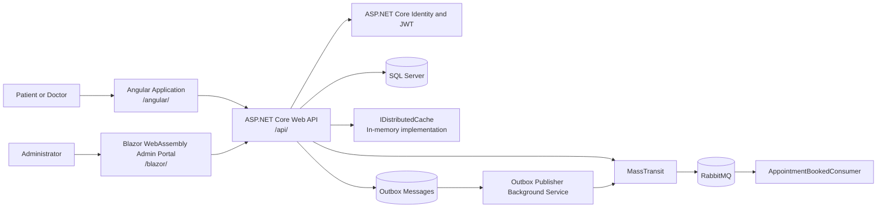
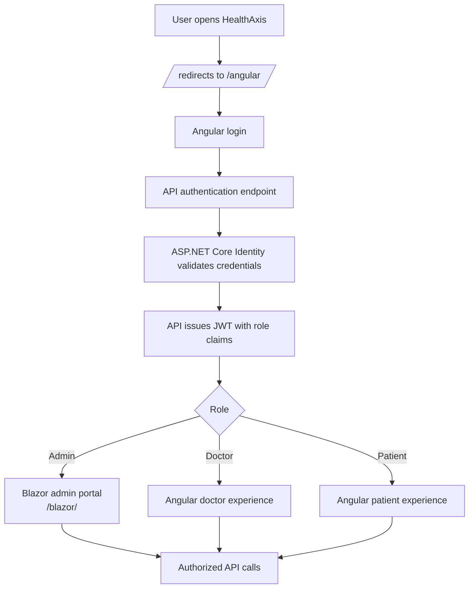
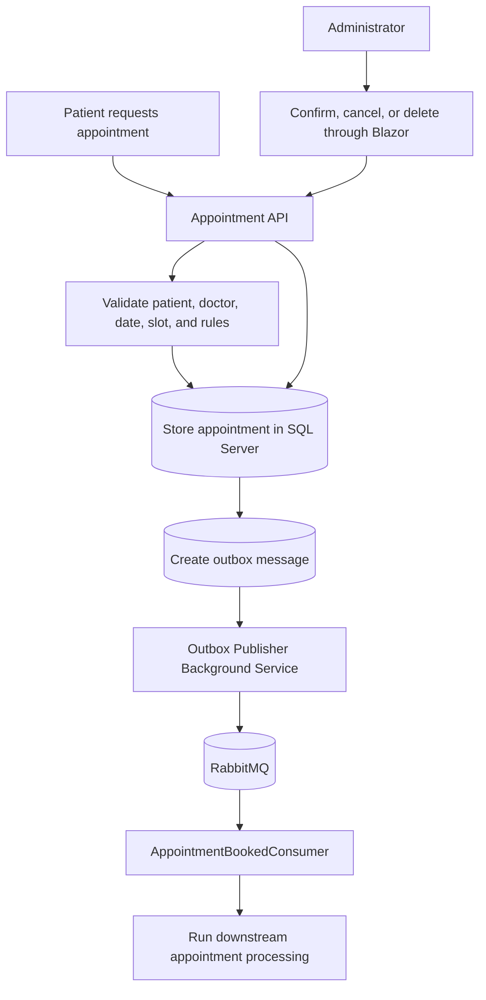
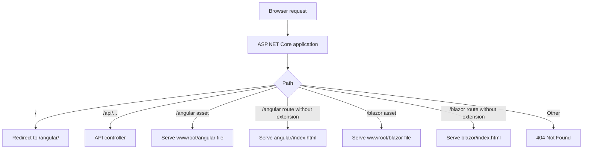
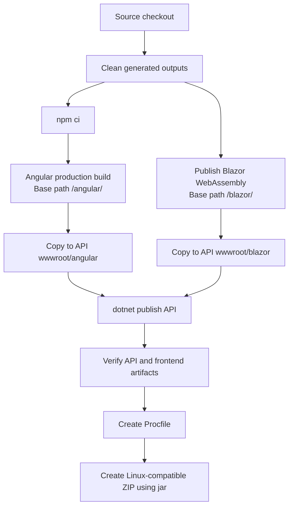
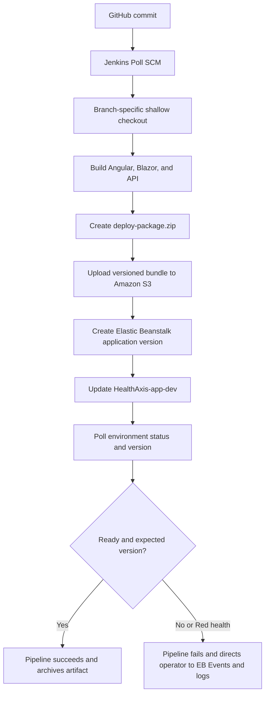
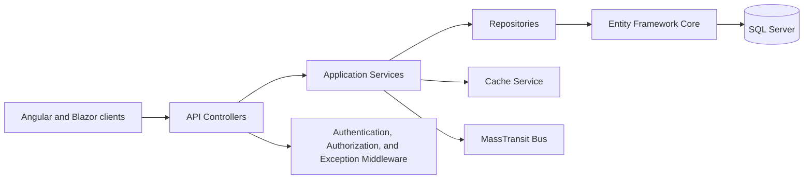

# HealthAxis

A full-stack healthcare management and appointment platform that serves an Angular user experience and a Blazor WebAssembly administrator portal from one ASP.NET Core API deployment package.

## Table of Contents

1. [Overview](#overview)
2. [Security Notice](#security-notice)
3. [Quick Start](#quick-start)
4. [Problem Statement](#problem-statement)
5. [Solution](#solution)
6. [Key Features](#key-features)
7. [User Roles](#user-roles)
8. [Architecture](#architecture)
9. [Flow Diagrams](#flow-diagrams)
10. [Technology Stack](#technology-stack)
11. [Repository Structure](#repository-structure)
12. [Authentication and Authorization](#authentication-and-authorization)
13. [Routing and Frontend Hosting](#routing-and-frontend-hosting)
14. [Database and Persistence](#database-and-persistence)
15. [Messaging and Background Processing](#messaging-and-background-processing)
16. [Caching](#caching)
17. [Error Handling and Logging](#error-handling-and-logging)
18. [Prerequisites](#prerequisites)
19. [Configuration](#configuration)
20. [Local Setup](#local-setup)
21. [Build and Publish](#build-and-publish)
22. [Testing](#testing)
23. [CI/CD Pipeline](#cicd-pipeline)
24. [AWS Deployment](#aws-deployment)
25. [Security](#security)
26. [Troubleshooting](#troubleshooting)
27. [Known Limitations](#known-limitations)
28. [Roadmap](#roadmap)
29. [Repository Hygiene](#repository-hygiene)
30. [Contributing](#contributing)
31. [License](#license)
32. [Acknowledgements](#acknowledgements)
33. [Project Status](#project-status)

## Overview

HealthAxis is a full-stack healthcare administration and appointment management platform. It combines an Angular application for the patient and doctor-facing experience, a Blazor WebAssembly administrator portal, and an ASP.NET Core Web API into one deployable application package.

The ASP.NET Core API hosts:

- `/api/...` for REST endpoints
- `/angular/` for the Angular frontend
- `/blazor/` for the Blazor WebAssembly administrator portal
- `/` as a redirect to `/angular/`

Primary deployment target:

- AWS Elastic Beanstalk on Linux
- AWS region: `ap-southeast-2`
- Elastic Beanstalk application: `HealthAxis-app`
- Elastic Beanstalk environment: `HealthAxis-app-dev`
- CI/CD engine: Jenkins on Windows
- Source control: GitHub
- Repository URL: `https://github.com/bootcamp-hackerearth/UST-Live-01.git`
- Current pipeline branch reference: `Feature/Sprint5_Pod1_Ayushi`

Branch, application, and environment names should be treated as configurable values. Update these after merge to `main` if the team workflow changes.

## Security Notice

Do not commit secrets to source control.

Secrets must be supplied through secure runtime configuration, such as:

- Environment variables
- Jenkins Credentials
- AWS Elastic Beanstalk environment properties
- AWS Secrets Manager or AWS Systems Manager Parameter Store, if adopted later

Never commit:

- Real SQL Server connection strings
- JWT signing keys
- RabbitMQ passwords
- AWS access keys
- Private certificates
- Local `.env` files
- Local appsettings files containing secrets

Use placeholders in examples:

```powershell
ConnectionStrings__DefaultConnection="Server=<SQL_SERVER_HOST>,1433;Database=<DATABASE_NAME>;User Id=<DATABASE_USER>;Password=<DATABASE_PASSWORD>;Encrypt=True;TrustServerCertificate=True"
Jwt__Key="<STRONG_JWT_SIGNING_KEY>"
RabbitMQ__Password="<RABBITMQ_PASSWORD>"
```

## Quick Start

Run commands from the repository root. Replace placeholders if the local repository structure differs.

```powershell
git clone https://github.com/bootcamp-hackerearth/UST-Live-01.git
cd UST-Live-01
git checkout Feature/Sprint5_Pod1_Ayushi
```

Restore API dependencies:

```powershell
dotnet restore .\HealthAxisApi\HealthAxisCore_Api.csproj
```

Build and copy frontend assets into the API project:

```powershell
powershell.exe -NoProfile -ExecutionPolicy Bypass -File .\build-frontends.ps1
```

Run the API project:

```powershell
dotnet run --project .\HealthAxisApi\HealthAxisCore_Api.csproj
```

Open these URLs using the port printed by the API process:

```text
https://localhost:<REPLACE_WITH_PORT>/
https://localhost:<REPLACE_WITH_PORT>/angular/
https://localhost:<REPLACE_WITH_PORT>/blazor/
https://localhost:<REPLACE_WITH_PORT>/swagger/
```

The API requires valid SQL Server, RabbitMQ, JWT, and application configuration to run all workflows successfully.

## Problem Statement

Healthcare administration and appointment workflows are often fragmented across disconnected systems. This creates operational friction for patients, clinicians, administrators, and engineering teams.

HealthAxis addresses these challenges:

- Patients need a clear experience for authentication, doctor discovery, booking, and appointment visibility.
- Doctors need access to relevant schedules and healthcare workflows.
- Administrators need a secure operational portal for doctors, patients, appointments, account status, and related data.
- Backend workflows must remain maintainable, role-aware, observable, and deployable.
- The complete system should be deliverable as one Elastic Beanstalk application while preserving separate Angular and Blazor client experiences.

## Solution

HealthAxis centralizes healthcare management through one ASP.NET Core API application that hosts two client applications.

The solution combines:

- Angular for the main patient and doctor experience
- Blazor WebAssembly for the administrator portal
- ASP.NET Core Web API for backend workflows
- A shared .NET project for DTOs, enums, and contracts
- SQL Server persistence through Entity Framework Core
- ASP.NET Core Identity and JWT bearer authentication
- RabbitMQ and MassTransit for asynchronous messaging
- Outbox publishing for reliable event publishing
- Distributed cache abstractions backed by in-memory distributed caching in the current configuration
- Serilog structured logging
- Swagger/OpenAPI in Development
- Jenkins CI/CD deployment to AWS Elastic Beanstalk through S3 application bundles

## Key Features

### Administrator Portal

The administrator portal is a Blazor WebAssembly application hosted at `/blazor/`.

Project-described capabilities include:

- Secure administrator access
- Administrator dashboard
- Doctor directory
- Add and edit doctors
- Activate and deactivate doctor accounts
- Temporary password display after doctor creation
- Copy temporary password or login details through browser clipboard integration, if present in the UI
- Patient directory and patient details
- Appointment directory
- Appointment search, filtering, status filtering, date filtering, and pagination
- View appointments associated with a selected doctor, if implemented in current admin pages
- Confirm pending appointments
- Cancel eligible appointments with a reason
- Delete appointments
- Appointment status legend and visual indicators

### Angular Experience

The Angular application is hosted at `/angular/`.

Project-described capabilities include:

- Authentication
- Registration with validation
- Role-based navigation
- Administrator redirection from Angular login to the Blazor admin portal
- Patient-facing workflows
- Doctor-facing workflows
- Doctor dashboards and appointment visibility, where implemented in Angular routes and components
- Appointment booking and health-record-related workflows, where implemented in Angular routes and services

### Backend Capabilities

The ASP.NET Core API provides:

- REST endpoints
- Role-aware authorization
- Repository and service layers
- EF Core persistence
- ASP.NET Core Identity authentication
- JWT token generation and validation
- Domain validation
- Appointment state operations
- Doctor availability and leave handling, where implemented
- Health record workflows, where implemented
- Structured error handling through `GlobalExceptionHandler`
- Structured request logging through Serilog
- RabbitMQ messaging through MassTransit
- Background services for operational workflows

## User Roles

| Role | Primary Interface | Responsibility |
|---|---|---|
| Patient | Angular | Registration, login, doctor discovery, appointment-related workflows |
| Doctor | Angular | Dashboard, schedule-related workflows, appointment and health-record workflows where implemented |
| Administrator | Blazor WebAssembly | Operational management of doctors, patients, appointments, and system data |

## Architecture

HealthAxis uses one ASP.NET Core application as the deployment host. The API serves static frontend assets and backend endpoints from the same runtime.

Request handling model:

- Browser requests `/angular/` for Angular assets and routes.
- Browser requests `/blazor/` for Blazor WebAssembly assets and routes.
- Both frontend applications call `/api/...`.
- Controllers delegate to application services.
- Services use repositories, EF Core, Identity, MassTransit, cache abstractions, and background workflows.
- RabbitMQ handles asynchronous event-driven processing.
- SQL Server persists application and Identity data.

## Flow Diagrams

### 1. High-Level System Architecture



### 2. Authentication and Role-Routing Flow



### 3. Appointment Workflow



### 4. Static Hosting and Request Routing



### 5. Local Build and Packaging Flow



### 6. Jenkins to Elastic Beanstalk Deployment Flow



### 7. Backend Layering



## Technology Stack

### Backend

- C#
- .NET 10
- ASP.NET Core Web API
- Entity Framework Core
- SQL Server
- ASP.NET Core Identity
- JWT bearer authentication
- AutoMapper
- Serilog
- Swagger/OpenAPI

### Frontend

- Angular
- TypeScript
- HTML and CSS
- Blazor WebAssembly
- Razor components
- JavaScript interop where required

### Messaging and Background Processing

- RabbitMQ
- MassTransit
- `AppointmentBookedConsumer`
- `OutboxPublisherBackgroundService`
- `HeartbeatService` or heartbeat background service
- `NotificationCleanupService` or notification cleanup background service
- `DoctorAvailabilityMonitorService`, if present in source

### Caching

- `IDistributedCache`
- Distributed memory cache in the current configuration

### Testing and Quality

- .NET API test project
- Coverage artifacts only if verified from source
- SonarQube or SonarScanner only if verified from repository files

### DevOps and Cloud

- Git and GitHub
- Jenkins Declarative Pipeline
- AWS CLI
- Amazon S3 deployment bucket
- AWS Elastic Beanstalk
- Linux deployment package
- JDK `jar` tool for ZIP creation with Linux-compatible forward-slash paths

## Repository Structure

The project structure described for HealthAxis is:

```text
.
├── HealthAxisApi/
│   ├── HealthAxisCore_Api.csproj
│   ├── Controllers/
│   ├── Middleware/
│   ├── Services/
│   ├── Repositories/
│   ├── Data/
│   ├── Models/
│   ├── Mappings/
│   ├── Messaging/
│   ├── BackgroundServices/
│   └── wwwroot/
│       ├── angular/
│       └── blazor/
│
├── HealthAxis_AngularProj/
│   ├── angular.json
│   ├── package.json
│   ├── package-lock.json
│   └── src/
│
├── HealthAxisAdminLayout/
│   ├── HealthAxisAdminLayout.csproj
│   ├── App.razor
│   ├── Pages/
│   ├── Layout/
│   ├── Services/
│   └── wwwroot/
│
├── HealthAxis_Shared/
│   └── DTOs, enums, and shared contracts
│
├── HealthAxisCore_Api.Tests/
│   └── API tests
│
├── build-frontends.ps1
├── Jenkinsfile
└── <REPLACE_WITH_SOLUTION_FILE>
```

| Project | Responsibility |
|---|---|
| `HealthAxisApi` | ASP.NET Core API, controllers, services, repositories, EF Core context, Identity, messaging, middleware, background services, and static frontend hosting |
| `HealthAxis_AngularProj` | Angular application built for `/angular/`; production output copied to `HealthAxisApi/wwwroot/angular` |
| `HealthAxisAdminLayout` | Blazor WebAssembly admin portal hosted under `/blazor/`; published output copied to `HealthAxisApi/wwwroot/blazor` |
| `HealthAxis_Shared` | Shared DTOs, enums, and contracts used across .NET projects |
| `HealthAxisCore_Api.Tests` | API test project; exact tests should be verified from source |
| `build-frontends.ps1` | Builds Angular, publishes Blazor, copies outputs into API `wwwroot`, and validates artifacts |
| `Jenkinsfile` | Defines CI/CD pipeline from checkout to Elastic Beanstalk deployment |

## Authentication and Authorization

HealthAxis uses ASP.NET Core Identity and JWT bearer authentication.

Authentication flow:

1. User submits credentials from Angular or Blazor.
2. API validates credentials through ASP.NET Core Identity.
3. API issues a JWT containing role claims.
4. Frontend stores the token in browser storage.
5. Frontend sends the JWT as a Bearer token for protected API calls.
6. API validates issuer, audience, signing key, lifetime, signature, and zero clock skew.

JWT validation includes:

- Issuer validation
- Audience validation
- Lifetime validation
- Signing key validation
- Zero clock skew

Roles described in the project:

- `Admin`
- `Doctor`
- `User` or patient role, depending on current source naming

Angular stores administrator bridge values for the Blazor admin portal:

```text
authToken
authRole
```

Blazor administrator pages should use role-aware API calls backed by JWT bearer authorization. `[Authorize(Roles = "Admin")]` should only be documented as active where verified in source.

## Routing and Frontend Hosting

One ASP.NET Core application serves API and frontend routes.

| Route | Purpose |
|---|---|
| `/` | Redirects to `/angular/` |
| `/api/...` | API controllers |
| `/angular/` | Angular application |
| `/angular/{route}` | Angular SPA fallback to `angular/index.html` |
| `/blazor/` | Blazor WebAssembly admin portal |
| `/blazor/{route}` | Blazor SPA fallback to `blazor/index.html` |

Frontend base paths:

```text
Angular base href: /angular/
Blazor base href: /blazor/
```

Recommended static hosting section:

```csharp
app.UseStaticFiles();

app.MapGet("/", () => Results.Redirect("/angular/"));

app.UseAuthentication();
app.UseAuthorization();

app.MapControllers();

app.MapFallbackToFile(
    "/angular/{*path:nonfile}",
    "angular/index.html");

app.MapFallbackToFile(
    "/blazor/{*path:nonfile}",
    "blazor/index.html");
```

## Database and Persistence

HealthAxis uses SQL Server with Entity Framework Core.

Core persistence elements:

- `HealthAppDbContext`
- EF Core persistence
- Repository pattern
- Domain-specific repositories
- Application services on top of repositories
- ASP.NET Core Identity stores using EF Core database context, if verified from source

Connection string configuration key:

```text
ConnectionStrings:DefaultConnection
```

Safe example:

```powershell
ConnectionStrings__DefaultConnection="Server=<SQL_SERVER_HOST>,1433;Database=<DATABASE_NAME>;User Id=<DATABASE_USER>;Password=<DATABASE_PASSWORD>;Encrypt=True;TrustServerCertificate=True"
```

If EF Core migrations are present and verified:

```powershell
dotnet ef database update --project .\HealthAxisApi\HealthAxisCore_Api.csproj
```

## Messaging and Background Processing

HealthAxis uses MassTransit with RabbitMQ.

Documented messaging components:

- RabbitMQ
- MassTransit
- `appointment-booked-queue`
- `AppointmentBookedConsumer`
- `OutboxPublisherBackgroundService`

Consumer retry:

```text
3 retries at 5-second intervals
```

RabbitMQ configuration examples:

```powershell
RabbitMQ__Host="<RABBITMQ_HOST>"
RabbitMQ__Username="<RABBITMQ_USERNAME>"
RabbitMQ__Password="<RABBITMQ_PASSWORD>"
RabbitMQ__VirtualHost="/"
RabbitMQ__AppointmentBookedQueue="appointment-booked-queue"
```

Outbox and consumer retry solve different problems:

| Mechanism | Failure Scenario |
|---|---|
| Outbox retry | Appointment saved but message publishing fails or RabbitMQ is unavailable |
| Consumer retry | RabbitMQ delivered a message but consumer processing failed |

## Caching

Current cache registration uses distributed memory cache:

```csharp
builder.Services.AddDistributedMemoryCache();
```

Important characteristics:

- Implements `IDistributedCache`.
- Current cache is local to one API process.
- Multiple Elastic Beanstalk instances require a shared cache.
- Redis-compatible infrastructure is recommended when scaling horizontally.

## Error Handling and Logging

HealthAxis uses:

- Serilog bootstrap logger
- Serilog configuration loaded from application configuration and services
- Serilog request logging
- `GlobalExceptionHandler`
- Swagger/OpenAPI in Development

Recommended improvement:

- Add a dedicated `/health` endpoint if not already implemented.
- Add health checks for SQL Server and RabbitMQ connectivity.

## Prerequisites

Required for local development:

- .NET 10 SDK
- Node.js and npm compatible with the Angular lock file
- Git
- SQL Server access
- RabbitMQ access
- PowerShell

Deployment tooling:

- AWS CLI
- Jenkins on Windows
- JDK with `jar`
- Corporate CA bundle, if required by TLS inspection

## Configuration

ASP.NET Core nested configuration uses double underscores.

| Configuration Key | Purpose | Required | Development Source | Production Source |
|---|---|---:|---|---|
| `ASPNETCORE_ENVIRONMENT` | Runtime environment | Yes | Launch profile or environment variable | Elastic Beanstalk environment property |
| `ConnectionStrings__DefaultConnection` | SQL Server database connection | Yes | User secrets or local environment variable | Elastic Beanstalk environment property or secret manager |
| `Jwt__Key` | JWT signing key | Yes | User secrets | Elastic Beanstalk environment property or secret manager |
| `Jwt__Issuer` | JWT issuer | Yes | appsettings or environment variable | Elastic Beanstalk environment property |
| `Jwt__Audience` | JWT audience | Yes | appsettings or environment variable | Elastic Beanstalk environment property |
| `Jwt__DurationInMinutes` | JWT lifetime, if present | Optional | appsettings or environment variable | Elastic Beanstalk environment property |
| `RabbitMQ__Host` | RabbitMQ host | Yes | local environment variable | Elastic Beanstalk environment property |
| `RabbitMQ__Username` | RabbitMQ username | Yes | local environment variable | Elastic Beanstalk environment property or secret manager |
| `RabbitMQ__Password` | RabbitMQ password | Yes | local secret | Elastic Beanstalk environment property or secret manager |
| `RabbitMQ__AppointmentBookedQueue` | Appointment queue name | Yes | appsettings or environment variable | Elastic Beanstalk environment property |
| `AppUrls__AngularUrl` | Local Angular CORS origin | Optional | appsettings | Usually not required for same-origin production hosting |
| `NavigationSettings__<REPLACE_WITH_KEY>` | Blazor navigation settings, if present | Optional | appsettings | Elastic Beanstalk environment property |
| `Serilog__<REPLACE_WITH_KEY>` | Logging configuration | Optional | appsettings | appsettings or environment variable |

Do not commit real production values.

## Local Setup

### 1. Clone Repository

```powershell
git clone https://github.com/bootcamp-hackerearth/UST-Live-01.git
cd UST-Live-01
git checkout Feature/Sprint5_Pod1_Ayushi
```

### 2. Configure Local Secrets

```powershell
$env:ConnectionStrings__DefaultConnection="Server=<SQL_SERVER_HOST>,1433;Database=<DATABASE_NAME>;User Id=<DATABASE_USER>;Password=<DATABASE_PASSWORD>;Encrypt=True;TrustServerCertificate=True"
$env:Jwt__Key="<STRONG_JWT_SIGNING_KEY>"
$env:RabbitMQ__Password="<RABBITMQ_PASSWORD>"
```

### 3. Restore Dependencies

```powershell
dotnet restore .\HealthAxisApi\HealthAxisCore_Api.csproj
```

### 4. Build Frontends

```powershell
powershell.exe -NoProfile -ExecutionPolicy Bypass -File .\build-frontends.ps1
```

### 5. Verify Static Assets

```text
HealthAxisApi/wwwroot/angular
HealthAxisApi/wwwroot/blazor
```

### 6. Run API

```powershell
dotnet run --project .\HealthAxisApi\HealthAxisCore_Api.csproj
```

### 7. Open Local URLs

```text
https://localhost:<REPLACE_WITH_PORT>/
https://localhost:<REPLACE_WITH_PORT>/angular/
https://localhost:<REPLACE_WITH_PORT>/blazor/
https://localhost:<REPLACE_WITH_PORT>/swagger/
```

## Build and Publish

Production build flow:

1. Clean generated output.
2. Run `npm ci`.
3. Build Angular using `/angular/` as the base path.
4. Publish Blazor WebAssembly using `/blazor/` as the base path.
5. Copy generated Angular assets into API `wwwroot/angular`.
6. Copy generated Blazor assets into API `wwwroot/blazor`.
7. Publish the API in Release mode.
8. Verify required output files.
9. Create a `Procfile`.
10. Build a Linux-compatible ZIP from inside the publish directory.

Procfile:

```text
web: dotnet HealthAxisCore_Api.dll
```

ZIP creation:

```powershell
cd .\artifacts\publish
jar -cf ..\deploy-package.zip .
```

The JDK `jar` command is used to preserve Linux-compatible forward-slash paths in the ZIP package.

## Testing

Test project:

```text
HealthAxisCore_Api.Tests
```

Run tests:

```powershell
dotnet test .\HealthAxisCore_Api.Tests\HealthAxisCore_Api.Tests.csproj
```

Document exact test framework, categories, and coverage after inspecting the test project.

Recommended checks:

```powershell
dotnet test
dotnet list package --vulnerable
npm audit
```

## CI/CD Pipeline

Jenkins pipeline stages:

1. Clean workspace
2. Branch-specific shallow checkout
3. Tool verification
4. Node HTTPS verification
5. Project-file verification
6. Cleanup of generated outputs
7. .NET restore
8. Angular and Blazor build through `build-frontends.ps1`
9. Frontend artifact verification
10. API publish
11. Procfile creation
12. Linux-compatible ZIP creation using `jar`
13. ZIP content verification
14. AWS certificate and credential verification
15. S3 bucket and Elastic Beanstalk resource verification
16. S3 upload using a build-number-specific object key
17. Elastic Beanstalk application-version creation
18. Environment update
19. Wait loop for `Ready` status and expected version label
20. Final environment summary
21. Deployment artifact archiving

Jenkins credentials:

| Credential ID | Type | Purpose |
|---|---|---|
| `aws-deploy-creds` | AWS Access Key ID and Secret Access Key | AWS CLI deployment |
| `aws-ca-bundle` | Secret File | Corporate CA certificate bundle for TLS verification |

Notes:

- Repository is public, so Git checkout currently uses no GitHub credentials.
- Jenkins uses Poll SCM approximately every five minutes.
- Branch-specific refspec and depth-1 clone reduce checkout scope.
- Corporate TLS inspection may require Node system CA support and AWS CLI CA bundle.
- Do not use `--no-verify-ssl` in production deployment pipelines.
- Branch should change to `main` after merge if that is the team workflow.

## AWS Deployment

Deployment target:

| Item | Value |
|---|---|
| Region | `ap-southeast-2` |
| Elastic Beanstalk Application | `HealthAxis-app` |
| Elastic Beanstalk Environment | `HealthAxis-app-dev` |
| Deployment Package | ZIP source bundle |
| Procfile | `web: dotnet HealthAxisCore_Api.dll` |

Source bundle requirements:

- Application files must be at the ZIP root.
- The ZIP must not contain an extra parent publish directory.
- `Procfile` must be at ZIP root.
- `wwwroot/angular` and `wwwroot/blazor` must be included.

S3 placeholder:

```text
s3://<REPLACE_WITH_DEPLOYMENT_BUCKET>/<REPLACE_WITH_OBJECT_KEY>
```

Networking requirements:

- Elastic Beanstalk instances must reach SQL Server.
- Elastic Beanstalk instances must reach RabbitMQ.
- SQL Server TCP `1433` should be allowed from the Elastic Beanstalk instance security group.
- RabbitMQ TCP `5672` should be allowed from the Elastic Beanstalk instance security group.

A successful Elastic Beanstalk update request does not prove the application became healthy. Always check Health, Events, and logs.

## Security

Security guidance:

- Rotate secrets regularly.
- Do not commit secrets.
- Store Jenkins secrets in Jenkins Credentials.
- Store production settings in Elastic Beanstalk environment properties or a secret manager.
- Prefer IAM roles or short-lived credentials over long-lived AWS access keys where feasible.
- Apply least-privilege IAM.
- Enforce HTTPS and certificate validation.
- Do not bypass TLS verification in production.
- Use strong JWT signing keys.
- Do not log tokens or passwords.
- Use ASP.NET Core Identity for password hashing and user management.
- Use role authorization for protected operations.
- Restrict SQL Server and RabbitMQ network access.
- Keep CORS limited to verified development origins.
- Prefer same-origin Angular, Blazor, and API hosting in production.
- Redact sensitive fields in logs.
- Run dependency vulnerability reviews.
- Validate input on the server.
- Use global exception handling.

## Troubleshooting

| Symptom | Likely Cause | Resolution |
|---|---|---|
| Root URL returns 404 | Missing root redirect | Verify `/` redirects to `/angular/` |
| `/angular` route refresh returns 404 | Missing Angular SPA fallback | Verify fallback to `angular/index.html` |
| `/blazor` route refresh returns 404 | Missing Blazor SPA fallback | Verify fallback to `blazor/index.html` |
| Blazor displays `/blazor/ css/app.css` as text | Invalid HTML tags in `index.html` | Use proper `<base>`, `<link>`, and `<script>` tags |
| Blazor `_framework` files return 404 | Blazor assets were not copied correctly | Verify `wwwroot/blazor/_framework` exists |
| Angular build fails at `npm ci` | Lock file mismatch | Synchronize `package.json` and `package-lock.json` |
| Jenkins Git checkout fails with early EOF or curl 56 | Network or repository transfer issue | Use shallow checkout, retry, HTTP/1.1, and avoid committing generated artifacts |
| AWS CLI `CERTIFICATE_VERIFY_FAILED` | Corporate TLS inspection | Supply CA bundle through `AWS_CA_BUNDLE` or Jenkins Secret File |
| Elastic Beanstalk deploy request succeeds but app is unhealthy | Runtime or configuration issue | Inspect EB Events and logs, validate Procfile, database, RabbitMQ, and health path |
| SQL connection failure | Network or connection string issue | Verify TCP 1433, connection string, VPC routing, and security group source |
| RabbitMQ connection failure | Network or RabbitMQ configuration issue | Verify host, credentials, virtual host, TCP 5672, and security group source |
| Popup shows Logout on validation message | Popup treats warning as confirmation | Use `error` type for validation popups or add configurable popup buttons |

## Known Limitations

- Distributed memory cache is process-local.
- Multiple API instances require shared cache.
- Background services run inside the web process and may run in every horizontally scaled instance.
- Background workers may need coordination or separation when scaling horizontally.
- RabbitMQ and SQL connectivity depend on VPC routing and security groups.
- Poll SCM is less immediate than GitHub webhooks.
- Current pipeline is Windows-hosted and uses Windows batch, PowerShell, and JDK `jar`.
- Corporate TLS inspection requires certificate management.
- Package vulnerability warnings should be reviewed and remediated.
- A dedicated health endpoint is recommended if not already implemented.
- Test coverage and categories require source verification before formal reporting.

## Roadmap

Future improvements:

- Shared distributed cache for multi-instance deployments
- Dedicated health checks
- GitHub webhook or managed CI alternative
- Stronger automated integration tests
- End-to-end tests for Angular and Blazor workflows
- Dependency vulnerability remediation
- Centralized secret management using AWS Secrets Manager or Parameter Store
- Deployment rollback automation
- Separation of background workers during horizontal scaling
- Observability dashboards and alerts

## Repository Hygiene

Do not commit generated or local-only files:

```text
.vs/
bin/
obj/
node_modules/
dist/
.angular/
artifacts/
publish/
testpublish/
backup-blazor/
HealthAxisApi/wwwroot/angular/
HealthAxisApi/wwwroot/blazor/
*.zip
logs/
TestResults/
coverage/
.env
*.local.json
.aws/
.elasticbeanstalk/
```

Commit these files:

```text
package-lock.json
Jenkinsfile
build-frontends.ps1
*.csproj
*.sln or *.slnx
Angular source
Blazor source
API source
Shared DTOs and contracts
```

## Contributing

Recommended workflow:

1. Pull or fetch latest changes before starting.
2. Create or use the assigned feature branch.
3. Keep commits focused.
4. Do not commit generated output.
5. Do not commit secrets.
6. Run local build before pushing.
7. Run tests before pushing.
8. Use `git pull --rebase` carefully when the remote branch advances.
9. Open a pull request to `main` according to team policy.
10. Update Jenkins branch configuration after merge if required.

```powershell
git fetch origin
git checkout Feature/<REPLACE_WITH_BRANCH>
git pull --rebase
```

## License

License information has not been provided.

```text
<REPLACE_WITH_LICENSE>
```

## Acknowledgements

Team and organization details should be added only if approved for repository publication.

```text
<REPLACE_WITH_TEAM_OR_ORGANIZATION_DETAILS>
```

## Project Status

HealthAxis is an active full-stack healthcare management project with an ASP.NET Core API, Angular frontend, Blazor WebAssembly admin portal, SQL Server persistence, RabbitMQ messaging, and Jenkins to AWS Elastic Beanstalk deployment workflow. Some implementation details, exact test coverage, and final production configuration values should be verified directly from the repository before release documentation is finalized.
