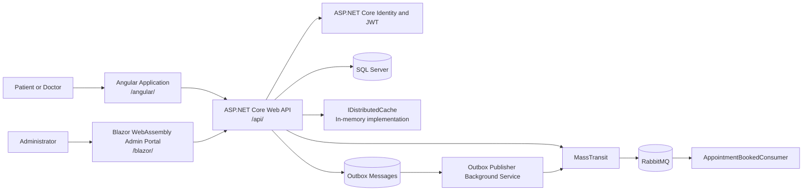
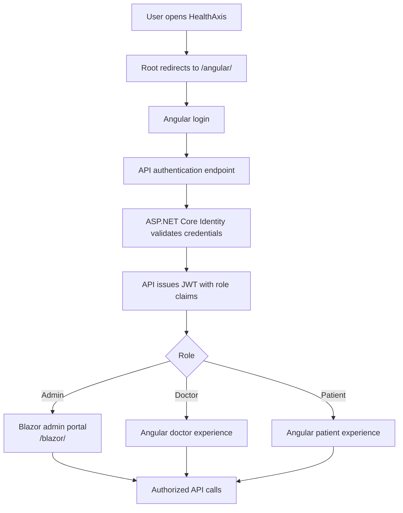
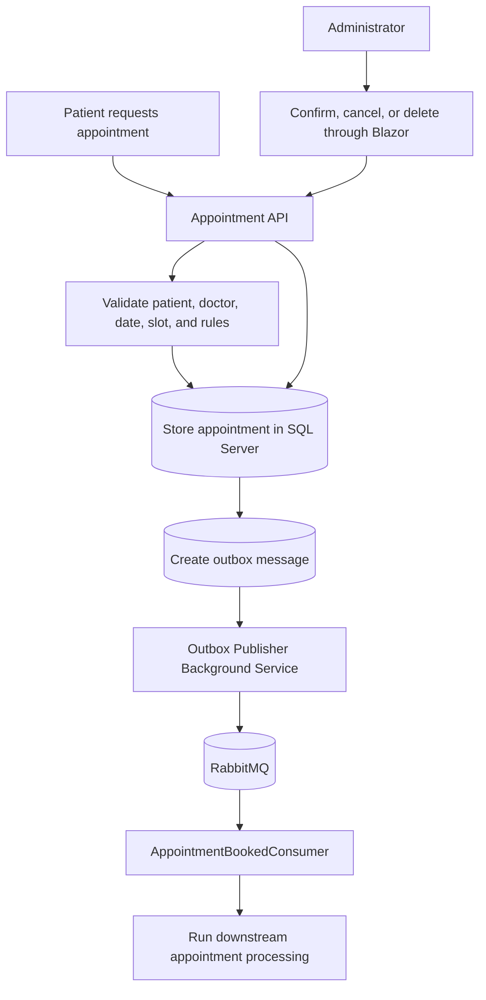
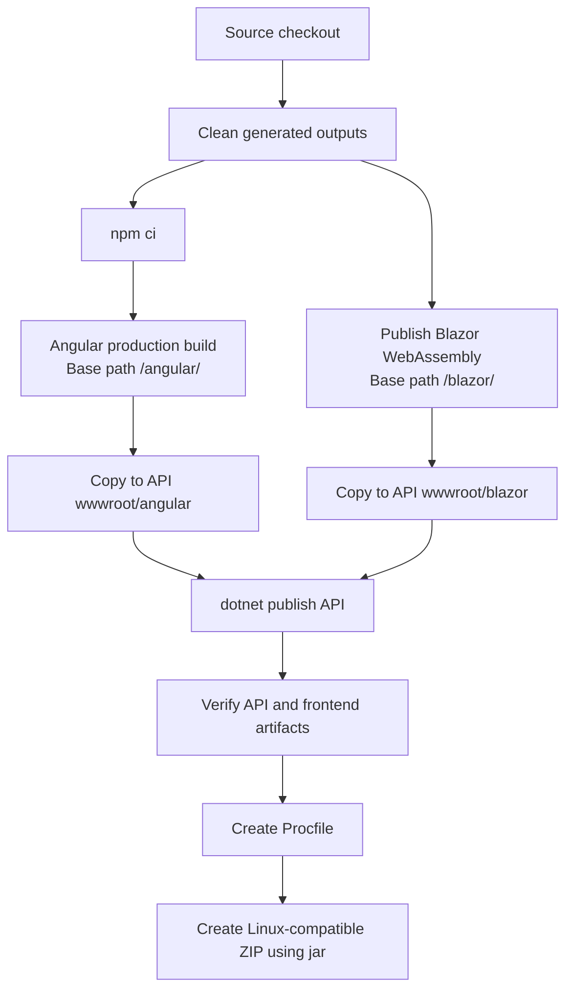
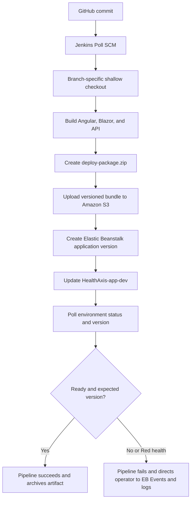
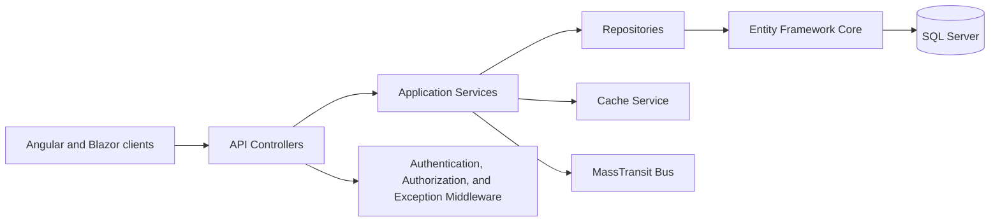

# HealthAxis

> A full-stack healthcare management platform for patients, doctors, and administrators, built with ASP.NET Core, Angular, Blazor WebAssembly, SQL Server, RabbitMQ, AWS Elastic Beanstalk, and Jenkins.


> [!IMPORTANT]
> **Security notice:** Never commit passwords, AWS keys, JWT signing keys, database connection strings, RabbitMQ credentials, certificate bundles, or access tokens. Use local environment variables or user secrets for development, Jenkins Credentials for CI/CD, and AWS Elastic Beanstalk environment properties for deployed environments.

## Quick Start

```powershell
git clone https://github.com/bootcamp-hackerearth/UST-Live-01.git
cd UST-Live-01
git checkout Feature/Sprint5_Pod1_Ayushi

dotnet restore .\HealthAxisApi\HealthAxisCore_Api.csproj
powershell.exe -NoProfile -ExecutionPolicy Bypass -File .\build-frontends.ps1
dotnet run --project .\HealthAxisApi\HealthAxisCore_Api.csproj
```

After startup, use the URL printed by ASP.NET Core:

- `/` redirects to the Angular application
- `/angular/` serves the Angular frontend
- `/blazor/` serves the Blazor WebAssembly admin portal
- `/swagger/` is available when the API runs in the Development environment

SQL Server and RabbitMQ must be reachable and correctly configured before the API can start successfully.

## Table of Contents

- [Overview](#overview)
- [Problem Statement](#problem-statement)
- [Solution Overview](#solution-overview)
- [Key Capabilities](#key-capabilities)
- [User Roles and Workflows](#user-roles-and-workflows)
- [Runtime Architecture](#runtime-architecture)
- [Flow Diagrams](#flow-diagrams)
- [Technology Stack](#technology-stack)
- [Project Structure](#project-structure)
- [Authentication and Authorization](#authentication-and-authorization)
- [Frontend Hosting Model](#frontend-hosting-model)
- [Database](#database)
- [Event-Driven Messaging and Background Services](#event-driven-messaging-and-background-services)
- [Caching](#caching)
- [Error Handling and Logging](#error-handling-and-logging)
- [Prerequisites](#prerequisites)
- [Configuration](#configuration)
- [Local Setup](#local-setup)
- [Build and Publish](#build-and-publish)
- [Testing](#testing)
- [CI/CD Pipeline](#cicd-pipeline)
- [AWS Deployment](#aws-deployment)
- [Security](#security)
- [Troubleshooting](#troubleshooting)
- [Screenshots](#screenshots)
- [Known Limitations](#known-limitations)
- [Future Enhancements](#future-enhancements)
- [Repository Hygiene](#repository-hygiene)
- [Git Workflow and Contributing](#git-workflow-and-contributing)
- [License](#license)
- [Acknowledgements](#acknowledgements)

## Overview

HealthAxis is a full-stack healthcare platform that combines a user-facing Angular application, an administrator-facing Blazor WebAssembly portal, and an ASP.NET Core Web API. The API serves both frontend bundles from one deployment artifact while centralizing authentication, authorization, persistence, appointment processing, messaging, caching, background work, and structured logging.

The application is designed for:

- Patients and doctors using the Angular experience
- Administrators managing operational data through the Blazor portal
- Developers maintaining a layered .NET backend
- DevOps engineers deploying one Linux-compatible bundle to AWS Elastic Beanstalk

## Problem Statement

Healthcare workflows are often distributed across disconnected systems and interfaces. This fragmentation can make authentication, doctor discovery, appointment management, patient administration, and operational oversight difficult to maintain consistently.

HealthAxis addresses the following challenges:

- Patients need a clear experience for authentication, doctor discovery, booking, and appointment visibility.
- Doctors need access to relevant schedules and healthcare workflows.
- Administrators need a secure portal for doctors, patients, appointments, account status, and related operational data.
- Backend operations must be role-aware, maintainable, observable, and deployable.
- Appointment processing must support reliable asynchronous messaging.
- Angular, Blazor, and the API must be deployable as one application while preserving separate frontend experiences.

## Solution Overview

HealthAxis provides:

- An Angular frontend hosted under `/angular/`
- A Blazor WebAssembly administrator portal hosted under `/blazor/`
- An ASP.NET Core Web API serving `/api/...` endpoints
- SQL Server persistence through Entity Framework Core
- ASP.NET Core Identity and JWT-based authentication
- Role-based authorization for protected functionality
- RabbitMQ integration through MassTransit
- An outbox publisher for more reliable event publication
- Process-local distributed cache abstractions
- Serilog request and application logging
- Automated Windows-based Jenkins builds and AWS Elastic Beanstalk deployments

The production build copies both frontend bundles into the API's `wwwroot` directory. The resulting API publish output becomes a single Elastic Beanstalk source bundle.

## Key Capabilities

### Administrator Portal

- Protected administrator pages using role authorization
- Operational dashboard
- Doctor directory with searching, filtering, and pagination
- Add and edit doctor profiles
- Activate and deactivate doctor accounts
- Doctor on-leave visibility where supported by the API
- Temporary password display after doctor creation
- Clipboard actions for temporary passwords and login details
- Doctor-specific appointment modal
- Patient directory and patient details
- Appointment directory with search, date filtering, status filtering, and pagination
- Confirm pending appointments
- Cancel eligible appointments with a reason
- Delete appointments
- Visual status indicators and status legends

### Angular Experience

- Authentication and role-aware navigation
- Patient and doctor experiences implemented through Angular routes and components
- Administrator handoff to the Blazor portal where supported by the authentication flow
- Static hosting under the `/angular/` base path

> Inspect the current Angular routes and components before documenting additional patient or doctor workflows as completed features.

### Backend

- RESTful ASP.NET Core controllers
- Service and repository layers
- Entity Framework Core persistence
- ASP.NET Core Identity
- JWT token generation and validation
- Domain-specific appointment operations
- Doctor, patient, appointment, health-record, and doctor-leave abstractions
- AutoMapper object mapping
- Global exception handling
- Serilog request logging
- RabbitMQ messaging through MassTransit
- Hosted background services

## User Roles and Workflows

| Role | Primary Interface | Responsibilities |
|---|---|---|
| Administrator | Blazor WebAssembly | Manages doctors, patients, appointments, statuses, and administrative workflows |
| Doctor | Angular | Uses verified doctor-facing routes and healthcare workflows |
| Patient | Angular | Uses verified patient-facing routes, discovery, booking, and appointment workflows |

Role claims are issued in JWTs and enforced by the API and protected frontend pages. Blazor administrator pages use authorization declarations such as:

```razor
@attribute [Authorize(Roles = "Admin")]
```

## Runtime Architecture

HealthAxis uses a layered application architecture:

1. Angular and Blazor provide role-focused client experiences.
2. ASP.NET Core controllers receive HTTP requests.
3. Application services implement business operations.
4. Repositories provide persistence abstractions.
5. Entity Framework Core communicates with SQL Server.
6. MassTransit communicates with RabbitMQ.
7. Hosted services perform recurring or asynchronous work.
8. The API serves the generated frontend assets from `wwwroot`.

### Deployment Architecture

A single Elastic Beanstalk application hosts:

```text
/              -> redirects to /angular/
/api/...       -> ASP.NET Core API controllers
/angular/...   -> Angular application and SPA routes
/blazor/...    -> Blazor WebAssembly application and SPA routes
```

The frontend applications remain logically separate but are packaged with the API for one operational deployment.

## Flow Diagrams

### 1. High-Level System Architecture



### 2. Authentication and Role Routing



### 3. Appointment Workflow



### 4. Static Hosting and Request Routing


### 5. Local Build and Packaging



### 6. Jenkins to Elastic Beanstalk Deployment



### 7. Backend Layering



## Technology Stack

### Backend

- C#
- .NET 10
- ASP.NET Core Web API
- Entity Framework Core
- SQL Server
- ASP.NET Core Identity
- JWT bearer authentication
- AutoMapper
- Serilog
- Swagger/OpenAPI

### Frontend

- Angular
- TypeScript
- HTML and CSS
- Blazor WebAssembly
- Razor components
- JavaScript interop for browser features such as confirmation, prompts, and clipboard access

### Event-Driven Messaging and Background Services

- RabbitMQ
- MassTransit
- `AppointmentBookedConsumer`
- `OutboxPublisherBackgroundService`
- `HeartbeatService`
- `NotificationCleanupService`
- `DoctorAvailabilityMonitorService`

### Caching

- `IDistributedCache`
- `ICacheService`
- In-memory distributed-cache implementation

### DevOps and Cloud

- Git and GitHub
- Jenkins Declarative Pipeline
- PowerShell and Windows batch commands
- AWS CLI v2
- Amazon S3
- AWS Elastic Beanstalk on Linux
- JDK `jar` for Linux-compatible ZIP creation

### Testing and Quality

- .NET test project: `HealthAxisCore_Api.Tests`
- Coverage and SonarScanner artifacts exist in the development workspace, but exact test framework, coverage command, and SonarQube workflow must be verified from the repository before being documented as active automation.

## Project Structure

```text
UST-Live-01/
├── HealthAxisApi/
│   ├── BackgroundServices/
│   ├── Consumers/
│   ├── Controllers/
│   ├── Data/
│   ├── Mappings/
│   ├── Middleware/
│   ├── Models/
│   ├── Repositories/
│   ├── Services/
│   ├── wwwroot/
│   │   ├── angular/          # Generated
│   │   └── blazor/          # Generated
│   └── HealthAxisCore_Api.csproj
├── HealthAxis_AngularProj/  # Angular application
├── HealthAxisAdminLayout/   # Blazor WebAssembly admin portal
├── HealthAxis_Shared/       # Shared DTOs and enums
├── HealthAxisCore_Api.Tests/
├── build-frontends.ps1
├── Jenkinsfile
├── HealthAxisApi.slnx
└── README.md
```

### Project Responsibilities

| Path | Responsibility |
|---|---|
| `HealthAxisApi/` | API, persistence, authentication, business services, messaging, middleware, logging, and static hosting |
| `HealthAxis_AngularProj/` | Patient- and doctor-facing Angular experience |
| `HealthAxisAdminLayout/` | Blazor WebAssembly administrator portal |
| `HealthAxis_Shared/` | DTOs, enums, and shared .NET contracts |
| `HealthAxisCore_Api.Tests/` | API automated tests, subject to source verification |
| `build-frontends.ps1` | Reproducible frontend build, copy, and validation workflow |
| `Jenkinsfile` | CI/CD build and AWS deployment pipeline |

## Authentication and Authorization

HealthAxis uses ASP.NET Core Identity with `ApplicationUser`, `IdentityRole`, and Entity Framework stores. JWT bearer authentication validates:

- Issuer
- Audience
- Token lifetime
- Signing key
- Signature
- Zero clock skew

Roles and the administrator account are seeded during application startup through `RoleSeeder` and `AdminSeeder`.

Protected administrator pages use role authorization. API controllers and other routes should enforce equivalent policies where required.

### JWT Configuration

```text
Jwt__Key=<STRONG_JWT_SIGNING_KEY>
Jwt__Issuer=<JWT_ISSUER>
Jwt__Audience=<JWT_AUDIENCE>
```

If the project uses a token-duration setting, configure:

```text
Jwt__DurationInMinutes=<TOKEN_DURATION>
```

Never log JWTs or commit the signing key.

## Frontend Hosting Model

The API statically hosts both client applications:

| Path | Behavior |
|---|---|
| `/` | Redirects to `/angular/` |
| `/api/...` | Maps to API controllers |
| `/angular` | Redirects to `/angular/` |
| `/angular/...` | Serves Angular assets or `angular/index.html` for SPA routes |
| `/blazor` | Redirects to `/blazor/` |
| `/blazor/...` | Serves Blazor assets or `blazor/index.html` for SPA routes |

Angular must be built with `/angular/` as the base path. Blazor must use `/blazor/` as its base path. Direct browser refreshes on nested frontend routes depend on the ASP.NET Core SPA fallback mappings.

Generated files are copied into:

```text
HealthAxisApi/wwwroot/angular
HealthAxisApi/wwwroot/blazor
```

These directories are generated artifacts and should not be committed.

## Database

HealthAxis uses SQL Server through Entity Framework Core and `HealthAppDbContext`. The API reads its connection string from:

```text
ConnectionStrings:DefaultConnection
```

A safe environment-variable example is:

```text
ConnectionStrings__DefaultConnection=Server=<SQL_SERVER_HOST>,1433;Database=<DATABASE_NAME>;User Id=<DATABASE_USER>;Password=<DATABASE_PASSWORD>;Encrypt=True;TrustServerCertificate=True
```

The backend registers a generic repository plus domain repositories for patients, doctors, appointments, health records, and doctor leave.

Before adding migration commands to this document, verify that EF Core migrations are present and identify the correct startup and migrations projects.

## Event-Driven Messaging and Background Services

MassTransit connects the API to RabbitMQ. The application registers `AppointmentBookedConsumer` and configures the queue:

```text
appointment-booked-queue
```

Consumer processing uses three retries at five-second intervals. This protects consumer-side processing from temporary failures.

The `OutboxPublisherBackgroundService` reads pending or retryable failed outbox records and publishes them through MassTransit. The outbox addresses publisher-side reliability, while the consumer retry addresses failures after a message reaches the consumer.

### RabbitMQ Configuration

```text
RabbitMQ__Host=<RABBITMQ_HOST>
RabbitMQ__Username=<RABBITMQ_USERNAME>
RabbitMQ__Password=<RABBITMQ_PASSWORD>
```

The host uses the `/` virtual host in the current configuration. Hosted-service shutdown has a 30-second timeout.

Additional hosted services include:

- `HeartbeatService`
- `NotificationCleanupService`
- `DoctorAvailabilityMonitorService`
- `OutboxPublisherBackgroundService`

Inspect these services before describing their exact schedules, retention periods, or side effects.

## Caching

Application caching is exposed through `ICacheService` and `IDistributedCache`. The current configuration uses:

```csharp
services.AddDistributedMemoryCache();
```

This cache is local to one API process. It is appropriate for a single-process deployment but is not shared across multiple Elastic Beanstalk instances. Horizontal scaling should use a shared distributed cache such as a managed Redis-compatible service.

## Error Handling and Logging

HealthAxis uses Serilog for bootstrap and application logging. Configuration is loaded from application configuration and registered services.

HTTP request logs include:

- Request method
- Request path
- Response status code
- Elapsed time

Logging levels are selected as follows:

- Successful responses: Information
- 4xx responses: Warning
- 5xx responses and exceptions: Error

`GlobalExceptionHandler` centralizes unhandled exception processing. Swagger/OpenAPI is enabled only in the Development environment.

Console output can be collected through Elastic Beanstalk logs. A dedicated health-check endpoint is recommended if one is not already implemented.

## Prerequisites

### Required for Local Development

- Git
- .NET 10 SDK
- Node.js and npm compatible with the committed Angular lock file
- PowerShell
- SQL Server access
- RabbitMQ access

### Required for Deployment Work

- Jenkins on Windows
- AWS CLI v2
- JDK with the `jar` command
- AWS IAM permissions for the deployment bucket and Elastic Beanstalk resources
- Corporate CA certificate bundle where TLS inspection is present

> `npm ci` requires `package.json` and `package-lock.json` to be synchronized. If they differ, regenerate and commit the lock file before running CI.

## Configuration

ASP.NET Core converts double underscores in environment-variable names to nested configuration separators.

| Key | Purpose | Required | Development Source | Production Source |
|---|---|---:|---|---|
| `ASPNETCORE_ENVIRONMENT` | Runtime environment | Yes | Shell or launch settings | Elastic Beanstalk environment property |
| `ConnectionStrings__DefaultConnection` | SQL Server connection | Yes | User secrets or local environment | Elastic Beanstalk environment property or secret manager |
| `Jwt__Key` | JWT signing key | Yes | User secrets | Secret manager or protected environment property |
| `Jwt__Issuer` | JWT issuer | Yes | Local configuration | Elastic Beanstalk environment property |
| `Jwt__Audience` | JWT audience | Yes | Local configuration | Elastic Beanstalk environment property |
| `Jwt__DurationInMinutes` | Token duration, if used | Verify | Local configuration | Elastic Beanstalk environment property |
| `RabbitMQ__Host` | RabbitMQ server | Yes | Local environment | Elastic Beanstalk environment property |
| `RabbitMQ__Username` | RabbitMQ username | Yes | User secrets | Protected environment property |
| `RabbitMQ__Password` | RabbitMQ password | Yes | User secrets | Protected environment property |
| `NavigationSettings__AngularLoginUrl` | Blazor navigation to Angular login | Verify | Blazor settings | Generated Blazor configuration |
| `Serilog__...` | Logging levels and sinks | As configured | `appsettings` | Environment-specific configuration |

Do not commit production credentials to `appsettings.json`, `appsettings.Production.json`, `.env`, or frontend configuration files.

## Local Setup

### 1. Clone and Select the Branch

```powershell
git clone https://github.com/bootcamp-hackerearth/UST-Live-01.git
cd UST-Live-01
git checkout Feature/Sprint5_Pod1_Ayushi
```

After the feature branch is merged, update these instructions to use `main`.

### 2. Configure Local Secrets

Use environment variables, .NET user secrets, or an uncommitted local settings file. Example PowerShell session variables:

```powershell
$env:ConnectionStrings__DefaultConnection = "Server=<SQL_SERVER_HOST>,1433;Database=<DATABASE_NAME>;User Id=<DATABASE_USER>;Password=<DATABASE_PASSWORD>;Encrypt=True;TrustServerCertificate=True"
$env:Jwt__Key = "<STRONG_JWT_SIGNING_KEY>"
$env:Jwt__Issuer = "<JWT_ISSUER>"
$env:Jwt__Audience = "<JWT_AUDIENCE>"
$env:RabbitMQ__Host = "<RABBITMQ_HOST>"
$env:RabbitMQ__Username = "<RABBITMQ_USERNAME>"
$env:RabbitMQ__Password = "<RABBITMQ_PASSWORD>"
```

### 3. Restore the API

```powershell
dotnet restore .\HealthAxisApi\HealthAxisCore_Api.csproj
```

### 4. Build Both Frontends

```powershell
powershell.exe -NoProfile -ExecutionPolicy Bypass -File .\build-frontends.ps1
```

Verify:

```powershell
Test-Path .\HealthAxisApi\wwwroot\angular\index.html
Test-Path .\HealthAxisApi\wwwroot\blazor\index.html
Test-Path .\HealthAxisApi\wwwroot\blazor\_framework
```

### 5. Run the Application

```powershell
dotnet run --project .\HealthAxisApi\HealthAxisCore_Api.csproj
```

Use the base URL reported by the terminal. For example:

```text
<LOCAL_API_URL>/
<LOCAL_API_URL>/angular/
<LOCAL_API_URL>/blazor/
<LOCAL_API_URL>/swagger/
```

Swagger is enabled only in Development.

### 6. Independent Frontend Development

Before documenting independent Angular or Blazor launch commands, verify the current scripts, development ports, API base URLs, and authentication behavior from the source configuration.

## Build and Publish

The production build sequence is:

1. Remove previous generated outputs.
2. Run `npm ci` in the Angular project.
3. Build Angular for `/angular/`.
4. Publish Blazor WebAssembly for `/blazor/`.
5. Copy Angular assets to `HealthAxisApi/wwwroot/angular`.
6. Copy Blazor assets to `HealthAxisApi/wwwroot/blazor`.
7. Publish the API in Release configuration.
8. Verify API binaries and both frontend bundles.
9. Create a root-level `Procfile`.
10. Create a Linux-compatible ZIP from inside the publish directory.

### Build Frontends

```powershell
powershell.exe -NoProfile -ExecutionPolicy Bypass -File .\build-frontends.ps1
```

### Publish API

```powershell
dotnet publish .\HealthAxisApi\HealthAxisCore_Api.csproj `
    -c Release `
    -o .\publish `
    --self-contained false
```

### Procfile

```text
web: dotnet HealthAxisCore_Api.dll
```

### Create the Deployment ZIP

Run from the repository root:

```powershell
Push-Location .\publish
jar -cMf ..\deploy-package.zip .
Pop-Location
```

The `jar` command is used because it consistently writes forward-slash ZIP paths on Windows. This avoids Linux extraction failures that can occur with archives containing Windows-style backslash entry paths.

Application files must be at the ZIP root. Do not place the entire `publish` directory inside the archive.

## Testing

A test project exists at:

```text
HealthAxisCore_Api.Tests/HealthAxisCore_Api.Tests.csproj
```

Run the test project with:

```powershell
dotnet test .\HealthAxisCore_Api.Tests\HealthAxisCore_Api.Tests.csproj
```

Before documenting test counts, categories, coverage thresholds, or pass rates, inspect the current test source and CI behavior.

Dependency checks should include:

```powershell
cd .\HealthAxis_AngularProj
npm audit
```

```powershell
dotnet list .\HealthAxisApi\HealthAxisCore_Api.csproj package --vulnerable
```

Review and remediate warnings carefully. Avoid applying breaking dependency upgrades without validating the application.

## CI/CD Pipeline

The Jenkins Declarative Pipeline runs on a Windows Jenkins host and deploys to AWS Elastic Beanstalk.

### Trigger

Jenkins uses Poll SCM approximately every five minutes:

```text
H/5 * * * *
```

The repository is public, so Git checkout currently requires no GitHub credential. A branch-specific refspec and depth-1 clone reduce checkout scope.

### Pipeline Stages

1. Clean the Jenkins workspace.
2. Check out the configured branch.
3. Verify .NET, Git, Node.js, npm, AWS CLI, Java, `jar`, and PowerShell.
4. Verify Node HTTPS access.
5. Verify required project files.
6. Remove generated outputs.
7. Restore API dependencies.
8. Run `build-frontends.ps1`.
9. Verify Angular and Blazor artifacts.
10. Publish the API.
11. Verify the publish output.
12. Create the `Procfile`.
13. Create and inspect `deploy-package.zip`.
14. Verify AWS certificate trust and credentials.
15. Verify S3 and Elastic Beanstalk resources.
16. Upload a build-number-specific package to S3.
17. Create an Elastic Beanstalk application version.
18. Update the Elastic Beanstalk environment.
19. Poll until the expected version is Ready.
20. Display the final environment state and archive the package.

### Jenkins Credentials

| Credential ID | Type | Purpose |
|---|---|---|
| `aws-deploy-creds` | AWS Credentials | Deployment authentication |
| `aws-ca-bundle` | Secret File | Corporate CA bundle used by AWS CLI |

Never store either credential in the Jenkinsfile or repository.

### Corporate TLS Inspection

The Jenkins host may require:

```text
NODE_OPTIONS=--use-system-ca
```

AWS CLI may require `AWS_CA_BUNDLE` pointing to the Jenkins-managed Secret File. Never use `--no-verify-ssl` in the deployment pipeline.

If checkout intermittently fails with `curl 56`, `early EOF`, or an abrupt close, use a branch-specific shallow checkout, automatic retry, HTTP/1.1, and remove large generated binaries from Git tracking.

## AWS Deployment

Current deployment identifiers:

| Setting | Value |
|---|---|
| Region | `ap-southeast-2` |
| Elastic Beanstalk application | `HealthAxis-app` |
| Elastic Beanstalk environment | `HealthAxis-app-dev` |
| Platform | .NET on 64-bit Amazon Linux, exact version to verify |
| S3 deployment bucket | `<S3_DEPLOYMENT_BUCKET>` |

### Deployment Flow

1. Jenkins creates `deploy-package.zip`.
2. Jenkins uploads the ZIP to S3 using a unique build-number-based key.
3. Jenkins registers the S3 object as a new Elastic Beanstalk application version.
4. Jenkins updates `HealthAxis-app-dev` to that version.
5. Jenkins waits for `Ready` status and verifies the expected version label.
6. Operators review Elastic Beanstalk Health, Events, and logs.

A successful `update-environment` API response confirms only that AWS accepted the request. It does not prove the application deployed successfully or became healthy.

### Networking

The Elastic Beanstalk instance must reach:

- SQL Server on TCP 1433
- RabbitMQ on TCP 5672

Security groups should permit these connections from the Elastic Beanstalk instance security group, not from the public internet.

### Environment Configuration

Configure production values through Elastic Beanstalk environment properties or a managed secret service. Required values include the database connection, JWT settings, and RabbitMQ settings.

## Security

- Never commit secrets, tokens, passwords, private endpoints, or certificate bundles.
- Rotate any credential that has been exposed in source, logs, chat, screenshots, or command output.
- Prefer IAM roles and short-lived credentials over long-lived access keys where feasible.
- Apply least-privilege IAM permissions to deployment identities.
- Keep TLS certificate verification enabled.
- Store the corporate CA bundle as a Jenkins Secret File.
- Use a strong externally supplied JWT signing key.
- Do not log access tokens or authentication payloads.
- Use ASP.NET Core Identity for password hashing and account management.
- Enforce role authorization at API and UI boundaries.
- Restrict SQL Server and RabbitMQ access through VPC routing and security groups.
- Keep production configuration out of frontend bundles when the values are secret.
- Review npm and NuGet vulnerability reports.
- Keep CORS origins explicit. The current configuration includes verified local-development origins, while the deployed frontends and API use the same origin.
- Preserve global exception handling without returning sensitive internals to clients.

## Troubleshooting

| Symptom | Likely Cause | Resolution |
|---|---|---|
| Root URL returns 404 | No exact `/` endpoint | Add or verify the redirect from `/` to `/angular/` |
| Deep-link refresh returns 404 | Missing SPA fallback or frontend index | Verify fallback mappings and generated `index.html` files |
| `npm ci` reports lock mismatch | `package.json` and `package-lock.json` differ | Run a compatible npm version, regenerate the lock file, validate with `npm ci`, and commit it |
| Jenkins checkout fails with `curl 56` or `early EOF` | Corporate network interruption or large tracked artifacts | Use HTTP/1.1, checkout retry, depth-1 branch refspec, and remove generated binaries from Git |
| AWS CLI returns `CERTIFICATE_VERIFY_FAILED` | Corporate TLS issuer is absent from the AWS CLI bundle | Supply a validated CA bundle through `AWS_CA_BUNDLE` or a Jenkins Secret File |
| CDK cannot find credentials | Profile or Node TLS trust issue | Verify the profile, Node system CA trust, and credential scope |
| Jenkins reports success but EB is unhealthy | AWS accepted the update but application startup failed | Check Elastic Beanstalk Events, logs, Procfile, runtime, configuration, SQL, and RabbitMQ |
| SQL connection fails | Incorrect configuration or blocked TCP 1433 | Verify connection string, firewall, routing, and security-group source |
| RabbitMQ connection fails | Incorrect host, credentials, binding, or blocked TCP 5672 | Verify listener, virtual host, credentials, routing, and security groups |
| Blazor displays a date expression as text | Razor expression was split incorrectly | Wrap the complete method call in `@(...)` |
| Table action buttons overflow | Action column is too narrow | Use explicit column width, fixed action slots, and horizontal scrolling |
| Angular route or asset fails | Incorrect base href or output copy | Verify `/angular/` base path and generated API `wwwroot/angular` content |
| Blazor route or framework file fails | Incorrect base href or nested publish output | Verify `/blazor/`, copied `_framework`, and Blazor index configuration |


## Known Limitations

- The in-memory distributed cache is local to one API process.
- Multiple API instances require a shared cache for consistent cached state.
- Hosted services run inside the web process. Horizontal scaling may cause the same worker logic to run on every instance unless coordination is introduced.
- SQL Server and RabbitMQ availability depend on correct VPC routing and security groups.
- Poll SCM is less immediate than a webhook.
- The current Jenkins pipeline is Windows-specific and uses batch, PowerShell, and JDK `jar`.
- Corporate TLS inspection requires managed certificate trust for AWS CLI and potentially other tools.
- Dependency vulnerability warnings require active review and remediation.
- A dedicated health endpoint should be added if none exists.
- Exact test coverage and automated quality gates remain to be verified from source and CI configuration.

## Future Enhancements

- Replace the process-local cache with a shared distributed cache for multi-instance deployments.
- Add dedicated liveness and readiness endpoints.
- Add stronger integration and end-to-end test coverage.
- Remediate verified npm and NuGet vulnerability warnings.
- Move production secrets to AWS Secrets Manager or Systems Manager Parameter Store.
- Prefer instance roles or other short-lived AWS credentials for Jenkins where feasible.
- Add automatic deployment rollback.
- Separate background workers from the web process when scaling horizontally.
- Add centralized observability dashboards and alerts.
- Consider a GitHub webhook or managed CI alternative where network access permits it.
- Update branch references from the feature branch to `main` after the team merge workflow completes.

## Repository Hygiene

Generated and local-only files should not be committed:

```gitignore
.vs/
**/bin/
**/obj/
**/node_modules/
**/dist/
**/.angular/
artifacts/
publish/
testpublish/
backup-blazor-*/
HealthAxisApi/wwwroot/angular/
HealthAxisApi/wwwroot/blazor/
*.zip
Logs/
**/Logs/
TestResults/
coverage.xml
.sonar/
.sonarqube/
.scannerwork/
.env
.env.*
.aws/
.elasticbeanstalk/
```

Files that must remain committed include:

- `package-lock.json`
- `Jenkinsfile`
- `build-frontends.ps1`
- Angular source and configuration
- Blazor source and configuration
- API source
- Shared DTOs and enums
- Project and solution files

If a generated file was tracked before `.gitignore` was updated, remove it from the Git index with `git rm --cached` while preserving the local file where required.

## Git Workflow and Contributing

1. Fetch or pull the latest remote changes before starting.
2. Create or use the assigned feature branch.
3. Keep commits focused and use clear messages.
4. Do not commit generated outputs or secrets.
5. Run the frontend build, API build, and tests before pushing.
6. If the remote branch advances, use `git pull --rebase` carefully and resolve conflicts before pushing.
7. Open a pull request to `main` according to team policy.
8. Update the Jenkins branch configuration after merge if the deployment pipeline should follow `main`.

Example validation:

```powershell
powershell.exe -NoProfile -ExecutionPolicy Bypass -File .\build-frontends.ps1
dotnet build .\HealthAxisApi\HealthAxisCore_Api.csproj
dotnet test .\HealthAxisCore_Api.Tests\HealthAxisCore_Api.Tests.csproj
```

## License

`<REPLACE_WITH_LICENSE_INFORMATION>`

Until a license is added, do not assume the repository grants permission for reuse or redistribution.

## Acknowledgements

HealthAxis was developed as a full-stack healthcare and DevOps implementation exercise involving .NET, Angular, Blazor WebAssembly, SQL Server, RabbitMQ, AWS Elastic Beanstalk, and Jenkins CI/CD.

---

**Project status:** HealthAxis has an integrated Angular, Blazor WebAssembly, and ASP.NET Core deployment architecture with Jenkins-based AWS Elastic Beanstalk automation. Test coverage, dependency remediation, production health checks, scaling behavior, and final branch configuration should be verified and strengthened before production use.
