# HealthAxis

> A full-stack healthcare management platform for patients, doctors, and administrators, built with ASP.NET Core, Angular, Blazor WebAssembly, SQL Server, RabbitMQ, AWS Elastic Beanstalk, and Jenkins.


## Table of Contents

- [Problem Statement](#problem-statement)
- [Solution Overview](#solution-overview)
- [Key Capabilities](#key-capabilities)
- [User Roles and Workflows](#user-roles-and-workflows)
- [Runtime Architecture](#runtime-architecture)
- [Technology Stack](#technology-stack)
- [Project Structure](#project-structure)
- [Frontend Hosting Model](#frontend-hosting-model)
- [Authentication and Authorization](#authentication-and-authorization)
- [Database](#database)
- [Event-Driven Messaging](#event-driven-messaging)
- [Background Services](#background-services)
- [Logging and Observability](#logging-and-observability)
- [Responsive Design](#responsive-design)
- [API Overview](#api-overview)
- [Local Development](#local-development)
- [Configuration and Secrets](#configuration-and-secrets)
- [Build and Publish](#build-and-publish)
- [AWS Deployment](#aws-deployment)
- [Jenkins CI/CD](#jenkins-cicd)
- [Poll SCM](#poll-scm)
- [Security Considerations](#security-considerations)
- [Testing and Verification](#testing-and-verification)
- [Troubleshooting](#troubleshooting)
- [Screenshots](#screenshots)
- [Known Limitations](#known-limitations)
- [Future Enhancements](#future-enhancements)
- [Git Workflow](#git-workflow)
- [License](#license)
- [Acknowledgements](#acknowledgements)

## Problem Statement

Healthcare workflows are often fragmented across appointment systems, patient records, doctor availability tools, and administrative reports. This fragmentation creates manual effort for patients, clinical users, and administrators.

HealthAxis addresses this problem by providing role-based digital experiences through one platform:

- Patients can find doctors, review availability, book appointments, and access health records.
- Doctors can use a dedicated portal for appointment-related workflows.
- Administrators can centrally review doctors, patients, appointments, reports, and appointment status operations.

## Solution Overview

HealthAxis combines multiple applications and infrastructure components into a single deployable system:

- **HealthAxis.API** provides authentication, authorization, business logic, data access, background processing, RabbitMQ integration, static file hosting, and single-page application fallback routing.
- **HealthAxis.Angular** provides the public landing page, authentication, registration, patient portal, and doctor portal.
- **HealthAxis.Admin** provides the administrator portal as a Blazor WebAssembly application.
- **HealthAxis.Shared** contains shared .NET contracts and models.
- **SQL Server** stores application, domain, and ASP.NET Core Identity data.
- **RabbitMQ and MassTransit** support asynchronous appointment notification processing.
- **Serilog** provides structured console and rolling-file logging.
- **AWS Elastic Beanstalk** hosts the combined application behind NGINX.
- **Amazon S3** stores versioned deployment packages.
- **Jenkins** automates build, test, packaging, and deployment.

## Key Capabilities

- Role-based patient, doctor, and administrator experiences
- JWT access and refresh token authentication
- ASP.NET Core Identity integration
- Doctor search and specialization filtering
- Doctor availability and appointment booking
- Patient appointment and health-record views
- Administrative doctor, patient, and appointment reporting
- Asynchronous appointment-booked event processing
- Combined Angular, Blazor, and API hosting
- Mobile, tablet, and desktop responsive design
- Automated deployment to AWS Elastic Beanstalk

## User Roles and Workflows

### Public and Authentication

- Responsive landing page
- Patient registration
- User login
- JWT-based authentication
- Refresh-token support
- Role-based redirection
- Secure logout

### Patient Portal

- Responsive patient dashboard
- Appointment summary metrics
- Doctor search by name, ID, or specialization
- Specialization filtering
- Doctor experience, consultation fee, and availability information
- Appointment date and time-slot selection
- Appointment booking
- Upcoming and previous appointment views
- Health-history access
- Diagnoses, prescriptions, and consultation records
- Patient information and password-management pages where enabled

### Doctor Portal

- Responsive doctor portal
- Doctor dashboard
- Assigned appointment workflows
- Doctor-specific views and actions implemented by the application

### Administrator Portal

- Blazor WebAssembly administration dashboard
- Paginated doctor listing
- Paginated patient listing
- Appointment reports and pagination
- Appointment details by date
- Appointment confirmation and status operations
- Angular-to-Blazor administrator authentication callback
- Browser local-storage persistence for required administrator authentication data
- Responsive navigation and administrative data views

## Runtime Architecture

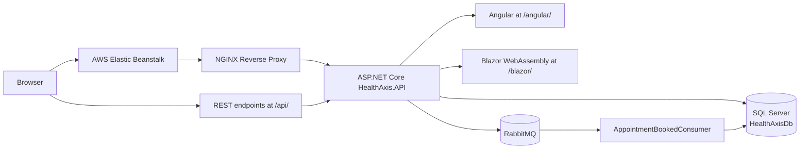

## Technology Stack

### Backend

- C#
- .NET 10
- ASP.NET Core Web API
- Entity Framework Core
- Microsoft SQL Server
- ASP.NET Core Identity
- JWT access and refresh tokens
- Role-based authorization
- MassTransit
- RabbitMQ
- Serilog
- Background hosted services

### Angular Frontend

- Angular
- TypeScript
- HTML and CSS
- Angular Router
- Reactive Forms
- Template-driven forms where appropriate
- Responsive mobile, tablet, and desktop layouts

### Blazor Frontend

- Blazor WebAssembly
- Razor components
- C#
- Bootstrap assets
- JavaScript interop
- Authentication callback and local-storage integration
- Responsive administrator layout

### Cloud and DevOps

- AWS Elastic Beanstalk
- Amazon EC2
- Amazon S3
- AWS IAM
- Amazon VPC and security groups
- Ubuntu server for SQL Server and RabbitMQ
- Jenkins Declarative Pipeline
- Git and GitHub
- AWS CLI
- Node.js and npm
- Java `jar` utility
- Jenkins Poll SCM

## Project Structure

```text
HealthAxis/
├── HealthAxis.Angular/          Angular public, patient, and doctor application
├── HealthAxis.Admin/            Blazor WebAssembly administrator application
├── HealthAxis API/              ASP.NET Core API and combined static host
├── HealthAxis.Shared/           Shared .NET contracts and models
├── HealthAxis.slnx              .NET solution definition
└── Jenkinsfile                  Jenkins Pipeline as Code
```

The Jenkins pipeline invokes `dotnet test` against `HealthAxis.slnx`. Any test projects included in the solution are executed by that command.

## Frontend Hosting Model

The ASP.NET Core API publishes and serves both frontend applications:

| Application | Base Path | Published Location |
|---|---|---|
| Angular | `/angular/` | `wwwroot/angular` |
| Blazor WebAssembly | `/blazor/` | `wwwroot/blazor` |
| REST API | `/api/` | ASP.NET Core endpoints |

Key behavior:

- Angular production output is generated into `HealthAxis API/wwwroot/angular`.
- Angular uses `/angular/` as its production base href.
- Blazor publish assets are copied into `HealthAxis API/wwwroot/blazor`.
- Blazor uses `/blazor/` as its base path.
- Browser API calls use relative `/api` URLs.
- No production frontend bundle should contain a hardcoded localhost API URL.
- SPA fallback routing supports refreshes and direct navigation for Angular and Blazor routes.

Example final publish layout:

```text
publish/
├── HealthAxis.API.dll
├── HealthAxis.API.deps.json
├── HealthAxis.API.runtimeconfig.json
├── appsettings.json
├── Procfile
└── wwwroot/
    ├── angular/
    │   ├── index.html
    │   ├── main-<HASH>.js
    │   └── styles-<HASH>.css
    └── blazor/
        ├── index.html
        ├── _framework/
        ├── css/
        ├── js/
        └── lib/
```

## Authentication and Authorization

### Authentication Flow

1. A user submits credentials through Angular.
2. HealthAxis.API validates the user using ASP.NET Core Identity.
3. The API returns access-token, refresh-token, role, and reference information.
4. Patient and doctor users continue to role-specific Angular routes.
5. Administrators are redirected to `/blazor/auth-callback` with an encoded authentication payload.
6. The Blazor callback validates the payload and role, stores required values in browser local storage, and navigates to `/blazor/dashboard`.
7. Protected API endpoints enforce JWT authentication and role authorization.

Because Blazor is hosted under `/blazor/`, internal navigation uses base-relative routes such as `dashboard` and `doctors`, not root-relative routes such as `/dashboard`.

### Bearer Authentication

Protected API requests use:

```http
Authorization: Bearer <ACCESS_TOKEN>
```

## Database

HealthAxis uses Microsoft SQL Server and Entity Framework Core.

### Database

```text
HealthAxisDb
```

The database contains ASP.NET Core Identity structures, including `AspNetUsers`, and domain entities such as:

- Doctors
- Patients
- Appointments
- Health records
- Notifications
- Other entities represented in the application model

### Application Database Identity

The deployed application uses a dedicated SQL login:

```text
healthaxis_app
```

The runtime account receives only the required permissions, including appropriate data-reader, data-writer, and execute permissions. The application does not use the `sa` account.

Safe production environment-variable example:

```text
ConnectionStrings__HealthAxisDb=Server=<PRIVATE_SQL_HOST>,1433;Database=HealthAxisDb;User Id=healthaxis_app;Password=<SQL_PASSWORD>;Encrypt=True;TrustServerCertificate=True;Connect Timeout=30;
```

## Event-Driven Messaging

RabbitMQ is the application message broker, and MassTransit provides transport integration.

### Appointment Notification Flow

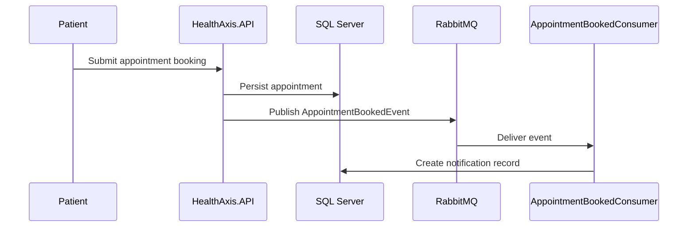

Key messaging details:

- Published event: `AppointmentBookedEvent`
- Consumer: `AppointmentBookedConsumer`
- Queue: `appointment-booked-notification-queue`
- AMQP port: `5672`
- Optional management port: `15672`
- Remote application user: `healthaxis_app`

The RabbitMQ `guest` user is not used for remote production connections.

A MassTransit Entity Framework outbox is a recommended future enhancement for consistency when database persistence succeeds but event publication fails.

## Background Services

HealthAxis includes background processing for:

- Application heartbeat logging
- Notification cleanup
- RabbitMQ consumption through MassTransit

Background-service failures are recorded through Serilog.

## Logging and Observability

The final runtime uses:

- Serilog Console sink
- Serilog rolling File sink
- Daily files such as `Logs/healthaxis-api-.log` where file logging is retained
- Elastic Beanstalk process output
- NGINX proxy logs
- Elastic Beanstalk deployment logs

Useful AWS log locations:

```text
/var/log/web.stdout.log
/var/log/nginx/access.log
/var/log/nginx/error.log
/var/log/eb-engine.log
```

### Removed Components

Elasticsearch, Kibana, and Redis were removed from the final runtime because they were not required by the completed deployment architecture.

The Elasticsearch Serilog sink was removed after the application attempted to connect to `localhost:9200` on an Elastic Beanstalk instance where no Elasticsearch service existed. Console and File sinks are used instead. Elastic Beanstalk captures console output in `/var/log/web.stdout.log`.

## Responsive Design

HealthAxis supports desktop, tablet, and mobile layouts, including:

- Responsive landing page
- Compact mobile header
- Mobile patient registration form
- Off-canvas patient navigation
- Hamburger menu and overlay
- Responsive patient dashboard cards
- Responsive doctor filters and cards
- Responsive appointment booking and time-slot selection
- Touch-friendly controls
- Full-width mobile actions
- Text wrapping and overflow protection
- Tablet grid layouts
- Responsive administrative navigation and data views

Recommended viewport checks:

```text
390 x 844
768 x 1024
1024 x 768
1366 x 768
```

## API Overview

The following list contains known representative endpoints. Inspect API controllers or Swagger/OpenAPI for the definitive endpoint set.

### Authentication

```http
POST /api/auth/login
```

### Doctors

```http
GET /api/doctors
GET /api/doctors/{doctorId}
GET /api/doctors/{doctorId}/availability?date=<DATE>
```

### Patient Appointments and Records

```http
GET  /api/appointments
POST /api/appointments
GET  /api/patients/me/health-records
```

### Administration

```http
GET /api/admin/doctors
GET /api/admin/patients
GET /api/admin/reports/appointments
GET /api/admin/reports/appointments/details?date=<DATE>
PUT /api/admin/appointments/{appointmentId}/confirm
```

## Local Development

### Prerequisites

Install the following on the development machine:

- Git
- .NET 10 SDK
- Node.js and npm
- Microsoft SQL Server
- RabbitMQ
- Optional `sqlcmd`
- Visual Studio or Visual Studio Code

Local configuration should normally use `localhost` for SQL Server and RabbitMQ. AWS private IP addresses are not reachable from a typical local workstation unless private VPC connectivity is configured.

### 1. Clone and Check Out the Branch

```cmd
git clone https://github.com/bootcamp-hackerearth/UST-Live-01.git
cd UST-Live-01
git switch Feature/Sprint5_Pod2_Aniket
```

### 2. Restore .NET Dependencies

```cmd
dotnet restore HealthAxis.slnx
```

### 3. Install Angular Dependencies

```cmd
cd "HealthAxis.Angular"
npm ci
cd ..
```

### 4. Configure Local Secrets

From the API project directory:

```cmd
cd "HealthAxis API"
dotnet user-secrets set "ConnectionStrings:HealthAxisDb" "Server=localhost,1433;Database=HealthAxisDb;User Id=<LOCAL_SQL_USER>;Password=<LOCAL_SQL_PASSWORD>;Encrypt=True;TrustServerCertificate=True;"
dotnet user-secrets set "RabbitMq:Host" "localhost"
dotnet user-secrets set "RabbitMq:VirtualHost" "/"
dotnet user-secrets set "RabbitMq:Username" "<LOCAL_RABBITMQ_USER>"
dotnet user-secrets set "RabbitMq:Password" "<LOCAL_RABBITMQ_PASSWORD>"
dotnet user-secrets set "Jwt:Key" "<LOCAL_JWT_SIGNING_KEY>"
cd ..
```

Never commit the secret values.

### 5. Start SQL Server and RabbitMQ

Start both services using the commands appropriate for the local operating system. Confirm SQL Server listens on port `1433` and RabbitMQ listens on port `5672`.

### 6. Build Angular

```cmd
cd "HealthAxis.Angular"
npm run build
cd ..
```

Angular production output is written into:

```text
HealthAxis API/wwwroot/angular
```

### 7. Publish and Copy Blazor

```cmd
dotnet publish "HealthAxis.Admin\HealthAxis.Admin.csproj" -c Release -o blazor-publish-temp
if exist "HealthAxis API\wwwroot\blazor" rmdir /S /Q "HealthAxis API\wwwroot\blazor"
mkdir "HealthAxis API\wwwroot\blazor"
robocopy "blazor-publish-temp\wwwroot" "HealthAxis API\wwwroot\blazor" /E
```

`robocopy` success return codes below `8` are nonfatal.

### 8. Run the API

```cmd
cd "HealthAxis API"
dotnet run
```

Use the URLs reported by the application, for example:

```text
https://localhost:<HTTPS_PORT>/angular/
https://localhost:<HTTPS_PORT>/blazor/
```

## Configuration and Secrets

ASP.NET Core reads configuration from multiple providers. Environment variables override matching `appsettings` values. Double underscores represent hierarchical separators.

| Environment Variable | Purpose |
|---|---|
| `ASPNETCORE_ENVIRONMENT` | Runtime environment name |
| `ConnectionStrings__HealthAxisDb` | SQL Server connection string |
| `RabbitMq__Host` | RabbitMQ hostname or private address |
| `RabbitMq__VirtualHost` | RabbitMQ virtual host |
| `RabbitMq__Username` | RabbitMQ application user |
| `RabbitMq__Password` | RabbitMQ application password |
| `Jwt__Issuer` | JWT issuer |
| `Jwt__Audience` | JWT audience |
| `Jwt__Key` | JWT signing secret |
| `Jwt__AccessTokenMinutes` | Access-token lifetime |
| `Jwt__RefreshTokenDays` | Refresh-token lifetime |

Production secrets belong in Elastic Beanstalk environment properties or a dedicated secret-management solution, not in Git.

## Build and Publish

### Build and Test the Solution

```cmd
dotnet restore HealthAxis.slnx
dotnet build HealthAxis.slnx -c Release --no-restore
dotnet test HealthAxis.slnx -c Release --no-build
```

### Publish the API

```cmd
if exist publish rmdir /S /Q publish
dotnet publish "HealthAxis API\HealthAxis.API.csproj" -c Release -o publish
echo web: dotnet HealthAxis.API.dll> publish\Procfile
```

### Create the Deployment ZIP

Run from the publish directory:

```cmd
cd publish
jar -cMf ..\deploy-package.zip .
cd ..
```

The `jar` utility creates forward-slash archive paths that Linux-based Elastic Beanstalk can extract reliably.

## AWS Deployment

### Environment

```text
Region: ap-south-1
Elastic Beanstalk application: HealthAxisAPI
Elastic Beanstalk environment: HealthAxisAPI-dev
```

### Deployment Architecture

- The combined .NET application runs on Elastic Beanstalk behind NGINX.
- SQL Server and RabbitMQ run on an Ubuntu EC2 instance in the same VPC.
- Elastic Beanstalk connects to those services through private networking.
- S3 stores Jenkins deployment ZIP files.
- Elastic Beanstalk environment properties supply configuration and secrets.

### Security Groups

- Allow SQL Server TCP `1433` from the Elastic Beanstalk EC2 instance security group.
- Allow RabbitMQ TCP `5672` from the Elastic Beanstalk EC2 instance security group.
- Do not open these ports to `0.0.0.0/0`.
- Restrict RabbitMQ management port `15672` to approved administrative sources.
- Public HTTP or HTTPS traffic is handled through Elastic Beanstalk.

## Jenkins CI/CD

### Pipeline Configuration

```text
Job: HealthAxis-Deploy
Repository: https://github.com/bootcamp-hackerearth/UST-Live-01.git
Branch: Feature/Sprint5_Pod2_Aniket
Pipeline file: Jenkinsfile
AWS credential ID: aws-deploy-creds
```

### CI/CD Flow

```mermaid
flowchart LR
    G[GitHub\nFeature/Sprint5_Pod2_Aniket] --> P[Jenkins Poll SCM]
    P --> A[Angular npm ci and build]
    A --> B[Blazor publish]
    B --> T[.NET restore, build, and test]
    T --> D[API publish]
    D --> Z[Create deployment ZIP]
    Z --> S3[Upload to Amazon S3]
    S3 --> V[Create Elastic Beanstalk version]
    V --> E[Deploy to HealthAxisAPI-dev]
```

### Pipeline Stages

1. Check out source.
2. Run `npm ci`.
3. Build Angular into `HealthAxis API/wwwroot/angular`.
4. Publish `HealthAxis.Admin` to a temporary folder.
5. Copy its `wwwroot` assets into `HealthAxis API/wwwroot/blazor`.
6. Restore `HealthAxis.slnx`.
7. Build in Release mode.
8. Run tests through `HealthAxis.slnx`.
9. Publish `HealthAxis.API`.
10. Generate a `Procfile` with `web: dotnet HealthAxis.API.dll`.
11. Verify Angular and Blazor assets.
12. Create `deploy-package.zip` with `jar -cMf`.
13. Upload the package to S3.
14. Create an Elastic Beanstalk application version.
15. Update `HealthAxisAPI-dev`.
16. Wait for the environment update and display deployment status.

### CI/CD Security

- Jenkins uses a dedicated IAM user.
- AWS keys are stored in Jenkins Credentials.
- The Jenkinsfile references only `aws-deploy-creds`.
- The IAM identity should have only the S3 and Elastic Beanstalk permissions it needs.
- GitHub credentials, when required, belong in Jenkins Credentials.
- Pipeline steps must never print secrets.

## Poll SCM

The Jenkins job polls the configured repository and branch using:

```text
H/5 * * * *
```

Jenkins checks for changes approximately every five minutes. A detected push starts a build with:

```text
Started by an SCM change
```

The Jenkins Windows service and host computer must remain running and connected to GitHub and AWS.

## Security Considerations

- Do not commit SQL, RabbitMQ, JWT, AWS, or GitHub secrets.
- Use a dedicated SQL login rather than `sa`.
- Use a dedicated RabbitMQ user rather than remote `guest` access.
- Store production configuration in Elastic Beanstalk environment properties.
- Restrict database and broker ports by security-group source.
- Use role-based authorization for protected endpoints.
- Avoid exposing token payloads in logs.
- Rotate Jenkins IAM keys according to organizational policy.
- Review browser local-storage usage as part of security testing.

## Testing and Verification

### Automated Validation

- `dotnet test HealthAxis.slnx`
- Angular production build
- Blazor publish validation
- API publish validation
- Jenkins package and deployment validation

### Manual Validation

- Public landing and registration workflows
- Patient, doctor, and administrator login
- Role-based routing
- Doctor search and filtering
- Appointment date and time-slot selection
- Booking persistence
- Health-record retrieval
- Administrator reports and status operations
- Browser Network-tab checks
- Mobile and tablet layouts
- SQL data checks
- RabbitMQ queue and consumer checks

### Deployment Checklist

- [ ] Jenkins finishes successfully
- [ ] Elastic Beanstalk runs the version associated with the Jenkins build
- [ ] Environment status is `Ready`
- [ ] Environment health returns to `Green`
- [ ] Angular loads under `/angular/`
- [ ] Blazor loads under `/blazor/`
- [ ] Login succeeds
- [ ] Patient API requests succeed
- [ ] Administrator authentication reaches `/blazor/auth-callback`
- [ ] Administrator dashboard loads under `/blazor/dashboard`
- [ ] Appointment booking succeeds
- [ ] RabbitMQ consumes the appointment event
- [ ] Notification processing completes
- [ ] Browser requests contain no localhost production URLs

## Troubleshooting

### Jenkins Cannot Find `master` or `main`

**Cause:** The configured branch does not exist.

**Fix:** Configure:

```text
*/Feature/Sprint5_Pod2_Aniket
```

### Jenkins Cannot Find `Jenkinsfile`

**Cause:** Missing file, incorrect case, or a file named `Jenkinsfile.txt`.

**Fix:** Use an extensionless file named exactly `Jenkinsfile` at the repository root.

### `npm ci` Reports an Out-of-Sync Lock File

Run locally:

```cmd
cd "HealthAxis.Angular"
npm install
npm ci
```

Commit the updated `package-lock.json` and push it.

### Angular Build Exceeds Budgets

Review the production budgets in `angular.json`. Either reduce bundle and component CSS sizes or deliberately update warning and error limits.

### `HealthAxis.sln` Is Missing

The solution uses:

```text
HealthAxis.slnx
```

Use that filename for restore, build, and test commands.

### Angular `index.html` Is Missing from the API Publish

Ensure Angular uses:

```json
"baseHref": "/angular/",
"outputPath": {
  "base": "../HealthAxis API/wwwroot/angular",
  "browser": ""
}
```

### Blazor Internal Routes Return 404

Use base-relative routes such as `dashboard` and avoid `forceLoad` for internal navigation.

### Browser Calls Localhost After Deployment

Use relative `/api` URLs, rebuild Angular, republish the API, redeploy, and clear the browser cache.

### SQL Connection String Is Missing

Configure:

```text
ConnectionStrings__HealthAxisDb
```

in Elastic Beanstalk environment properties.

### SQL Connection-String Format Error

Check for malformed syntax, extra quotes, or an unescaped semicolon in a password. Quote only the password value when required.

### `UPDATE` Permission Is Denied on `AspNetUsers`

Grant the dedicated application database user the required runtime write permission or role membership. Do not grant unnecessary `db_owner` access.

### RabbitMQ `BrokerUnreachableException`

Verify:

- RabbitMQ is running and listening on `5672`
- The hostname is correct
- Credentials and virtual-host permissions are valid
- VPC routing is correct
- The target security group allows `5672` from the Elastic Beanstalk instance security group
- Host firewall rules permit the connection

### Elastic Beanstalk Is Degraded

Inspect:

- Health causes
- Elastic Beanstalk events
- `/var/log/web.stdout.log`
- `/var/log/nginx/error.log`
- `/var/log/eb-engine.log`

### Elasticsearch Connection Is Refused at `localhost:9200`

Remove the active `Elastic.Serilog.Sinks` configuration and use Console and File sinks. Elasticsearch, Kibana, and Redis are not part of the final runtime.

### Jenkins Succeeds but Live Changes Do Not Appear

Verify:

- The deployed Elastic Beanstalk version
- Elastic Beanstalk Events
- The source repository and branch
- The generated frontend bundle hash
- Browser cache and service-worker state

## Screenshots

Add screenshots under `docs/images/` when available.

```markdown
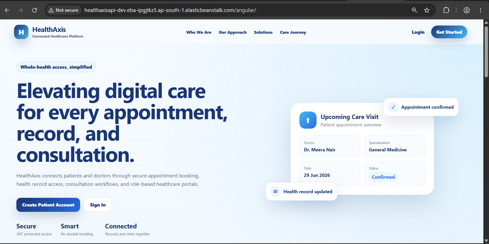

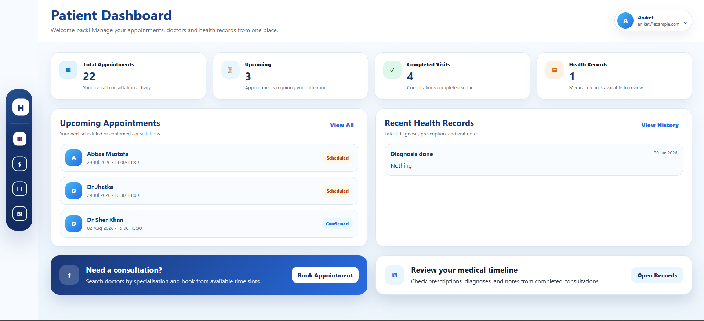
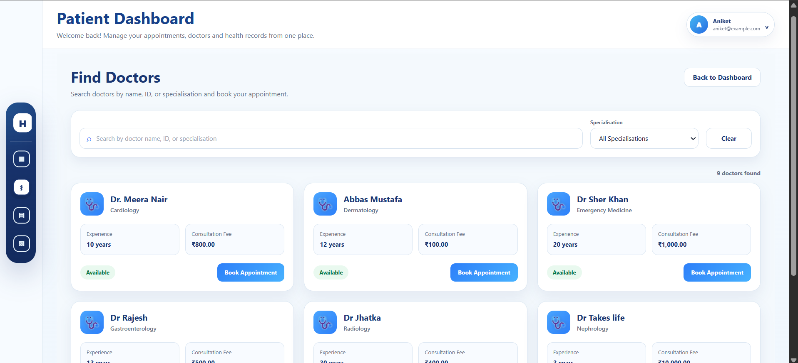
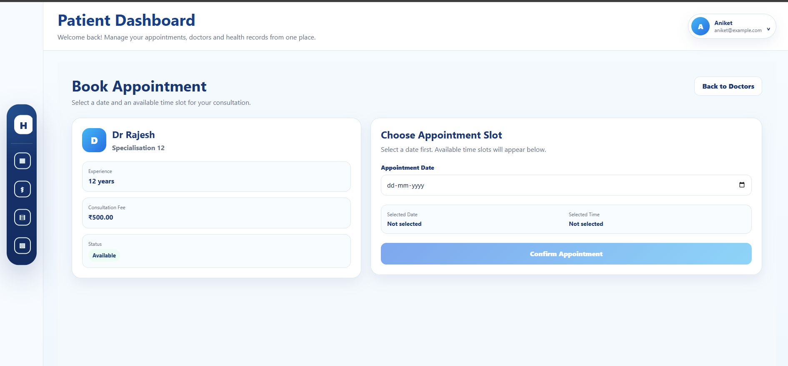
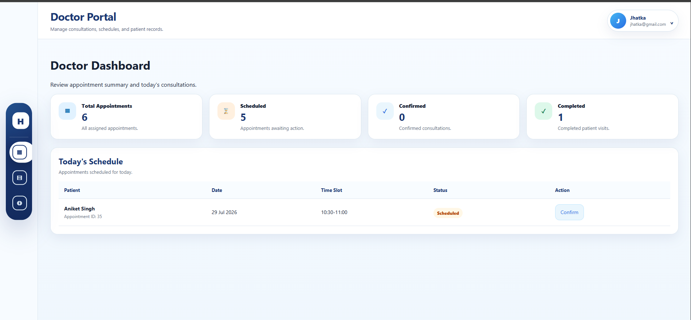
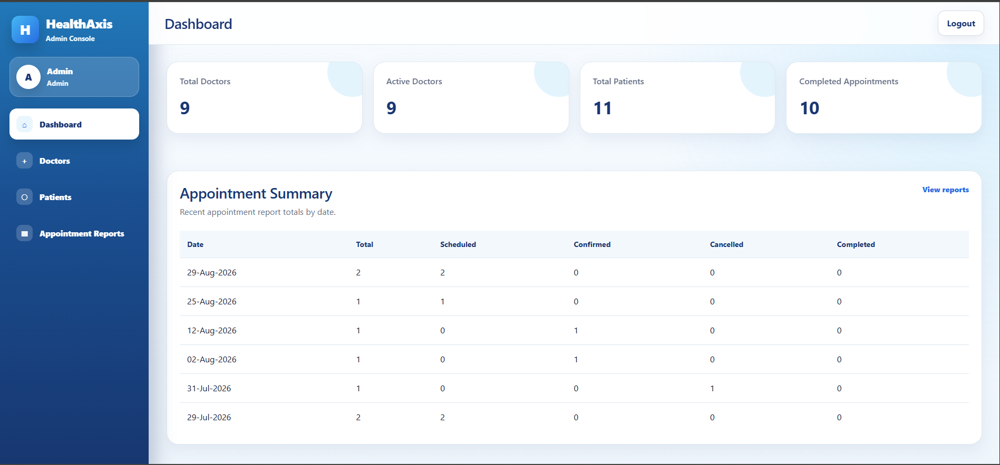
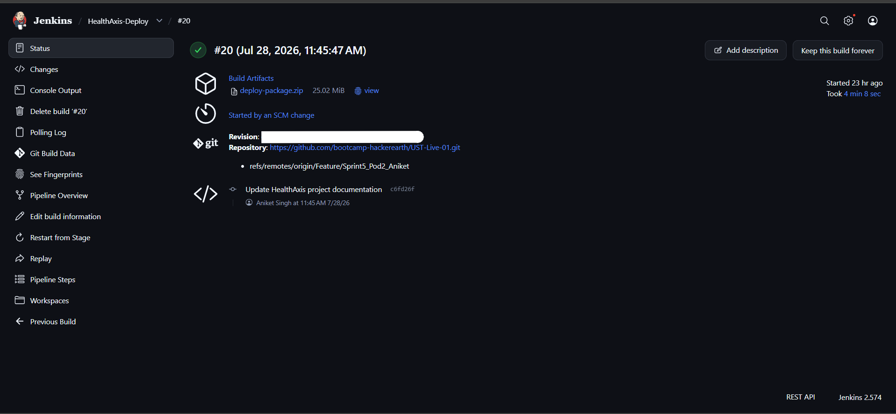
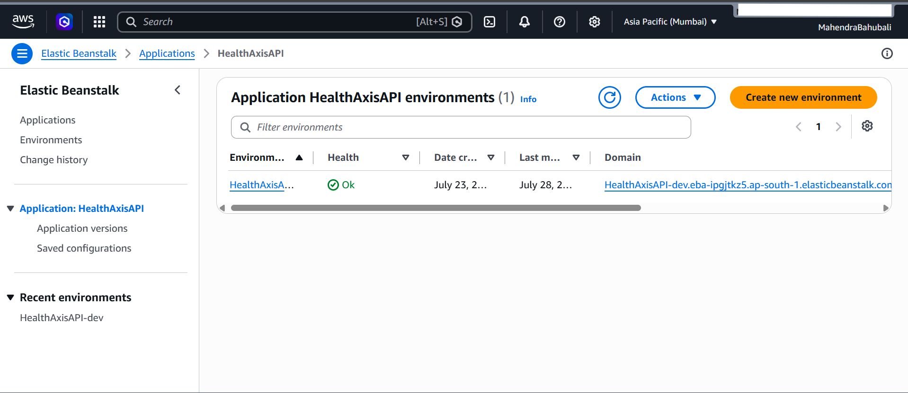
```

## Known Limitations

- The deployment currently depends on a Jenkins host that must remain running for Poll SCM.
- SQL Server and RabbitMQ are self-managed on an Ubuntu EC2 instance.
- Frontend end-to-end testing is not yet documented as automated.
- Deployment packages and Elastic Beanstalk application versions require a retention strategy.
- Database and event publication consistency can be improved with an outbox pattern.

## Future Enhancements

- Custom domain with HTTPS and a managed certificate
- AWS Secrets Manager or Systems Manager Parameter Store
- Managed database and broker services where appropriate
- MassTransit Entity Framework outbox
- Expanded automated test coverage
- Frontend end-to-end tests
- Dedicated health-check endpoint
- Stronger post-deployment smoke tests
- Blue/green or rolling deployment strategy
- CloudWatch log streaming, metrics, and alarms
- Automatic S3 and Elastic Beanstalk version cleanup
- Accessibility audit
- Performance and bundle-size optimization
- Progressive Web App support if required

## Git Workflow

Current development and deployment branch:

```text
Feature/Sprint5_Pod2_Aniket
```

Recommended workflow:

```cmd
git fetch origin
git switch Feature/Sprint5_Pod2_Aniket
git pull
git status
git add <CHANGED_FILES>
git commit -m "Describe the focused change"
git push origin Feature/Sprint5_Pod2_Aniket
```

A push is detected by Jenkins Poll SCM and starts the deployment pipeline.

Do not commit:

- `node_modules`
- `bin`
- `obj`
- `publish`
- Temporary Blazor publish folders
- `TestResults`
- Runtime logs
- Deployment ZIP files
- User secrets
- Connection strings containing passwords
- AWS keys
- GitHub tokens
- JWT signing secrets

Review the existing `.gitignore` before adding or changing ignore rules.

## License

Add the project license here when confirmed:

```text
<LICENSE_NAME>
```

## Acknowledgements

HealthAxis was developed as a full-stack healthcare and DevOps implementation exercise involving .NET, Angular, Blazor WebAssembly, SQL Server, RabbitMQ, AWS Elastic Beanstalk, and Jenkins CI/CD.
