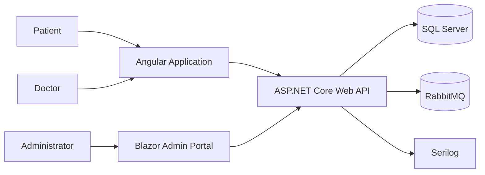
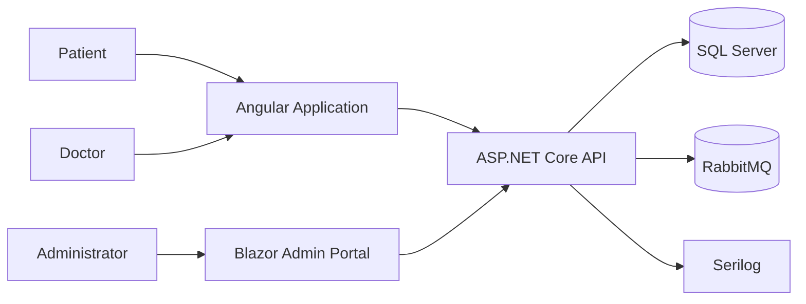
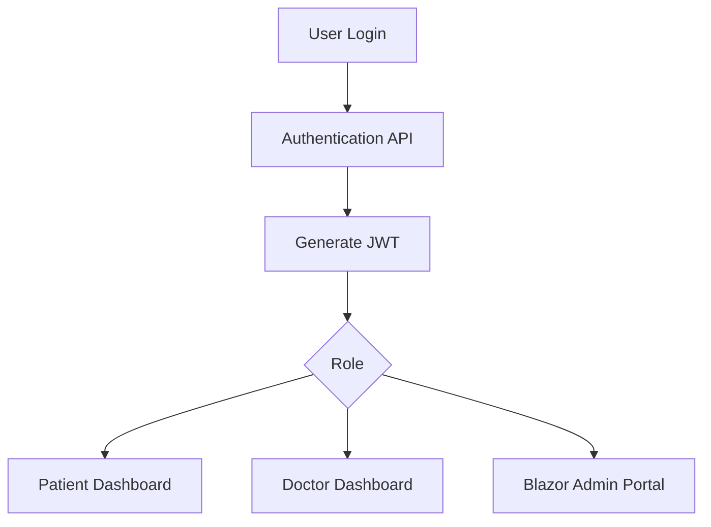
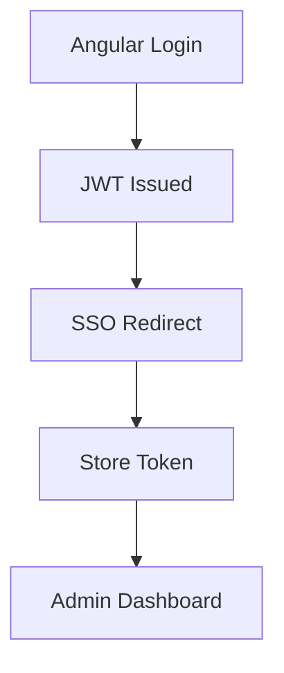
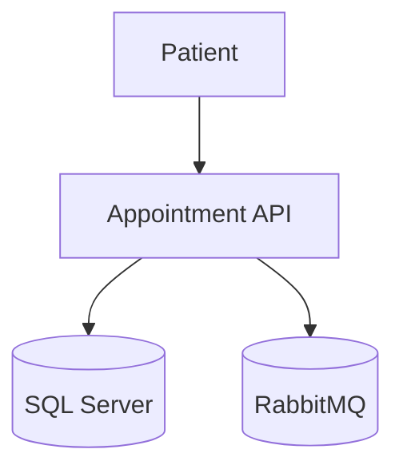
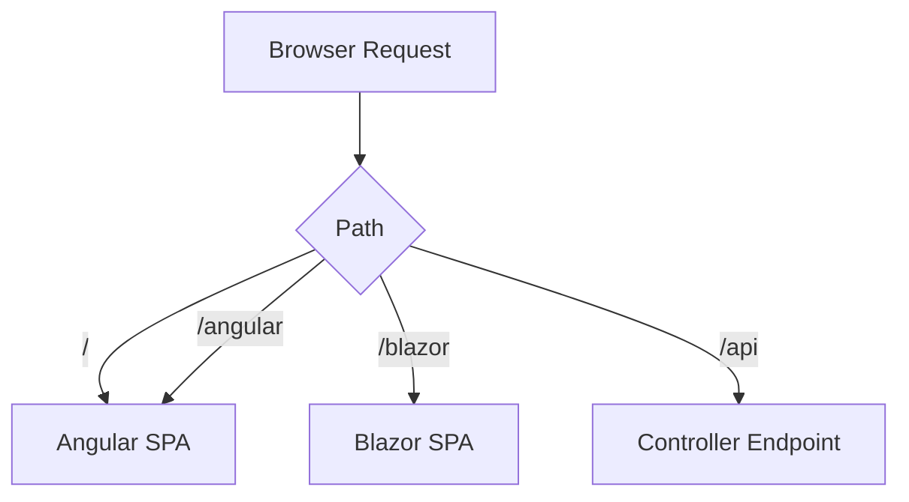
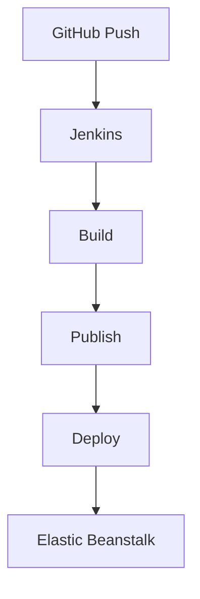
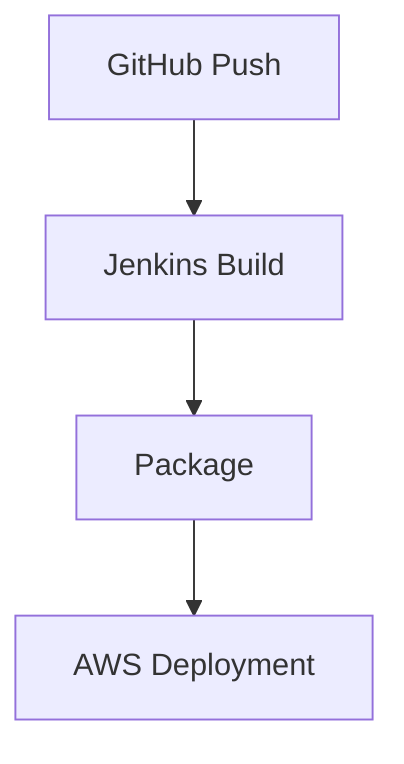

# HealthAxis

A full-stack healthcare management platform built using **ASP.NET Core Web API**, **Angular**, **Blazor WebAssembly**, **SQL Server**, **RabbitMQ**, **MassTransit**, **Serilog**, **Jenkins**, and **AWS Elastic Beanstalk**.

---

## Security Notice

⚠️ **Never commit secrets to source control.**

Store sensitive configuration using:

- Environment Variables
- AWS Elastic Beanstalk Environment Properties
- Jenkins Credentials
- Secure Secret Stores

Examples:

```text
ConnectionStrings__DbCon=Server=<SQL_SERVER_HOST>;Database=<DATABASE_NAME>;User Id=<DATABASE_USER>;Password=<DATABASE_PASSWORD>;
Jwt__Key=<STRONG_JWT_SIGNING_KEY>
RabbitMQ__Password=<RABBITMQ_PASSWORD>
```

---

# Table of Contents

- Overview
- Quick Start
- Problem Statement
- Solution
- Key Features
- User Roles
- Architecture
- Flow Diagrams
- Technology Stack
- Repository Structure
- Authentication and Authorization
- Routing and Frontend Hosting
- Database and Persistence
- Messaging
- Error Handling and Logging
- Prerequisites
- Configuration
- Local Setup
- Build and Publish
- Testing
- CI/CD Pipeline
- AWS Deployment
- Security
- Troubleshooting
- Known Limitations
- Roadmap
- Contributing
- License
- Project Status

---

# Overview

HealthAxis is a healthcare appointment and administration platform that provides separate experiences for Patients, Doctors, and Administrators while sharing a centralized backend API.

The solution includes:

- Angular frontend for Patients and Doctors
- Blazor WebAssembly admin portal
- ASP.NET Core Web API backend
- SQL Server persistence
- RabbitMQ asynchronous messaging
- JWT authentication
- Serilog structured logging
- Jenkins CI/CD automation
- AWS Elastic Beanstalk deployment

The Angular and Blazor applications are hosted from a single ASP.NET Core deployment package.

---

# Quick Start

```powershell
git clone <REPLACE_WITH_REPOSITORY_URL>

cd <REPLACE_WITH_REPOSITORY_ROOT>

dotnet restore

dotnet run --project .\HealthAxisApplicn\HealthAxisApplicn.csproj
```

Open:

```text
http://localhost:5289
```

The application redirects to:

```text
http://localhost:5289/angular
```

Admin Portal:

```text
http://localhost:5289/blazor
```

Swagger:

```text
http://localhost:5289/swagger
```

---

# Problem Statement

Healthcare systems often suffer from fragmented workflows and disconnected interfaces.

Challenges addressed by HealthAxis include:

- Appointment management
- Centralized authentication
- Role-based access control
- Doctor and patient administration
- Operational visibility
- Scalable deployment
- Maintainable healthcare workflows

---

# Solution

HealthAxis combines:

- Angular for Patient and Doctor experiences
- Blazor WebAssembly for Administration
- ASP.NET Core Web API
- Entity Framework Core
- SQL Server
- ASP.NET Identity
- JWT Bearer Authentication
- RabbitMQ and MassTransit
- Serilog Logging
- Jenkins Deployment Automation
- AWS Elastic Beanstalk Hosting

---

# Key Features

## Patient Features

- Secure Login
- Appointment Booking
- View Appointment History
- Dashboard Access

## Doctor Features

- Secure Login
- Appointment Visibility
- Schedule Management
- First Login Password Change

## Administrator Features

- Administrative Dashboard
- Doctor Management
- Patient Management
- Appointment Monitoring
- Appointment Status Tracking
- Single Sign-On (SSO)

## Platform Features

- JWT Authentication
- Role-Based Authorization
- RabbitMQ Messaging
- Structured Logging
- CI/CD Automation
- AWS Deployment

---

# User Roles

| Role | Responsibility |
|--------|---------------|
| Patient | Appointment booking and healthcare access |
| Doctor | Appointment and healthcare workflow management |
| Admin | Administrative operations and platform management |

---

# Architecture



---

# Flow Diagrams

## System Architecture



---

## Authentication Flow



---

## Admin SSO Flow



---

## Appointment Workflow



---

## Static Hosting and Routing



---

## CI/CD Flow



---

# Technology Stack

## Backend

- C#
- .NET 10
- ASP.NET Core Web API
- Entity Framework Core
- SQL Server
- ASP.NET Identity
- JWT Bearer Authentication
- AutoMapper

## Frontend

### Angular

- Angular
- TypeScript
- Bootstrap
- HTML
- CSS

### Blazor

- Blazor WebAssembly
- Razor Components
- JavaScript Interop

## Messaging

- RabbitMQ
- MassTransit

## Logging

- Serilog
- Console Logging
- File Logging

## DevOps

- GitHub
- Jenkins
- AWS Elastic Beanstalk
- Ubuntu EC2

---

# Repository Structure

```text
HealthAxis
│
├── HealthAxisApplicn
│   ├── Controllers
│   ├── Services
│   ├── Data
│   ├── DTOs
│   ├── Messaging
│   ├── Middleware
│   └── wwwroot
│       ├── angular
│       └── blazor
│
├── HealthAxisAngular
│
├── HealthAxisAdminPortal
│
└── HealthAxisWebApp.Shared
```

---

# Authentication and Authorization

HealthAxis uses:

- ASP.NET Identity
- JWT Bearer Authentication

Roles:

```text
Patient
Doctor
Admin
```

Authentication Flow:

```text
Login
↓
Identity Validation
↓
JWT Generation
↓
Authorized Access
```

Admins are redirected from Angular to Blazor using SSO.

---

# Routing and Frontend Hosting

The ASP.NET Core API serves:

```text
/                   Redirect to Angular
/angular            Angular Application
/blazor             Blazor Admin Portal
/api                Web API Endpoints
/swagger            Swagger UI
```

Static assets are hosted from:

```text
wwwroot/angular
wwwroot/blazor
```

---

# Database and Persistence

Database Technology:

```text
SQL Server
```

ORM:

```text
Entity Framework Core
```

Example Configuration:

```text
ConnectionStrings__DbCon=Server=<SQL_SERVER_HOST>;Database=<DATABASE_NAME>;User Id=<DATABASE_USER>;Password=<DATABASE_PASSWORD>;TrustServerCertificate=True
```

---

# Messaging

RabbitMQ and MassTransit are used for asynchronous communication.

Example:

```text
RabbitMQ__Host=<RABBITMQ_HOST>
RabbitMQ__Username=<RABBITMQ_USERNAME>
RabbitMQ__Password=<RABBITMQ_PASSWORD>
```

Queue:

```text
appointment-booked-queue
```

---

# Error Handling and Logging

Logging Framework:

```text
Serilog
```

Features:

- Console Logging
- File Logging
- Structured Logging
- Exception Tracking
- Request Monitoring

Application Features:

- Global Exception Handling
- Structured Logs
- API Request Logging

---

# Prerequisites

Install:

- .NET 10 SDK
- Node.js
- npm
- SQL Server Access
- RabbitMQ Access
- PowerShell
- Git

Optional:

- Amazon AWS CLI
- Jenkins

---

# Configuration

| Configuration | Purpose |
|--------------|---------|
| ASPNETCORE_ENVIRONMENT | Environment |
| ConnectionStrings__DbCon | Database |
| Jwt__Key | JWT Key |
| Jwt__Issuer | Token Issuer |
| Jwt__Audience | Token Audience |
| RabbitMQ__Host | RabbitMQ Host |
| RabbitMQ__Username | RabbitMQ Username |
| RabbitMQ__Password | RabbitMQ Password |

---

# Local Setup

Clone repository:

```powershell
git clone <REPLACE_WITH_REPOSITORY_URL>
```

Restore dependencies:

```powershell
dotnet restore
```

Run application:

```powershell
dotnet run --project .\HealthAxisApplicn\HealthAxisApplicn.csproj
```

Browse:

```text
http://localhost:5289/angular
```

---

# Build and Publish

Publish the API:

```powershell
dotnet publish -c Release
```

Output:

```text
bin/Release/net10.0/publish
```

Contents include:

- API binaries
- Angular static assets
- Blazor static assets

---

# Testing

Execute tests:

```powershell
dotnet test
```

Coverage reporting may be added as part of future quality improvements.

---

# CI/CD Pipeline

Deployment is automated through Jenkins.

Pipeline stages:

1. Source Checkout
2. Restore Dependencies
3. Build
4. Publish
5. Package
6. AWS Deployment
7. Environment Verification



---

# AWS Deployment

Deployment Target:

```text
AWS Elastic Beanstalk
Ubuntu EC2
```

Deployment Process:

```text
GitHub
↓
Jenkins
↓
Build & Publish
↓
Elastic Beanstalk
↓
Live Environment
```

Environment configuration stores:

- Database Settings
- JWT Settings
- RabbitMQ Settings

---

# Security

Recommendations:

- Never commit secrets
- Use secure JWT signing keys
- Restrict database access
- Restrict RabbitMQ access
- Use HTTPS
- Rotate credentials periodically
- Use least-privilege IAM roles
- Avoid logging sensitive information

---

# Troubleshooting

| Symptom | Resolution |
|----------|------------|
| Root URL not loading | Verify root redirect to `/angular` |
| Angular refresh returns 404 | Verify Angular fallback routing |
| Blazor refresh returns 404 | Verify Blazor fallback routing |
| SQL login failure | Check connection string and credentials |
| RabbitMQ connection failure | Verify host, credentials, port 5672 |
| 502 Bad Gateway | Review Elastic Beanstalk logs |
| Admin SSO failure | Verify `/blazor/sso-login` routing |

---

# Known Limitations

- Application requires SQL Server availability.
- RabbitMQ availability impacts event processing.
- Background services require monitoring when scaling.
- AWS deployment depends on infrastructure configuration.

---

# Roadmap

Future Improvements:

- Distributed Caching
- Health Check Endpoints
- Deployment Rollbacks
- End-to-End Testing
- Enhanced Monitoring and Alerting
- AWS Secrets Manager Integration

---

# Contributing

1. Pull latest changes.
2. Create a feature branch.
3. Keep commits focused.
4. Do not commit generated files.
5. Run builds and tests before pushing.
6. Submit a Pull Request.

---

# License

HealthAxis is an internal project developed solely for educational and training purposes.

This project is not open source and is not intended for public distribution. The source code, documentation, assets, and related materials may not be copied, modified, published, sublicensed, or redistributed outside the authorized organization without prior written permission.

All rights reserved.

---

# Project Status

HealthAxis is an actively maintained healthcare management platform featuring Angular, Blazor WebAssembly, ASP.NET Core Web API, RabbitMQ messaging, Serilog logging, Jenkins CI/CD automation, and AWS Elastic Beanstalk deployment.