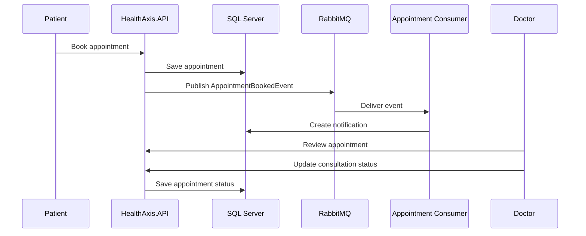
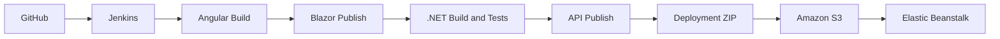

# HealthAxis

> A full-stack digital healthcare management platform for patients, doctors, and administrators, built using ASP.NET Core, Angular, Blazor WebAssembly, SQL Server, RabbitMQ, Serilog, AWS Elastic Beanstalk, and Jenkins.


---

## Table of Contents

- [Project Overview](#project-overview)
- [Problem Statement](#problem-statement)
- [Solution](#solution)
- [Main Features](#main-features)
- [User Roles](#user-roles)
- [System Architecture](#system-architecture)
- [Technology Stack](#technology-stack)
- [Project Structure](#project-structure)
- [Authentication and Authorization](#authentication-and-authorization)
- [Appointment Workflow](#appointment-workflow)
- [Health Record Access](#health-record-access)
- [Notifications and RabbitMQ](#notifications-and-rabbitmq)
- [Logging](#logging)
- [Local Development](#local-development)
- [Configuration and Secrets](#configuration-and-secrets)
- [Build and Test](#build-and-test)
- [AWS Deployment](#aws-deployment)
- [Jenkins CI/CD](#jenkins-cicd)
- [Security](#security)
- [Testing Checklist](#testing-checklist)
- [Troubleshooting](#troubleshooting)
- [Screenshots](#screenshots)
- [Known Limitations](#known-limitations)
- [Future Enhancements](#future-enhancements)
- [Git Workflow](#git-workflow)
- [License](#license)

---

## Project Overview

**HealthAxis** is a role-based healthcare management system that connects patients, doctors, and administrators through one secure platform.

The project contains:

- An Angular application for public pages, patient features, and doctor features
- A Blazor WebAssembly application for administrators
- An ASP.NET Core Web API for authentication, business logic, and data access
- SQL Server for application and identity data
- RabbitMQ with MassTransit for asynchronous event processing
- Serilog for structured logging
- AWS Elastic Beanstalk for deployment
- Jenkins for continuous integration and deployment

---

## Problem Statement

Healthcare workflows are often handled through separate systems for appointments, doctor availability, patient records, notifications, and administration.

This can cause:

- Repeated manual work
- Difficulty tracking appointments
- Delayed access to patient history
- Poor communication between patients and doctors
- Complicated administration and reporting
- Inconsistent user experiences across different roles

HealthAxis solves these problems by providing one secure and centralized healthcare platform.

---

## Solution

HealthAxis provides separate experiences for each user role while using the same secure backend.

- **Patients** can register, log in, search for doctors, book appointments, view appointment status, and access their health records.
- **Doctors** can manage their availability, review assigned appointments, and create health records for completed consultations.
- **Administrators** can manage doctors, patients, appointments, reports, and account-related operations.
- **The API** handles authentication, authorization, business rules, database access, messaging, logging, and frontend hosting.

---

## Main Features

- Patient registration and login
- Doctor and administrator login
- JWT authentication
- Refresh-token support
- Role-based authorization
- Doctor search and specialisation filters
- Doctor active or inactive availability
- Appointment date and time-slot selection
- Appointment booking and cancellation
- Appointment status updates
- Patient health-record access
- Doctor consultation history access based on confirmed appointments
- Diagnosis, prescription, and consultation notes
- In-application notifications
- RabbitMQ event processing
- Responsive Angular and Blazor interfaces
- Structured logging with Serilog
- AWS deployment through Elastic Beanstalk
- Jenkins CI/CD automation
- SonarQube code-quality analysis

---

## User Roles

### Patient

Patients can:

- Register a new account
- Log in securely
- View the patient dashboard
- Search doctors by name or specialisation
- View doctor experience, fee, and availability
- Select an appointment date and time slot
- Book an appointment
- View pending, confirmed, completed, and cancelled appointments
- Cancel eligible appointments
- Download or print appointment information
- View health records after appointments are completed
- Update personal information
- Change password
- Receive appointment notifications

### Doctor

Doctors can:

- Log in to the doctor portal
- View the doctor dashboard
- Change active or inactive status
- Review assigned appointments
- View patient history only when access conditions are satisfied
- Confirm or complete appointment-related work
- Create and update health records
- Add diagnosis, prescription, and doctor notes
- Receive appointment notifications

### Administrator

Administrators can:

- Access the Blazor WebAssembly admin portal
- View dashboard statistics
- Manage doctors
- Manage patients
- View appointments
- Confirm or update appointment status
- Review reports
- View appointment details by date
- Manage administrative account operations

---

## System Architecture

The following diagram shows the deployed HealthAxis runtime architecture, including the browser, AWS Elastic Beanstalk, NGINX, ASP.NET Core API, Angular application, Blazor administrator application, SQL Server, RabbitMQ, and background consumer.


### Runtime Paths

| Application | Base Path |
|---|---|
| Angular application | `/angular/` |
| Blazor administrator application | `/blazor/` |
| REST API | `/api/` |
| Swagger in development | `/swagger` |

The API root redirects to the Angular application.

---

## Technology Stack

### Backend

- C#
- .NET 10
- ASP.NET Core Web API
- Entity Framework Core
- ASP.NET Core Identity
- JWT access tokens
- Refresh tokens
- Role-based authorization
- SQL Server
- MassTransit
- RabbitMQ
- Serilog
- Hosted background services
- Swagger and OpenAPI

### Angular Frontend

- Angular
- TypeScript
- HTML
- CSS
- Angular Router
- Reactive Forms
- Signals
- Functional HTTP interceptor
- Responsive layouts

### Blazor Frontend

- Blazor WebAssembly
- Razor components
- C#
- Authentication state provider
- JavaScript interop
- Local-storage integration
- Responsive admin layout

### Cloud and DevOps

- AWS Elastic Beanstalk
- Amazon EC2
- Amazon S3
- AWS IAM
- Amazon VPC
- Security Groups
- CloudWatch Logs
- Jenkins
- Git and GitHub
- SonarQube
- AWS CLI

---

## Project Structure

```text
HealthAxis/
├── HealthAxis.API/                ASP.NET Core Web API
├── HealthAxis.UI/                 Angular patient and doctor application
├── HealthAxis_Admin/              Blazor WebAssembly administrator application
├── HealthAxis.Shared/             Shared DTOs, enums, and contracts
├── HealthAxis.Tests/              Automated tests
├── HealthAxis.slnx                .NET solution
├── Jenkinsfile                    Jenkins pipeline
└── README.md                      Project documentation
```

Actual folder names may vary slightly depending on the local repository structure.

---

## Authentication and Authorization

HealthAxis uses ASP.NET Core Identity and JWT authentication.

### Login Flow

1. The user submits an email address and password.
2. The API validates the credentials.
3. The API creates an access token and refresh token.
4. The response contains the role and required user reference information.
5. Angular stores the authenticated session.
6. The user is redirected according to the assigned role.
7. Protected endpoints validate the bearer token and role.

### Refresh Token Flow

When an access token expires:

1. The Angular HTTP interceptor receives a `401 Unauthorized` response.
2. It calls the refresh-token endpoint once.
3. A new access token is stored.
4. The original failed request is retried.
5. If refresh fails, the session is cleared and the user is redirected to login.

### Authorization Header

```http
Authorization: Bearer <ACCESS_TOKEN>
```

### Roles

```text
Patient
Doctor
Admin
```

Protected routes and API endpoints enforce role-based access.

---

## Appointment Workflow



Appointment statuses include:

```text
Pending
Confirmed
Completed
Cancelled
```

Cancellation rules are validated by the frontend and backend.

---

## Health Record Access

Health records contain information such as:

- Patient name
- Doctor name
- Specialisation
- Appointment reference
- Visit date
- Diagnosis
- Prescription
- Doctor notes
- Created date
- Updated date

Patient health records become available after the related appointment is completed.

Doctor access to patient history is controlled by appointment-related rules. A doctor should only access the relevant patient history when the doctor has an eligible confirmed appointment with that patient. Access should no longer be available after the permitted workflow ends.

---

## Notifications and RabbitMQ

HealthAxis uses RabbitMQ and MassTransit for asynchronous processing.

### Appointment Booking Notification Flow

The following sequence diagram shows how appointment booking is persisted and processed asynchronously through RabbitMQ.


1. The patient books an appointment.
2. The API saves the appointment.
3. The API publishes an appointment event.
4. RabbitMQ delivers the event to the configured queue.
5. The consumer processes the event.
6. A notification is stored in the database.
7. The notification appears in the application top bar.

### Default Queue Configuration

```text
healthaxis.appointment.booked.queue
```

### RabbitMQ Port

```text
5672
```

The RabbitMQ management interface commonly uses port `15672` when enabled.

---

## Logging

HealthAxis uses Serilog for structured logging.

Logs include:

- API startup
- HTTP requests
- Errors and exceptions
- Appointment actions
- Notification processing
- Background-service execution
- RabbitMQ consumer activity
- User and action context where available

### Local File Logs

```text
Logs/healthaxis-api-.log
```

### Elastic Beanstalk Logs

Useful log locations include:

```text
/var/log/web.stdout.log
/var/log/nginx/access.log
/var/log/nginx/error.log
/var/log/eb-engine.log
```

The Elastic Beanstalk environment also streams logs to the configured CloudWatch log group.

---

## Local Development

### Prerequisites

Install:

- .NET 10 SDK
- Visual Studio 2022 or Visual Studio Code
- Node.js and npm
- SQL Server
- RabbitMQ
- Git

### 1. Clone the Repository

```bash
git clone <REPOSITORY_URL>
cd <REPOSITORY_FOLDER>
git switch <BRANCH_NAME>
```

### 2. Restore .NET Dependencies

```bash
dotnet restore HealthAxis.slnx
```

### 3. Install Angular Dependencies

```bash
cd HealthAxis.UI
npm install
cd ..
```

Use `npm ci` in CI/CD when `package-lock.json` is available and synchronized.

### 4. Configure Local Secrets

From the API project folder:

```bash
cd HealthAxis.API

dotnet user-secrets set "ConnectionStrings:DbConnection" \
"Server=localhost,1433;Database=HealthAxisDb;User Id=<SQL_USER>;Password=<SQL_PASSWORD>;Encrypt=True;TrustServerCertificate=True;"

dotnet user-secrets set "Jwt:Key" "<LONG_RANDOM_JWT_KEY>"
dotnet user-secrets set "RabbitMq:HostName" "localhost"
dotnet user-secrets set "RabbitMq:Port" "5672"
dotnet user-secrets set "RabbitMq:UserName" "<RABBITMQ_USERNAME>"
dotnet user-secrets set "RabbitMq:Password" "<RABBITMQ_PASSWORD>"
dotnet user-secrets set "RabbitMq:VirtualHost" "/"

cd ..
```

Never commit actual secret values.

### 5. Apply Database Migrations

```bash
dotnet ef database update --project HealthAxis.API
```

Run the command from the correct solution directory and adjust the project path when required.

### 6. Start RabbitMQ

Confirm that RabbitMQ is running and listening on port `5672`.

### 7. Run the API

```bash
dotnet run --project HealthAxis.API
```

### 8. Run Angular During Development

```bash
cd HealthAxis.UI
npm start
```

or:

```bash
ng serve
```

### 9. Run Blazor During Development

```bash
dotnet run --project HealthAxis_Admin
```

Use the URLs printed in the terminal.

---

## Configuration and Secrets

Production secrets must not be stored directly in committed `appsettings` files.

### Elastic Beanstalk Environment Variables

| Environment Variable | Purpose |
|---|---|
| `ASPNETCORE_ENVIRONMENT` | Runtime environment |
| `ConnectionStrings__DbConnection` | SQL Server connection string |
| `Jwt__Issuer` | JWT issuer |
| `Jwt__Audience` | JWT audience |
| `Jwt__Key` | JWT signing key |
| `Jwt__RefreshTokenExpirationDays` | Refresh-token lifetime |
| `Jwt__AccessTokenExpirationMinutes` | Access-token lifetime |
| `RabbitMq__HostName` | RabbitMQ host |
| `RabbitMq__Port` | RabbitMQ port |
| `RabbitMq__UserName` | RabbitMQ username |
| `RabbitMq__Password` | RabbitMQ password |
| `RabbitMq__VirtualHost` | RabbitMQ virtual host |
| `RabbitMq__AppointmentBookedQueue` | Appointment queue |

Double underscores represent nested configuration sections.

Example:

```text
ConnectionStrings__DbConnection
```

maps to:

```text
ConnectionStrings:DbConnection
```

### Safe Production Configuration Example

```json
{
  "ConnectionStrings": {
    "DbConnection": ""
  },
  "Jwt": {
    "Issuer": "HealthAxisCore",
    "Audience": "HealthAxisCore",
    "Key": "",
    "RefreshTokenExpirationDays": 7,
    "AccessTokenExpirationMinutes": 20
  },
  "RabbitMq": {
    "HostName": "",
    "Port": 5672,
    "UserName": "",
    "Password": "",
    "VirtualHost": "/",
    "AppointmentBookedQueue": "healthaxis.appointment.booked.queue"
  }
}
```

Recommended secret storage:

- AWS Secrets Manager
- AWS Systems Manager Parameter Store
- Elastic Beanstalk environment properties
- Jenkins Credentials
- .NET user secrets for local development

---

## Build and Test

### Build Angular

```bash
cd HealthAxis.UI
npm ci
npm run build
cd ..
```

The production Angular files are copied or generated into the API static hosting directory.

### Build the .NET Solution

```bash
dotnet restore HealthAxis.slnx
dotnet build HealthAxis.slnx -c Release --no-restore
```

### Run Tests

```bash
dotnet test HealthAxis.slnx -c Release --no-build
```

### Publish Blazor

```bash
dotnet publish HealthAxis_Admin/HealthAxis_Admin.csproj \
-c Release \
-o blazor-publish-temp
```

Copy the published Blazor `wwwroot` files into:

```text
HealthAxis.API/wwwroot/blazor
```

### Publish the API

```bash
dotnet publish HealthAxis.API/HealthAxis.API.csproj \
-c Release \
-o publish
```

The publish folder should contain the Angular and Blazor assets under `wwwroot`.

---

## AWS Deployment

### Current Deployment

```text
AWS Region: ap-south-2
Elastic Beanstalk Application: HealthAxisAPI
Elastic Beanstalk Environment: HealthAxisAPI-dev
```

### Deployment Architecture

- The ASP.NET Core application runs in Elastic Beanstalk.
- NGINX acts as the reverse proxy.
- Angular and Blazor are served from the API `wwwroot` folder.
- SQL Server and RabbitMQ are available through private network access.
- Elastic Beanstalk environment properties supply production configuration.
- CloudWatch receives streamed environment logs.

### Security Group Rules

Allow only the required sources:

| Service | Port | Recommended Source |
|---|---:|---|
| SQL Server | 1433 | Elastic Beanstalk instance security group |
| RabbitMQ | 5672 | Elastic Beanstalk instance security group |
| RabbitMQ Management | 15672 | Approved administrator IP only |
| HTTP | 80 | Public or load balancer |
| HTTPS | 443 | Public or load balancer |

Do not open SQL Server or RabbitMQ ports to `0.0.0.0/0`.

### Deployment Package

A typical deployment package contains:

```text
publish/
├── HealthAxis.API.dll
├── HealthAxis.API.deps.json
├── HealthAxis.API.runtimeconfig.json
├── appsettings.json
├── appsettings.Production.json
├── Procfile
└── wwwroot/
    ├── angular/
    └── blazor/
```

Example `Procfile`:

```text
web: dotnet HealthAxis.API.dll
```

---

## Jenkins CI/CD

The Jenkins pipeline automates:

1. Source-code checkout
2. Angular dependency installation
3. Angular production build
4. Blazor publish
5. Copying frontend assets into the API
6. .NET restore
7. .NET build
8. Automated tests
9. API publish
10. Deployment ZIP creation
11. Upload to Amazon S3
12. Elastic Beanstalk application-version creation
13. Deployment to `HealthAxisAPI-dev`
14. Deployment-status verification

### Pipeline Flow



### Jenkins Security

- Store AWS credentials in Jenkins Credentials.
- Store GitHub credentials in Jenkins Credentials when required.
- Never print secret values in the pipeline.
- Use the least-privilege IAM policy.
- Do not commit AWS keys into the repository.
- Rotate exposed credentials immediately.

---

## Security

- Do not commit database passwords.
- Do not commit RabbitMQ credentials.
- Do not commit JWT signing keys.
- Do not use the SQL Server `sa` account for production runtime access.
- Use a dedicated database login with only required permissions.
- Use a dedicated RabbitMQ application user.
- Restrict database and broker ports through security groups.
- Validate all JWT tokens.
- Enforce role-based authorization.
- Avoid logging access tokens, refresh tokens, or passwords.
- Use secure secret storage.
- Rotate credentials that were exposed in code, screenshots, logs, or chat.
- Use HTTPS in production.
- Review browser local-storage usage during security testing.
- Run SonarQube analysis before release.

---

## Testing Checklist

### Authentication

- [ ] Patient registration succeeds
- [ ] Patient login succeeds
- [ ] Doctor login succeeds
- [ ] Administrator login succeeds
- [ ] Invalid credentials show a safe error
- [ ] Expired access token is refreshed automatically
- [ ] Failed refresh clears the session
- [ ] Role-based routing works
- [ ] Unauthorized API calls return `401`
- [ ] Forbidden role access returns `403`

### Patient Portal

- [ ] Doctors load successfully
- [ ] Search and specialisation filters work
- [ ] Inactive doctors cannot be booked
- [ ] Past dates cannot be selected
- [ ] Unavailable time slots cannot be booked
- [ ] Appointment booking succeeds
- [ ] Appointment cancellation rules work
- [ ] Appointment print or PDF flow works
- [ ] Health records appear only when allowed
- [ ] Profile update works
- [ ] Password change works

### Doctor Portal

- [ ] Doctor dashboard loads
- [ ] Active or inactive status updates
- [ ] Assigned appointments load
- [ ] Patient-history access follows appointment rules
- [ ] Health-record creation succeeds
- [ ] Completed appointment workflow works

### Administrator Portal

- [ ] Blazor application loads under `/blazor/`
- [ ] Administrator authentication succeeds
- [ ] Doctor list loads
- [ ] Patient list loads
- [ ] Appointment reports load
- [ ] Appointment status operations work
- [ ] Pagination works

### Messaging and Logging

- [ ] RabbitMQ connection succeeds
- [ ] Appointment event is published
- [ ] Consumer receives the event
- [ ] Notification is saved
- [ ] Notification appears in the UI
- [ ] Serilog logs are generated
- [ ] Elastic Beanstalk logs are available
- [ ] CloudWatch log streaming works

### Deployment

- [ ] Jenkins build succeeds
- [ ] Tests pass
- [ ] Deployment package contains Angular assets
- [ ] Deployment package contains Blazor assets
- [ ] Elastic Beanstalk environment becomes `Ready`
- [ ] Elastic Beanstalk health becomes `Green`
- [ ] Angular loads under `/angular/`
- [ ] Blazor loads under `/blazor/`
- [ ] Production requests contain no localhost URLs

---

## Troubleshooting

### Database Connection String Is Missing

Configure:

```text
ConnectionStrings__DbConnection
```

Ensure the key contains two underscores.

### Login Fails After Removing Secrets from `appsettings`

Confirm the required Elastic Beanstalk environment properties are configured and applied.

### RabbitMQ Connection Fails

Verify:

- RabbitMQ is running
- Port `5672` is open from the Elastic Beanstalk instance security group
- The host name is correct
- The username and password are correct
- The virtual host exists
- The user has permission for the virtual host

### Angular Calls `localhost` in Production

- Use relative `/api` URLs
- Rebuild Angular
- Republish the API
- Redeploy
- Clear browser cache

### Angular Route Returns 404 After Refresh

Ensure the API has SPA fallback routing for:

```text
/angular/{*path:nonfile}
```

### Blazor Route Returns 404 After Refresh

Ensure the API has SPA fallback routing for:

```text
/blazor/{*path:nonfile}
```

### Elastic Beanstalk Is Degraded

Check:

```text
/var/log/web.stdout.log
/var/log/nginx/error.log
/var/log/eb-engine.log
```

Also review:

- Elastic Beanstalk Events
- Health causes
- CloudWatch logs
- Environment-property values
- SQL Server connectivity
- RabbitMQ connectivity

### Jenkins Build Succeeds but Changes Do Not Appear

Verify:

- The correct repository and branch are configured
- The newest Elastic Beanstalk application version is deployed
- Angular bundle hashes changed
- Blazor assets were copied
- Browser cache is cleared
- The environment update completed

### SonarQube Still Shows Fixed Issues

Run a clean build and scan:

```bash
dotnet clean
dotnet build
```

Delete old Angular build output when required, rebuild, and run the SonarQube analysis again.

---

## Screenshots

Add project screenshots inside:

```text
docs/images/
```

Recommended files:

```markdown


```

---

## Known Limitations

- SQL Server and RabbitMQ may require self-managed infrastructure.
- Production secrets currently depend on environment configuration.
- Frontend end-to-end test automation may be limited.
- Jenkins deployment requires the Jenkins host to remain available.
- Appointment persistence and event publication can be made more reliable with an outbox pattern.
- CloudWatch alarms and dashboards may require further configuration.
- Deployment-package and application-version cleanup may require automation.

---

## Future Enhancements

- AWS Secrets Manager integration
- AWS Systems Manager Parameter Store integration
- Managed SQL database
- Managed message broker
- MassTransit Entity Framework outbox
- CloudWatch alarms and dashboards
- Dedicated health-check endpoint
- Expanded unit and integration tests
- Angular end-to-end tests
- Blazor component tests
- Automated post-deployment smoke tests
- Custom domain and HTTPS certificate
- Blue/green deployment
- Automatic rollback
- Performance optimization
- Accessibility audit
- Progressive Web App support
- Email and SMS notifications
- Telemedicine integration
- Audit-history reporting

---

## Git Workflow

```bash
git fetch origin
git switch <BRANCH_NAME>
git pull
git status
git add .
git commit -m "Describe the completed change"
git push origin <BRANCH_NAME>
```

Do not commit:

```text
node_modules/
bin/
obj/
publish/
TestResults/
Logs/
*.zip
appsettings.* secrets
AWS credentials
JWT keys
Database passwords
RabbitMQ passwords
```

Review `.gitignore` before pushing.

---

## License

Add the confirmed license:

```text
<LICENSE_NAME>
```

---

## Acknowledgements

HealthAxis was developed as a full-stack healthcare and DevOps project using .NET, Angular, Blazor WebAssembly, SQL Server, RabbitMQ, AWS Elastic Beanstalk, Jenkins, and SonarQube.
