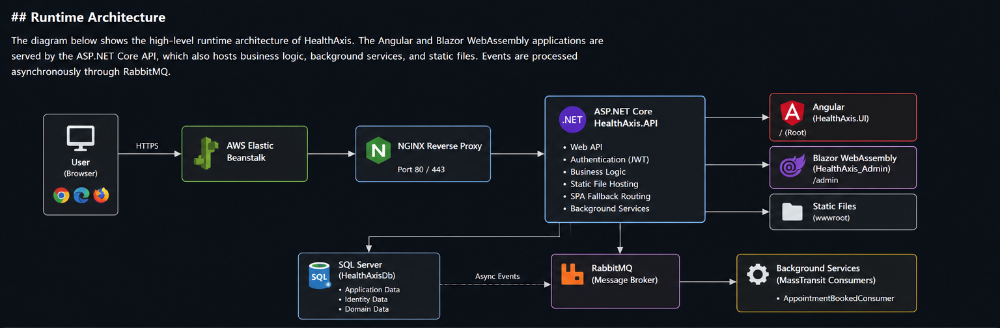
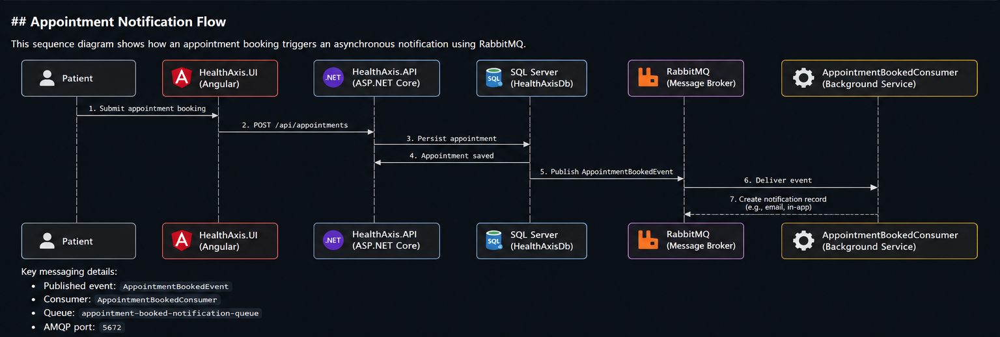

# HealthAxis

A secure full-stack healthcare management platform for patients, doctors, and administrators.


## Overview

HealthAxis connects patients, doctors, and administrators through one role-based healthcare system.

- **Angular** provides the patient and doctor portals.
- **Blazor WebAssembly** provides the administrator portal.
- **ASP.NET Core Web API** handles authentication, business logic, data access, notifications, and frontend hosting.
- **SQL Server** stores users, doctors, patients, appointments, health records, and notifications.
- **RabbitMQ with MassTransit** processes appointment events asynchronously.
- **AWS Elastic Beanstalk and Jenkins** support deployment and CI/CD.

## Main Features

### Patient Portal

- Registration and secure login
- Doctor search by name and specialisation
- Doctor availability and time-slot selection
- Appointment booking and cancellation
- Appointment status tracking
- Health-record access after completed consultations
- Appointment and health-record printing
- Profile update and password change
- Notifications

### Doctor Portal

- Doctor dashboard
- Active or inactive availability status
- Assigned appointment management
- Patient-history access based on valid appointment rules
- Health-record creation
- Diagnosis, prescription, and consultation notes
- Notifications

### Administrator Portal

- Blazor WebAssembly dashboard
- Doctor and patient management
- Appointment monitoring and status updates
- Reports and appointment details
- Role-protected administrator access

## Architecture



### Appointment Notification Flow



1. A patient books an appointment.
2. The API saves it in SQL Server.
3. An `AppointmentBookedEvent` is published to RabbitMQ.
4. MassTransit consumes the event.
5. A notification is stored and shown to the doctor.

## Technology Stack

| Area | Technologies |
|---|---|
| Backend | C#, .NET 10, ASP.NET Core Web API, Entity Framework Core |
| Authentication | ASP.NET Core Identity, JWT, Refresh Tokens, Role Authorization |
| Patient and Doctor UI | Angular, TypeScript, Reactive Forms, Signals |
| Admin UI | Blazor WebAssembly, Razor Components |
| Database | Microsoft SQL Server |
| Messaging | RabbitMQ, MassTransit |
| Logging | Serilog |
| Testing and Quality | .NET Tests, SonarQube |
| Deployment | AWS Elastic Beanstalk, EC2, S3 |
| CI/CD | Jenkins, GitHub, AWS CLI |

## Project Structure

```text
HealthAxis/
├── HealthAxis.API/
├── HealthAxis.UI/
├── HealthAxis_Admin/
├── HealthAxis.Shared/
├── HealthAxis.Tests/
├── HealthAxis.slnx
├── Jenkinsfile
├── docs/images/
└── README.md
```

Folder names may differ slightly in the repository.

## Authentication and Authorization

HealthAxis uses JWT access tokens, refresh tokens, and role-based authorization.

```http
Authorization: Bearer <ACCESS_TOKEN>
```

Roles:

```text
Patient
Doctor
Admin
```

When an access token expires, the Angular interceptor refreshes it and retries the failed request. If refresh fails, the session is cleared and the user is redirected to login.

## Local Setup

### Prerequisites

- .NET 10 SDK
- Node.js and npm
- SQL Server
- RabbitMQ
- Visual Studio 2022 or Visual Studio Code
- Git

### Restore and Install

```bash
dotnet restore HealthAxis.slnx

cd HealthAxis.UI
npm install
cd ..
```

### Configure Local Secrets

Run from the API project folder:

```bash
dotnet user-secrets set "ConnectionStrings:DbConnection" "<SQL_CONNECTION_STRING>"
dotnet user-secrets set "Jwt:Key" "<LONG_RANDOM_JWT_KEY>"
dotnet user-secrets set "RabbitMq:HostName" "localhost"
dotnet user-secrets set "RabbitMq:UserName" "<RABBITMQ_USERNAME>"
dotnet user-secrets set "RabbitMq:Password" "<RABBITMQ_PASSWORD>"
```

### Run

```bash
dotnet run --project HealthAxis.API
```

```bash
cd HealthAxis.UI
ng serve
```

```bash
dotnet run --project HealthAxis_Admin
```

## Production Configuration

Store production secrets in AWS environment properties, Secrets Manager, or Parameter Store.

```text
ConnectionStrings__DbConnection
Jwt__Key
RabbitMq__HostName
RabbitMq__UserName
RabbitMq__Password
RabbitMq__VirtualHost
```

Never commit passwords, connection strings, JWT keys, AWS keys, or RabbitMQ credentials.

## Build and Test

```bash
dotnet restore HealthAxis.slnx
dotnet build HealthAxis.slnx -c Release --no-restore
dotnet test HealthAxis.slnx -c Release --no-build
```

Angular production build:

```bash
cd HealthAxis.UI
npm ci
npm run build
```

## Deployment

- **AWS Region:** `ap-south-2`
- **Hosting:** AWS Elastic Beanstalk
- **Storage:** Amazon S3
- **CI/CD:** Jenkins

Application paths:

```text
/angular/   Angular patient and doctor application
/blazor/    Blazor administrator application
/api/       REST API
```

The Jenkins pipeline performs checkout, frontend builds, .NET build and tests, API publish, package creation, S3 upload, and Elastic Beanstalk deployment.

## Logging

Serilog writes structured logs to the console and rolling files.

Useful AWS logs:

```text
/var/log/web.stdout.log
/var/log/nginx/access.log
/var/log/nginx/error.log
/var/log/eb-engine.log
```

## Security

- Use HTTPS in production.
- Keep secrets outside source control.
- Use dedicated SQL Server and RabbitMQ users.
- Restrict ports `1433` and `5672`.
- Enforce JWT validation and role authorization.
- Never log passwords or tokens.
- Rotate exposed credentials immediately.
- Review SonarQube issues before release.

## Testing Checklist

- [ ] Patient, doctor, and admin login works
- [ ] Role-based routing works
- [ ] Refresh-token flow works
- [ ] Doctor search and filtering work
- [ ] Appointment booking and cancellation work
- [ ] Health records are visible only when allowed
- [ ] RabbitMQ notifications are processed
- [ ] Angular loads under `/angular/`
- [ ] Blazor loads under `/blazor/`
- [ ] Jenkins deployment succeeds
- [ ] Elastic Beanststalk health is green

## Future Enhancements

- AWS Secrets Manager integration
- Managed database and message broker
- MassTransit outbox pattern
- Expanded automated tests
- Email and SMS notifications
- CloudWatch alarms and dashboards
- Custom domain and HTTPS certificate
- Telemedicine support

HealthAxis was developed as a full-stack healthcare and DevOps project using .NET, Angular, Blazor WebAssembly, SQL Server, RabbitMQ, AWS, Jenkins, and SonarQube.