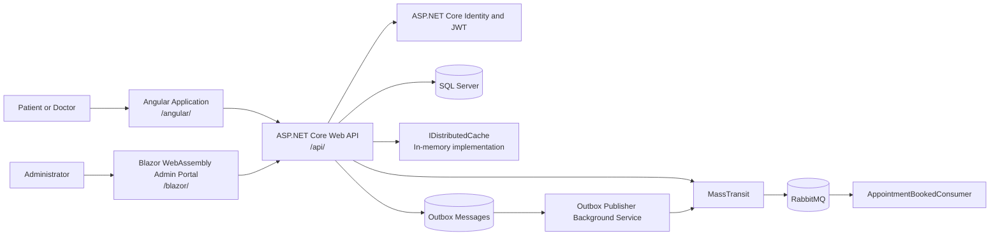
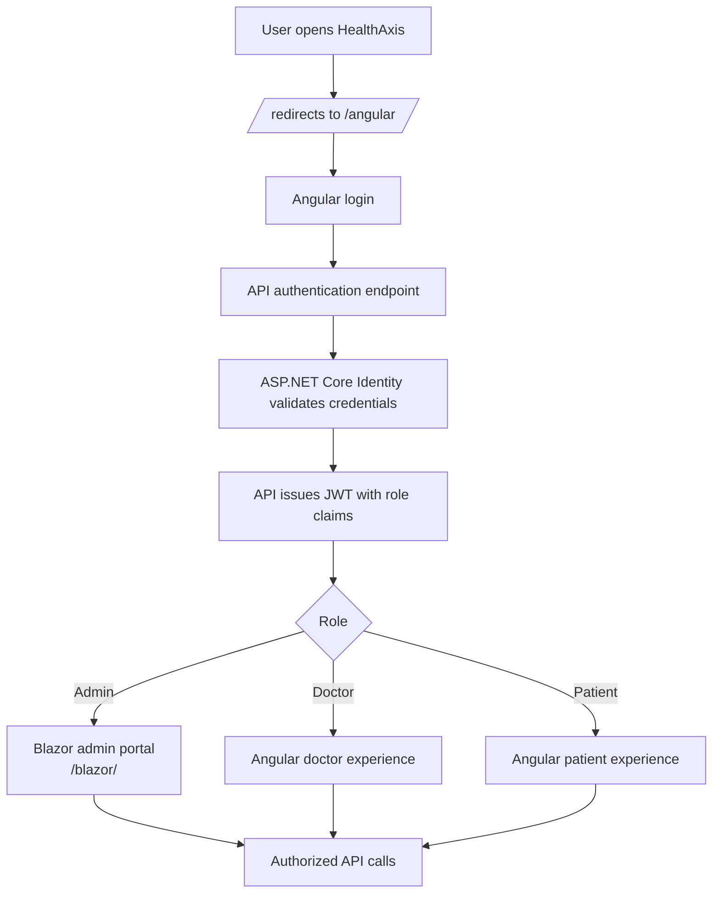
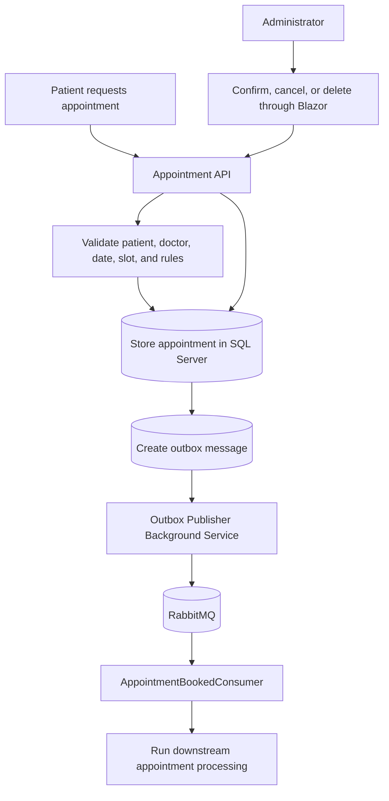
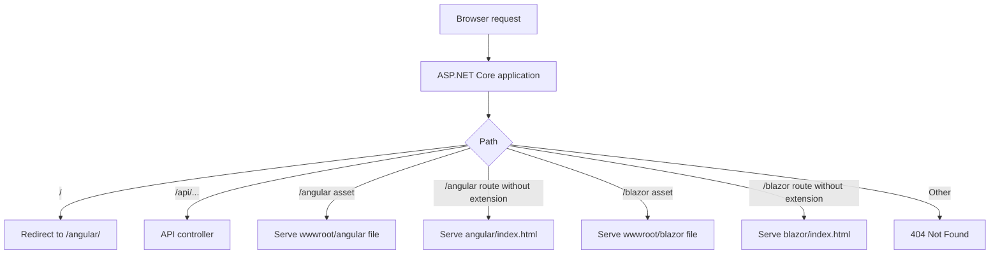
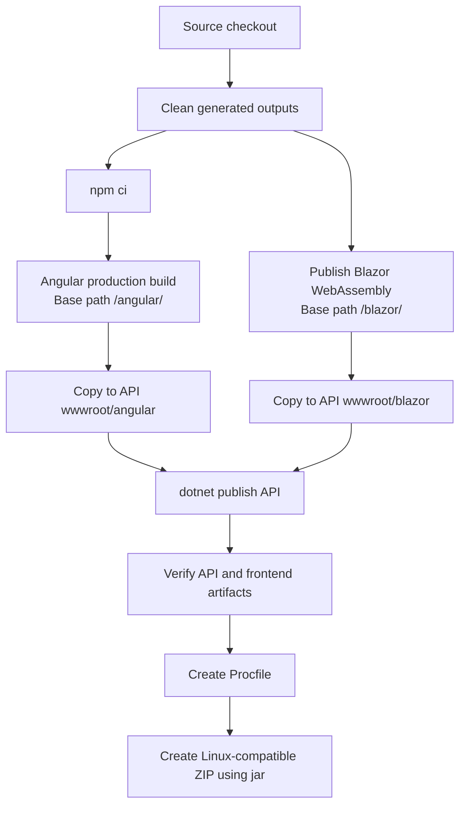
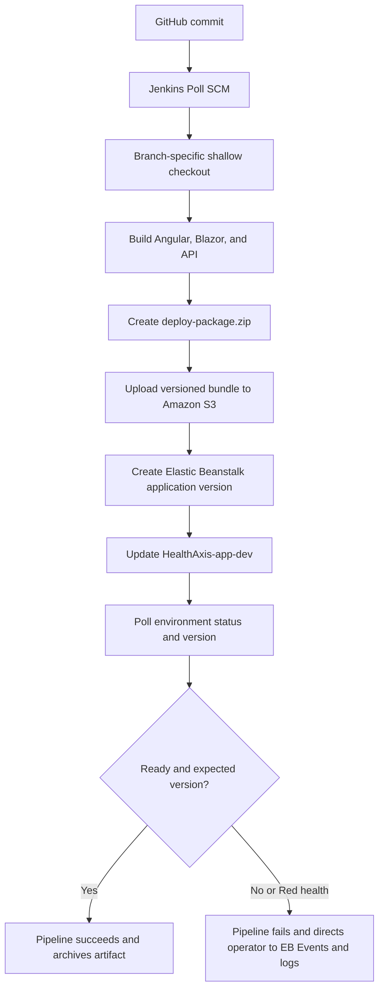
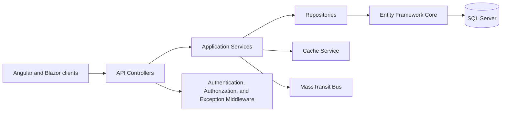

# HealthAxis

HealthAxis is a role-based healthcare management platform that connects patients, doctors, and administrators through dedicated web portals and a shared ASP.NET Core backend.

The application supports doctor discovery, appointment booking and management, patient profile access, health-record updates, role-based authorization, background processing, caching, structured logging, and automated testing.

## Table of Contents

- [Project Overview](#project-overview)
- [Key Features](#key-features)
- [Flow Diagrams](#flow-diagrams)
- [Technology Stack](#technology-stack)
- [Business Rules](#business-rules)
- [Event-Driven Booking Flow](#event-driven-booking-flow)
- [Repository Structure](#repository-structure)
- [Prerequisites](#prerequisites)
- [Getting Started](#getting-started)
- [Configuration](#configuration)
- [Database Setup](#database-setup)
- [Running the Applications](#running-the-applications)
- [Testing](#testing)
- [Logging and Monitoring](#logging-and-monitoring)
- [Caching](#caching)
- [API Security](#api-security)
- [Current Scope](#current-scope)
- [Future Improvements](#future-improvements)
- [Troubleshooting](#troubleshooting)
- [Contributing](#contributing)

## Project Overview

HealthAxis provides separate user experiences for the three primary roles in the system:

- **Patients** can manage their profiles, browse active doctors, book available future appointment slots, view appointments, cancel eligible appointments, and review their health history.
- **Doctors** can view their schedules, access eligible patient profiles, complete their own appointments, and add health records after appointments are successfully completed.
- **Administrators** can use the Blazor administration portal to oversee and manage platform data and operations.

All portals communicate with a central ASP.NET Core Web API. Authentication is based on JSON Web Tokens (JWT), while authorization is enforced using roles and resource-level ownership checks.

## Key Features

### Patient Portal

- Patient registration and login
- JWT-based authenticated sessions
- Patient profile viewing and management
- Active-doctor discovery
- Future-slot appointment booking
- Appointment history and status tracking
- Cancellation of eligible appointments
- Health-history viewing
- Loading, validation, success, and error states

### Doctor Portal

- Doctor login and role-protected navigation
- Today's schedule and appointment viewing
- Access to permitted patient profiles
- Appointment completion
- Health-record creation after appointment completion
- Doctor availability management and cached availability retrieval

### Admin Portal

- Blazor-based administration interface
- Role-restricted access
- Centralized management capabilities for platform entities

### Platform Capabilities

- ASP.NET Core REST API
- Entity Framework Core data access
- Repository and service layers
- JWT authentication and role-based authorization
- RabbitMQ messaging through MassTransit
- Redis caching for doctor availability
- Serilog structured logging
- Elasticsearch log storage and Kibana visualization
- Hosted background processing with `BackgroundService`
- Unit and integration tests using xUnit and Moq

## Flow Diagrams

### 1. High-level system architecture



### 2. Authentication and role-routing flow



### 3. Appointment workflow



### 4. Static hosting and request routing



### 5. Local build and packaging flow



### 6. Jenkins to Elastic Beanstalk deployment flow



### 7. Backend layering



The backend follows a layered design:

1. **Controllers** receive HTTP requests and return API responses.
2. **Services** implement application and business logic.
3. **Repositories** handle persistence operations through `AppDbContext`.
4. **DTOs** define request and response contracts without exposing persistence entities directly.
5. **Infrastructure integrations** provide messaging, caching, logging, and background processing.

## Technology Stack

### Backend

- C#
- ASP.NET Core Web API
- Entity Framework Core
- JWT Bearer authentication
- MassTransit
- RabbitMQ
- Redis
- Serilog
- Elasticsearch
- Kibana

### Frontend

- Angular patient portal
- Angular doctor portal
- TypeScript
- HTML and CSS
- Angular services, guards, interceptors, and reactive forms

### Administration

- Blazor admin portal

### Testing

- xUnit
- Moq
- `WebApplicationFactory`
- ASP.NET Core integration testing

## Business Rules

HealthAxis enforces the following rules in both the UI and API where applicable:

1. A patient can book appointments only with an **active doctor**.
2. A patient can book only an **available future slot**.
3. A patient can cancel only an appointment that belongs to that patient.
4. Only appointments in an eligible state, such as **Pending** or **Confirmed**, can be cancelled.
5. A doctor can complete only an appointment assigned to that doctor.
6. A doctor can access a patient's profile only when a valid appointment relationship exists between the doctor and patient.
7. A health record can be added only after the related appointment has been successfully completed.
8. Users cannot access routes, API operations, or records outside their assigned role.
9. Resource ownership is validated by the API; hiding a button in the UI is not treated as sufficient security.

## Event-Driven Booking Flow

HealthAxis includes an event-driven flow for appointment booking:

1. A patient submits an appointment-booking request.
2. The API validates the patient, doctor, slot, date, and availability.
3. The appointment is stored in the database.
4. An `AppointmentBooked` event is published through MassTransit.
5. RabbitMQ transports the event to the configured consumer.
6. The consumer processes the event independently of the original HTTP request.
7. Structured logs capture publishing, consumption, failures, and relevant correlation data.

This design allows later extension for notifications, reminders, audit processing, analytics, or other asynchronous workflows.

## Repository Structure

The exact folder names can vary based on the local solution, but the repository is organized around the following applications and responsibilities:

```text
HealthAxis/
├── HealthAxisCore_Api/
│   ├── Controllers/
│   ├── Services/
│   ├── Repositories/
│   ├── Models/
│   ├── DTOs/
│   ├── Data/
│   ├── Consumers/
│   ├── BackgroundServices/
│   ├── Migrations/
│   ├── Program.cs
│   └── appsettings.json
├── HealthAxisCore_Angular/
│   └── Angular patient application
|   └── Angular doctor application
|
├── HealthAxisCore_Admin/
│   └── Blazor administration application
├── tests/
│   ├── UnitTests/
│   └── IntegrationTests/
└── README.md
```

Important application areas include:

- `AuthController` and `AuthService`
- `DoctorController`, `DoctorService`, and `DoctorRepository`
- Doctor DTOs and related API contracts
- Angular authentication service, JWT interceptor, `AuthGuard`, and `RoleGuard`
- Patient Profile, Book Appointment, Appointments, and Health History screens
- Doctor Layout, Today's Schedule, Patients, Patient Profile, and Add Health Record screens
- Appointment and Health Record services and models

> Adjust the directory paths in the commands below if the checked-out repository uses different folder names.

## Prerequisites

Install or make available the following tools:

- .NET SDK matching the target framework used by the solution
- Node.js and npm compatible with the Angular version in the repository
- Angular CLI, if the project scripts require it
- A supported relational database configured for Entity Framework Core
- RabbitMQ
- Redis
- Elasticsearch
- Kibana
- Git

Docker or a browser-accessible development environment can be used for infrastructure services. This is especially useful on corporate devices where local administrator permissions are restricted.

## Getting Started

### 1. Clone the repository

```bash
git clone <repository-url>
cd HealthAxis
```

### 2. Restore the backend dependencies

```bash
cd HealthAxisCore_Api
dotnet restore
```

### 3. Install Angular dependencies

Run the commands in each Angular application directory:

```bash
cd HealthAxisCore_Angular
npm install
```

### 4. Restore the Blazor admin portal

```bash
cd HealthAxisCore_Admin
dotnet restore
```

## Configuration

Do not commit production passwords, access tokens, or connection strings to source control. Use environment variables, .NET user secrets, repository secrets, or the secret-management facility provided by the deployment platform.

A typical development configuration requires values for the following sections:

```json
{
  "ConnectionStrings": {
    "DefaultConnection": "<database-connection-string>",
    "Redis": "<redis-connection-string>"
  },
  "Jwt": {
    "Key": "<strong-development-secret>",
    "Issuer": "HealthAxisApi",
    "Audience": "HealthAxisClients",
    "ExpiryMinutes": 60
  },
  "RabbitMq": {
    "Host": "<rabbitmq-host>",
    "VirtualHost": "/",
    "Username": "<rabbitmq-username>",
    "Password": "<rabbitmq-password>"
  },
  "Elasticsearch": {
    "Uri": "<elasticsearch-uri>"
  }
}
```

The actual property names must match the option classes and `Program.cs` configuration in the project.

For local development, secrets may be configured without modifying `appsettings.json`:

```bash
dotnet user-secrets init
dotnet user-secrets set "ConnectionStrings:DefaultConnection" "<connection-string>"
dotnet user-secrets set "Jwt:Key" "<development-secret>"
dotnet user-secrets set "RabbitMq:Password" "<rabbitmq-password>"
```

### Angular environment configuration

Configure the backend URL in each Angular application's environment file:

```typescript
export const environment = {
  production: false,
  apiUrl: 'https://localhost:<api-port>/api'
};
```

The JWT interceptor should attach the current bearer token to protected API requests. `AuthGuard` and `RoleGuard` should protect routes based on authentication state and user role.

## Database Setup

From the backend project directory, create or update the database with Entity Framework Core migrations:

```bash
dotnet ef database update
```

If the EF Core CLI is not already available in the environment, it can be installed as a local repository tool instead of a machine-wide tool. Follow the repository's tool-manifest approach if one is included.

To create a migration after an intentional model change:

```bash
dotnet ef migrations add <MigrationName>
dotnet ef database update
```

Review generated migrations before applying them, particularly in shared or production environments.

## Running the Applications

The infrastructure services and API should be available before testing end-to-end workflows.

### Run the backend API

```bash
cd HealthAxisCore_Api
dotnet run
```

Use the HTTPS URL printed by ASP.NET Core. If Swagger/OpenAPI is enabled in the development environment, open the URL shown by the application, commonly:

```text
https://localhost:<api-port>/swagger
```

### Run the patient portal

```bash
cd HealthAxisCore_Angular
npm start
```

If the project uses the Angular CLI directly:

```bash
ng serve
```

### Run the admin portal

```bash
cd HealthAxisCore_Admin
dotnet run
```

The exact ports are determined by each application's launch and environment configuration.

## Testing

Run all .NET tests from the solution root:

```bash
dotnet test
```

Run a specific test project:

```bash
dotnet test <path-to-test-project.csproj>
```

### Unit tests

The booking-flow unit tests use xUnit and Moq. Tests should:

- Use self-contained data within each test
- Avoid dependence on shared seed data
- Mock external collaborators where appropriate
- Verify both expected results and important interactions
- Cover successful and rejected booking scenarios
- Validate role, ownership, appointment state, and availability rules

### Integration tests

The integration-test suite includes a `WebApplicationFactory` test that hosts the API in memory and verifies behavior through HTTP requests.

Integration tests should confirm:

- Application startup and dependency registration
- Authentication and authorization behavior
- Request validation and response status codes
- Serialization of expected response models
- At least one representative end-to-end API flow

### Angular tests

Run tests from the relevant Angular application directory:

```bash
npm test
```

## Logging and Monitoring

HealthAxis uses Serilog for structured application logging. Logs can be written to Elasticsearch and explored through Kibana.

Recommended log fields include:

- Timestamp
- Log level
- Message template
- Request path
- HTTP method and status code
- User ID and role, when safe and appropriate
- Appointment ID
- Correlation ID
- Event type
- Exception details
- Environment name

Avoid writing passwords, JWTs, connection strings, private medical content, or other sensitive information to logs.

Use Kibana to:

- Search API errors
- Trace an appointment-booking request
- Inspect `AppointmentBooked` publication and consumption
- Monitor background-service activity
- Filter failures by endpoint, exception type, or correlation ID

## Caching

Redis is used to cache doctor availability data.

The cache strategy should ensure that:

- Availability reads use the cache where appropriate.
- Missing cache entries fall back to the database.
- Cached results have a defined expiration period.
- Availability changes invalidate or refresh the relevant cache entry.
- A Redis outage does not silently produce incorrect availability data.
- Cache keys use a consistent naming convention.

Example key pattern:

```text
healthaxis:doctor:{doctorId}:availability:{date}
```

## API Security

HealthAxis uses layered security controls:

- JWT bearer authentication
- Role-based endpoint authorization
- Angular route guards
- Resource ownership validation
- Doctor-patient appointment relationship validation
- Request DTO validation
- Restricted CORS configuration
- Environment-based secret management

Frontend guards improve navigation and user experience, but the API remains the source of truth for authorization.

Recommended production controls include:

- HTTPS-only communication
- Short-lived access tokens
- Secure secret rotation
- Minimal CORS origins
- Database accounts with least privilege
- Protected RabbitMQ, Redis, Elasticsearch, and Kibana endpoints
- Health checks and centralized monitoring
- No sensitive information in logs or client-side storage beyond what is strictly required

## Current Scope

The implemented or planned project scope includes:

- ASP.NET Core API backend
- Angular Patient and Doctor portals
- Blazor Admin portal
- Authentication and role-based authorization
- Patient, doctor, appointment, and health-record workflows
- One RabbitMQ/MassTransit `AppointmentBooked` event flow
- Redis doctor-availability cache
- Serilog integration with Elasticsearch and Kibana
- A lightweight hosted `BackgroundService`
- Booking-flow unit tests using xUnit and Moq
- One `WebApplicationFactory` integration test
- Replacement of frontend mock data with API integrations
- Shared loading, error, success, validation, and styling improvements

## Future Improvements

Potential extensions include:

- Email, SMS, or in-app appointment notifications
- Appointment reminders and rescheduling
- Refresh-token support
- Fine-grained permissions beyond basic roles
- Distributed tracing and metrics dashboards
- Health checks for the database, Redis, RabbitMQ, and Elasticsearch
- Retry and dead-letter handling for failed messages
- Idempotent event consumers
- Audit history for sensitive record changes
- File attachment support for approved medical documents
- Improved admin reporting
- CI/CD pipelines with automated tests and deployment gates
- Broader unit, integration, frontend, and end-to-end test coverage
- Accessibility and responsive-design audits

Any feature involving medical or personal data should be designed according to the security, privacy, retention, and regulatory requirements that apply to the deployment environment.

## Troubleshooting

### The frontend cannot reach the API

- Confirm the API is running.
- Verify the Angular `apiUrl` value.
- Check the API CORS configuration.
- Confirm that the expected HTTP or HTTPS port is being used.
- Review the browser network tab for status codes and blocked requests.

### Requests return `401 Unauthorized`

- Confirm that the user is logged in.
- Check that the JWT interceptor attaches the bearer token.
- Verify token issuer, audience, signing key, and expiration settings.
- Ensure the backend and frontend use compatible authentication configuration.

### Requests return `403 Forbidden`

- Confirm that the authenticated account has the required role.
- Check role claims inside the JWT.
- Verify route and endpoint authorization policies.
- Confirm resource ownership and doctor-patient relationship rules.

### Database migration fails

- Confirm the database server is reachable.
- Validate the connection string.
- Ensure the configured database user has the required permissions.
- Verify that the correct startup project and migration project are selected.

### RabbitMQ messages are not consumed

- Confirm RabbitMQ is reachable and credentials are valid.
- Check MassTransit endpoint and consumer registration.
- Verify that the API and consumer use the same virtual host.
- Review Serilog/Kibana logs for connection or deserialization failures.
- Inspect dead-letter or error queues where configured.

### Redis caching is not working

- Confirm Redis connectivity.
- Verify the connection string and cache-key format.
- Check serialization and expiration behavior.
- Ensure availability updates invalidate affected entries.

### Logs do not appear in Kibana

- Confirm Elasticsearch is reachable.
- Verify the Serilog sink configuration and index name.
- Check the Kibana data view and time range.
- Review API startup logs for sink connection errors.

## Contributing

1. Create a feature branch from the agreed base branch.
2. Keep changes focused on one feature or fix.
3. Follow the existing project architecture and naming conventions.
4. Add or update tests for changed behavior.
5. Do not commit secrets, build output, or local environment files.
6. Run backend and frontend tests before opening a pull request.
7. Document configuration changes and database migrations.
8. Include a clear pull-request description and testing evidence.

Example branch names:

```text
feature/appointment-booking
feature/redis-availability-cache
fix/doctor-authorization
```

## License

HealthAxis is an internal project developed solely for educational and training purposes.

This project is not open source and is not intended for public distribution. The source code, documentation, assets, and related materials may not be copied, modified, published, sublicensed, or redistributed outside the authorized organization without prior written permission.

All rights reserved.

---

**HealthAxis** — a multi-portal healthcare management application built with ASP.NET Core, Angular, Blazor, RabbitMQ, Redis, and the Elastic Stack.
