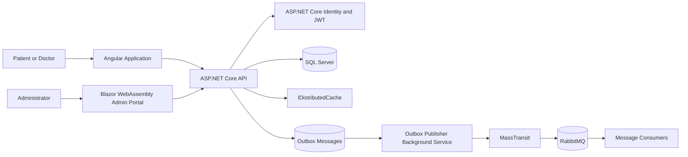
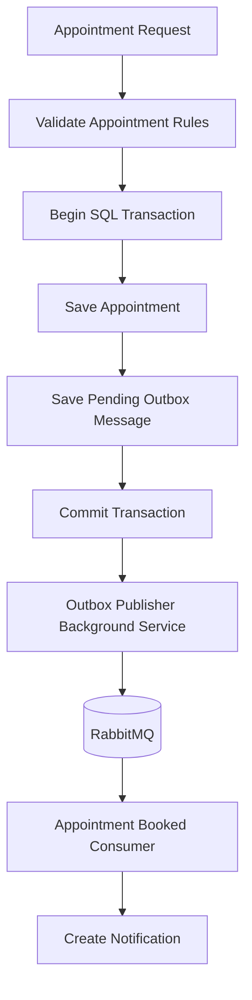
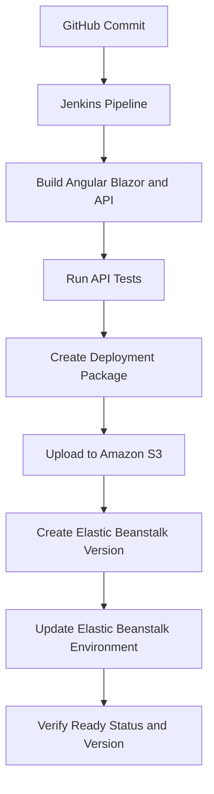

# HealthAxis

HealthAxis is a full-stack healthcare management and appointment platform implemented in the `HealthApp` solution. It combines an Angular application for patients and doctors, a Blazor WebAssembly administrator portal, and an ASP.NET Core API in one deployable application.

## Overview

HealthAxis provides a centralized healthcare experience for patients, doctors, and administrators.

The platform supports:

- User authentication and role-based access
- Doctor and patient management
- Doctor availability and leave workflows
- Appointment booking and appointment status management
- Health-record workflows
- Notifications
- Reliable event publishing through a transactional Outbox
- Angular and Blazor hosting from one ASP.NET Core deployment package

## Main Features

### Patient Experience

- Authentication and patient profile access
- Doctor discovery and availability lookup
- Appointment booking and appointment visibility
- Authorized health-record access
- Notifications

### Doctor Experience

- Authentication and doctor profile access
- Appointment and schedule workflows
- Availability management
- Doctor-leave workflows
- Authorized health-record operations

### Administrator Portal

- Protected Blazor WebAssembly administrator portal
- Administrator dashboard
- Doctor directory, details, creation, and editing
- Doctor account activation and deactivation
- Doctor-leave visibility
- Temporary-password result after doctor creation
- Patient directory and patient details
- Appointment directory and appointment details
- Appointment management operations
- Administrator profile and password change
- Search, filtering, and pagination in supported pages

## User Roles

| Role | Application Access |
|---|---|
| Admin | Blazor administrator portal and admin-authorized API operations |
| Doctor | Angular doctor experience and doctor-authorized API operations |
| Patient | Angular patient experience and patient-authorized API operations |

## Architecture

HealthAxis is delivered as one ASP.NET Core application:

```text
/          Angular application
/admin/    Blazor WebAssembly administrator portal
/api/...   ASP.NET Core API controllers
```

The backend follows a layered architecture:

```text
Controllers
    ↓
Services
    ↓
Repositories
    ↓
Entity Framework Core
    ↓
SQL Server
```

RabbitMQ and MassTransit support asynchronous processing. A transactional Outbox helps prevent event loss between SQL Server and RabbitMQ.



## Technology Stack

### Frontend

- Angular
- TypeScript
- HTML and CSS
- Bootstrap and Bootstrap Icons
- Blazor WebAssembly
- Razor components

### Backend

- C#
- .NET 10
- ASP.NET Core Web API
- Entity Framework Core
- SQL Server
- ASP.NET Core Identity
- JWT bearer authentication
- AutoMapper
- Serilog
- Swagger and OpenAPI

### Messaging and Background Processing

- RabbitMQ
- MassTransit
- Transactional Outbox
- `AppointmentBookedConsumer`
- `AppointmentCancelledByDoctorLeaveConsumer`
- `OutboxPublisherBackgroundService`
- `HeartbeatService`
- `NotificationCleanupService`

### Testing and Delivery

- xUnit
- Moq
- Coverlet
- Jenkins
- GitHub
- Amazon S3
- AWS Elastic Beanstalk

## Project Structure

```text
UST-Live-01/
├── HealthApp.slnx
├── HealthApp.Api/          ASP.NET Core API and static frontend host
├── HealthApp.Angular/      Patient and doctor frontend
├── HealthApp.AdminPortal/  Blazor administrator portal
├── HealthApp.Shared/       Shared DTOs, enums, events, and contracts
├── HealthApp.Api.Tests/    Automated API tests
├── Jenkinsfile             CI/CD pipeline
└── README.md
```

## Authentication and Authorization

HealthAxis uses ASP.NET Core Identity with `ApplicationUser` and `IdentityRole`.

The verified roles are:

```text
Admin
Doctor
Patient
```

JWT bearer validation includes issuer, audience, lifetime, and signing-key validation with zero clock skew. API controllers apply role-specific authorization. Blazor administrator pages use `[Authorize(Roles = "Admin")]`.

Roles and the configured administrator account are seeded during API startup. Demo doctor and patient login users are also seeded for configured demo data.

## Database and Persistence

HealthAxis uses SQL Server through Entity Framework Core and `HealthAppDbContext`.

The database supports:

- ASP.NET Core Identity
- Doctors and patients
- Appointments
- Health records
- Doctor leave
- Notifications
- Outbox messages

The connection string is read from:

```text
ConnectionStrings:DefaultConnection
```

Safe environment-variable example:

```text
ConnectionStrings__DefaultConnection=Server=<SQL_SERVER_HOST>,1433;Database=<DATABASE_NAME>;User Id=<DATABASE_USER>;Password=<DATABASE_PASSWORD>;Encrypt=True;TrustServerCertificate=True
```

## Messaging and Transactional Outbox

MassTransit connects the API to RabbitMQ. HealthAxis uses a transactional Outbox to prevent appointment events from being lost between SQL Server and RabbitMQ.



RabbitMQ production settings are supplied through environment properties:

```text
RabbitMq__Host=<RABBITMQ_HOST>
RabbitMq__Port=5672
RabbitMq__VirtualHost=/
RabbitMq__Username=<RABBITMQ_USERNAME>
RabbitMq__Password=<RABBITMQ_PASSWORD>
```

## Caching

The API uses `IDistributedCache` with `AddDistributedMemoryCache`. Cache entries are stored in the API process memory.

## Logging and Error Handling

HealthAxis uses:

- Serilog Console logging
- Serilog rolling File logging
- Structured HTTP request logging
- `GlobalExceptionHandler`
- ASP.NET Core Problem Details
- `CustomAuthorizationMiddlewareResultHandler`

Swagger and OpenAPI are available only in the Development environment.

## Local Setup

### Prerequisites

- .NET 10 SDK
- Node.js and npm
- Git
- SQL Server
- RabbitMQ
- Windows PowerShell

### Clone the Repository

```powershell
git clone https://github.com/bootcamp-hackerearth/UST-Live-01.git
cd UST-Live-01
git checkout <REPLACE_WITH_BRANCH>
```

### Configure Local Secrets

Use environment variables or .NET User Secrets. Do not commit actual values.

```powershell
$env:ConnectionStrings__DefaultConnection = "<SQL_CONNECTION_STRING>"
$env:Jwt__Key = "<STRONG_JWT_SIGNING_KEY>"
$env:AdminUser__Email = "<ADMIN_EMAIL>"
$env:AdminUser__Password = "<ADMIN_PASSWORD>"
$env:RabbitMq__Host = "<RABBITMQ_HOST>"
$env:RabbitMq__Username = "<RABBITMQ_USERNAME>"
$env:RabbitMq__Password = "<RABBITMQ_PASSWORD>"
```

### Restore Dependencies

```powershell
dotnet restore .\HealthApp.Api\HealthApp.Api.csproj
dotnet restore .\HealthApp.AdminPortal\HealthApp.AdminPortal.csproj
dotnet restore .\HealthApp.Api.Tests\HealthApp.Api.Tests.csproj
```

### Run Angular

```powershell
cd .\HealthApp.Angular
npm ci
npm start
```

### Run Blazor

```powershell
dotnet run --project .\HealthApp.AdminPortal\HealthApp.AdminPortal.csproj
```

### Run the API

```powershell
dotnet run --project .\HealthApp.Api\HealthApp.Api.csproj
```

## Testing

Run the API tests with:

```powershell
dotnet test .\HealthApp.Api.Tests\HealthApp.Api.Tests.csproj
```

A verified Jenkins build completed 269 API tests successfully with no failures or skipped tests. This result may change as the test suite evolves.

## CI/CD and Deployment

GitHub provides source control, while Jenkins performs the verified CI/CD workflow.

The Jenkins pipeline:

1. Checks out the configured branch
2. Builds Angular and Blazor
3. Copies both frontend builds into the API
4. Builds and tests the API
5. Publishes the combined application
6. Creates the Elastic Beanstalk deployment package
7. Uploads the package to Amazon S3
8. Creates an Elastic Beanstalk application version
9. Deploys the version
10. Waits for the expected environment version to become Ready



Current deployment configuration:

```text
AWS region: ap-south-1
Elastic Beanstalk application: HealthAppApi
Elastic Beanstalk environment: HealthAppApi-dev
```

Production secrets are supplied through Elastic Beanstalk environment properties and are not stored in the repository.