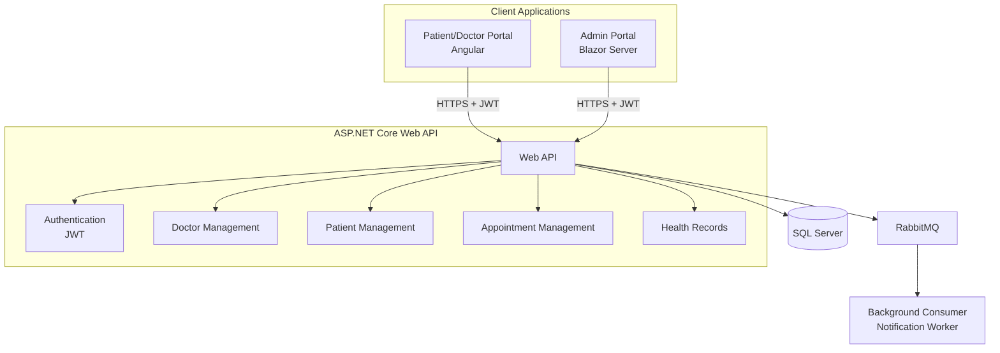

#  Healthcare Management System

A full-stack Healthcare Management System that enables patients to book appointments, doctors to manage patient records, and administrators to manage the healthcare platform. The project is built using **ASP.NET Core Web API**, **Angular**, **Blazor Server**, **SQL Server**, **RabbitMQ**, **JWT Authentication**, and **AWS** services for deployment.

---

# 📌 Features

## 👤 Patient Portal (Angular)

- User Registration
- User Login with JWT Authentication
- View Doctor Availability
- Book Appointments
- View Appointment History
- View Health Records
- Responsive User Interface

---

## 👨‍⚕️ Admin Portal (Blazor)

- Dashboard
- Manage Doctors
- Manage Patients
- Manage Appointments
- Add Health Records
- View Reports

---

## ⚙️ Backend (ASP.NET Core Web API)

- RESTful APIs
- JWT Authentication & Authorization
- Entity Framework Core
- Repository Pattern
- Dependency Injection
- AutoMapper
- Fluent Validation
- Global Exception Handling
- Serilog Logging

---

## 🚀 Additional Features

- RabbitMQ for asynchronous message processing
- AWS Elastic Beanstalk deployment
- AWS S3 deployment support
- CI/CD using Jenkins

---

# 🏗️ Architecture


---

# 🛠️ Tech Stack

## Frontend

- Angular
- TypeScript
- HTML
- CSS

## Admin Portal

- Blazor Server
- Razor Components

## Backend

- ASP.NET Core Web API
- C#
- Entity Framework Core

## Database

- SQL Server

## Authentication

- JWT Authentication

## Messaging

- RabbitMQ

## DevOps

- Jenkins
- AWS Elastic Beanstalk
- AWS EC2
- AWS S3

---

# 📂 Project Structure

```
HealthcareManagementSystem
│
├── HealthCare.Api
├── HealthCareApp.UI(Angular)
├── HealthCare.Admin.UI (Blazor)
├── Healthcare.Shared
└── README.md
```
---

# ⚡ Prerequisites

Install the following before running the project:

- .NET 8 SDK
- Node.js
- Angular CLI
- SQL Server
- RabbitMQ
- Visual Studio 2022 or Visual Studio Code

---

# 🚀 Getting Started

## 1. Clone the Repository

```bash
git clone https://github.com/bootcamp-hackerearth/UST-Live-01/edit/Feature/Sprint5_Pod3_Ajith
```

---

## 2. Restore NuGet Packages

```bash
dotnet restore
```

---

## 3. Configure Database

Update the SQL Server connection string in:

```
appsettings.json
```

Apply migrations:

```bash
dotnet ef database update
```

---

## 4. Start RabbitMQ

Ensure the RabbitMQ server is running before starting the API.

---

## 5. Run the API

```bash
dotnet run
```

The API will be available at:

```
https://localhost:5001
```

---

## 6. Run the Angular Patient Portal

```bash
cd HealthCare.PatientPortal

npm install

ng serve
```

Open:

```
http://localhost:4200
```

---

## 7. Run the Blazor Admin Portal

```bash
dotnet run
```

---

# 🔐 Authentication

The application uses **JWT Authentication**.

Authentication Flow:

1. User logs in.
2. API validates the credentials.
3. JWT token is generated.
4. Token is stored on the client.
5. Every secured API request includes the token.
6. The API validates the token before processing the request.

---

# 📨 RabbitMQ Flow

```
Patient Books Appointment
            │
            ▼
 ASP.NET Core API
            │
Publishes Appointment Event
            │
            ▼
      RabbitMQ Exchange
            │
            ▼
      RabbitMQ Queue
            │
            ▼
 Background Consumer
            │
            ▼
Processes Appointment Notification

---

# 📝 Logging

The application uses **Serilog** for application logging.

Logs include:

- User login events
- Appointment creation
- API requests
- Warnings
- Errors
- Unhandled exceptions

---

# 🔒 Security

- JWT Authentication
- Role-Based Authorization
- Password Hashing
- Input Validation
- Global Exception Handling
- Secure API Endpoints

---

# 🌟 Future Enhancements

- Email Notifications
- SMS Notifications
- Video Consultation
- Online Payment Gateway
- Prescription Management
- Mobile Application
- Docker & Kubernetes Deployment

---

# 👨‍💻 Author

**Ajith M**

---

# 📄 License

This project is developed for learning purposes.
