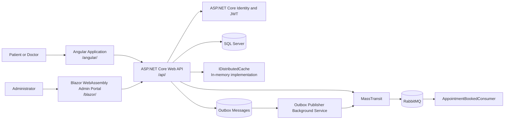
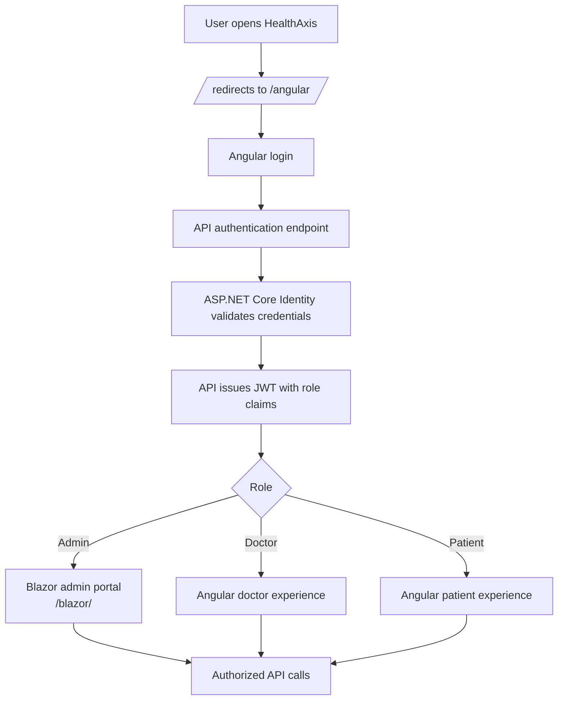
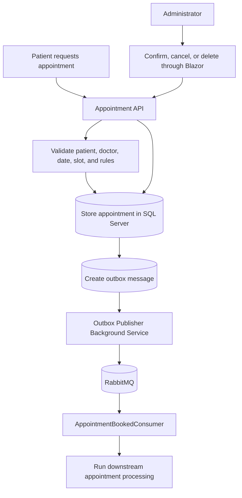
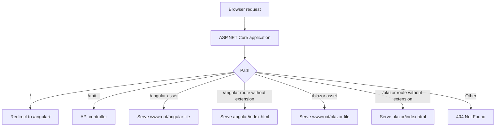
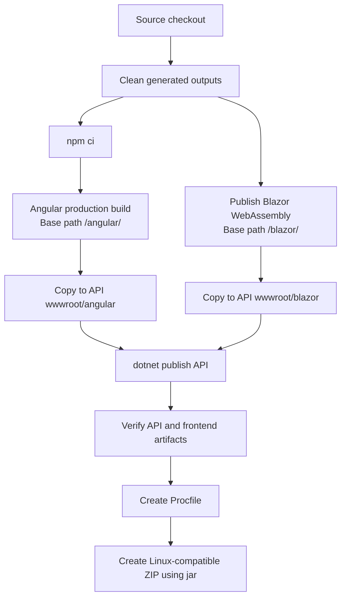
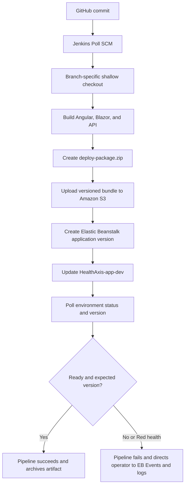
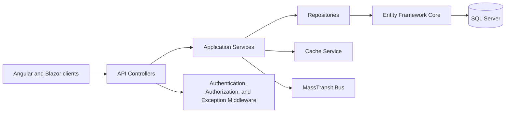

# HealthAxis

**A full-stack healthcare management and appointment platform built with ASP.NET Core, Angular, and Blazor WebAssembly, packaged as one AWS Elastic Beanstalk application.**

> [!IMPORTANT]
> **Security notice:** Never commit passwords, access keys, JWT signing keys, connection strings, private IP addresses, or production configuration values. Use environment variables, .NET User Secrets, Jenkins Credentials, AWS IAM roles, or AWS Elastic Beanstalk environment properties. Rotate any credential that has previously been exposed.

## Quick Start

```powershell
git clone https://github.com/bootcamp-hackerearth/UST-Live-01.git
cd UST-Live-01
git checkout Feature/Pod1_Sprint5_KevinBBaabu

dotnet restore .\HealthAxisApi\HealthAxisCore_Api.csproj
powershell.exe -NoProfile -ExecutionPolicy Bypass -File .\build-frontends.ps1
dotnet run --project .\HealthAxisApi\HealthAxisCore_Api.csproj
```

Before running the application, provide secure SQL Server, RabbitMQ, JWT, and seed-user configuration. The exact local URL is selected by the ASP.NET Core launch profile. Open the printed root URL and navigate to `/angular/`, `/blazor/`, or the Development Swagger page as required.

## Table of Contents

- [Overview](#overview)
- [Problem Statement](#problem-statement)
- [Solution](#solution)
- [Key Features](#key-features)
- [User Roles](#user-roles)
- [Architecture](#architecture)
- [Flow Diagrams](#flow-diagrams)
- [Technology Stack](#technology-stack)
- [Repository Structure](#repository-structure)
- [Authentication and Authorization](#authentication-and-authorization)
- [Routing and Frontend Hosting](#routing-and-frontend-hosting)
- [Database and Persistence](#database-and-persistence)
- [Messaging and Background Processing](#messaging-and-background-processing)
- [Caching](#caching)
- [Error Handling and Logging](#error-handling-and-logging)
- [Prerequisites](#prerequisites)
- [Configuration](#configuration)
- [Local Setup](#local-setup)
- [Build and Publish](#build-and-publish)
- [Testing](#testing)
- [CI/CD Pipeline](#cicd-pipeline)
- [AWS Deployment](#aws-deployment)
- [Security](#security)
- [Troubleshooting](#troubleshooting)
- [Known Limitations](#known-limitations)
- [Roadmap](#roadmap)
- [Contributing](#contributing)
- [License](#license)
- [Project Status](#project-status)

## Overview

HealthAxis centralizes healthcare administration and appointment workflows in a role-aware platform. Patients and doctors use an Angular experience, administrators use a dedicated Blazor WebAssembly portal, and both clients communicate with a shared ASP.NET Core Web API.

The API owns authentication, authorization, persistence, appointment operations, doctor and patient management, health records, messaging, caching, background processing, error handling, structured logging, and static frontend hosting. Angular and Blazor are built separately, copied into the API `wwwroot`, and published together as one deployment package.

### Deployment identifiers

These values are intentionally grouped so they are easy to update after a branch merge or environment change.

| Setting | Current value |
|---|---|
| Repository | `https://github.com/bootcamp-hackerearth/UST-Live-01.git` |
| Development branch | `Feature/Pod1_Sprint5_KevinBBaabu` |
| Target branch after merge | `<REPLACE_WITH_MAIN_BRANCH>` |
| AWS Region | `ap-southeast-2` |
| Elastic Beanstalk application | `HealthAxis-app` |
| Elastic Beanstalk environment | `HealthAxis-app-dev` |
| CI/CD engine | Jenkins on Windows |
| Primary runtime target | AWS Elastic Beanstalk on Linux |

## Problem Statement

Healthcare information and appointment workflows can become fragmented across disconnected interfaces and services. HealthAxis addresses the following needs:

- Patients need a clear path for authentication, doctor discovery, appointment booking, and appointment visibility.
- Doctors need access to schedules and relevant healthcare workflows.
- Administrators need a secure operational portal for doctors, patients, appointments, account status, and related data.
- Backend workflows must remain maintainable, role-aware, observable, and deployable.
- Messaging and background processing must tolerate transient failures without tightly coupling user requests to downstream work.
- The complete solution must be deployable as one Elastic Beanstalk application while preserving separate Angular and Blazor client experiences.

## Solution

HealthAxis combines:

- An Angular frontend for the main patient and doctor experience.
- A Blazor WebAssembly portal for administrative workflows.
- An ASP.NET Core Web API for application logic and REST endpoints.
- A shared .NET project for DTOs, enums, and contracts.
- SQL Server persistence through Entity Framework Core.
- ASP.NET Core Identity and JWT bearer authentication.
- RabbitMQ messaging through MassTransit.
- An outbox publisher background service for reliable publication attempts.
- `IDistributedCache` abstractions backed by distributed in-memory caching in the current configuration.
- Serilog structured logging and global exception handling.
- Swagger/OpenAPI when the API is running in Development.
- A Jenkins pipeline that builds, packages, uploads, and deploys the application to AWS Elastic Beanstalk through Amazon S3.

## Key Features

### Administrator portal

The Blazor WebAssembly administrator portal is designed for operational management and includes code-supported workflows such as:

- Secure administrator access and role authorization.
- Admin dashboard and navigation.
- Doctor directory, creation, editing, activation, and deactivation.
- Temporary password display after doctor creation.
- Browser clipboard integration for copying temporary login information.
- Doctor leave visibility where supported by the current page and API implementation.
- Patient directory and patient details.
- Appointment directory and doctor-associated appointment views.
- Search, filtering, date filtering, status filtering, and pagination where implemented by the corresponding page.
- Appointment confirmation, eligible cancellation with a reason, and deletion where supported by the API.
- Status indicators and appointment legends.

### Angular experience

The Angular application provides the main user-facing experience. Verified project requirements include:

- Authentication and role-based navigation.
- Patient and doctor portal experiences.
- Doctor discovery and dashboards.
- Appointment booking and appointment visibility.
- Patient health-record workflows.
- Administrator redirection to the Blazor portal when supported by the authentication flow.

Routes and UI details can evolve. Review `HealthAxis_AngularProj/src/app` before documenting additional pages as completed behavior.

### Backend capabilities

- REST API controllers.
- Role-aware authentication and authorization.
- Repository and service layers.
- Entity Framework Core persistence.
- ASP.NET Core Identity user and role management.
- JWT generation and validation.
- Appointment lifecycle operations and domain validation.
- Doctor availability and leave handling where present in the current source.
- Health-record workflows where present in the current source.
- RabbitMQ integration through MassTransit.
- Outbox-based publication attempts.
- Background services for recurring application work.
- Structured error handling through `GlobalExceptionHandler`.
- Structured request logging through Serilog.

## User Roles

| Role | Primary client | Responsibility |
|---|---|---|
| Patient | Angular | Authentication, doctor discovery, booking, appointment visibility, and supported health-record workflows |
| Doctor | Angular | Authentication, schedules, availability, and supported doctor workflows |
| Admin | Blazor WebAssembly | Doctor, patient, appointment, account-status, and operational administration |

Authorization enforcement must remain server-side. Client-side route guards improve navigation but do not replace API authorization.

## Architecture

HealthAxis uses a layered full-stack architecture:

1. Angular and Blazor WebAssembly render role-specific client experiences.
2. ASP.NET Core controllers expose authenticated REST operations.
3. Application services contain use-case and domain coordination logic.
4. Repositories isolate data access through Entity Framework Core.
5. SQL Server stores application and ASP.NET Core Identity data.
6. MassTransit connects application workflows to RabbitMQ.
7. Background services perform recurring publication, cleanup, heartbeat, and availability work.
8. Angular and Blazor static assets are hosted by the same ASP.NET Core deployment.

## Flow Diagrams

### 1. High-level system architecture



### 2. Authentication and role-routing flow



### 3. Appointment workflow



### 4. Static hosting and request routing



### 5. Local build and packaging flow



### 6. Jenkins to Elastic Beanstalk deployment flow



### 7. Backend layering



## Technology Stack

### Backend

- C#
- .NET 10
- ASP.NET Core Web API
- Entity Framework Core
- SQL Server
- ASP.NET Core Identity
- JWT bearer authentication
- AutoMapper
- Serilog
- Swagger/OpenAPI

### Frontend

- Angular
- TypeScript
- HTML and CSS
- Blazor WebAssembly
- Razor components
- JavaScript interop where browser APIs require it

### Messaging and background processing

- RabbitMQ
- MassTransit
- `AppointmentBookedConsumer`
- `OutboxPublisherBackgroundService`
- `HeartbeatService`
- `NotificationCleanupService`
- `DoctorAvailabilityMonitorService`

Verify exact registered service names in `Program.cs` before relying on this list for runtime operations.

### Caching

- `IDistributedCache`
- Application cache-service abstraction
- Distributed in-memory cache in the current configuration

### Testing and quality

- .NET test project: `HealthAxisCore_Api.Tests`
- Test framework, coverage tooling, and Sonar configuration must be confirmed from the current branch before being stated as active

### DevOps and cloud

- Git and GitHub
- Jenkins Declarative Pipeline
- PowerShell and Windows batch
- AWS CLI
- Amazon S3
- AWS Elastic Beanstalk
- Linux deployment package
- JDK `jar` utility for ZIP creation with Linux-compatible entry paths

## Repository Structure

```text
UST-Live-01/
├── HealthAxisApi/
│   ├── HealthAxisCore_Api.csproj
│   ├── Controllers/
│   ├── Data/
│   ├── Models/
│   ├── Repository/
│   ├── Services/
│   ├── Messaging/
│   ├── BackgroundServices/
│   └── wwwroot/
│       ├── angular/        # Generated Angular output
│       └── blazor/        # Generated Blazor output
├── HealthAxis_AngularProj/
├── HealthAxisAdminLayout/
├── HealthAxis_Shared/
├── HealthAxisCore_Api.Tests/
├── build-frontends.ps1
├── Jenkinsfile
├── <REPLACE_WITH_SOLUTION_FILE>
└── README.md
```

| Path | Responsibility |
|---|---|
| `HealthAxisApi/` | ASP.NET Core API, persistence, services, repositories, middleware, messaging, background services, and static hosting |
| `HealthAxisApi/HealthAxisCore_Api.csproj` | API project definition |
| `HealthAxis_AngularProj/` | Angular application built for `/angular/` |
| `HealthAxisAdminLayout/` | Blazor WebAssembly administrator portal hosted under `/blazor/` |
| `HealthAxis_Shared/` | Shared DTOs, enums, and contracts for .NET projects |
| `HealthAxisCore_Api.Tests/` | API test project; inspect current source for verified test coverage |
| `build-frontends.ps1` | Builds and validates Angular and Blazor assets, then copies them into API `wwwroot` |
| `Jenkinsfile` | Defines validation, build, packaging, S3 upload, Elastic Beanstalk version creation, deployment, and monitoring |

The published API assembly is:

```text
HealthAxisCore_Api.dll
```

## Authentication and Authorization

HealthAxis uses ASP.NET Core Identity with `ApplicationUser` and `IdentityRole`. The API issues JWT bearer tokens after successful authentication.

Token validation includes:

- Issuer validation
- Audience validation
- Lifetime validation
- Signing-key validation
- Role claim mapping
- Zero clock skew when configured by the API

Administrator Razor pages use role authorization such as:

```csharp
[Authorize(Roles = "Admin")]
```

Roles and the seed administrator are initialized during startup through the repository's seeding implementation. Confirm whether the current branch names the administrator seeder `RoleSeeder`, `AdminSeeder`, or both before changing startup behavior.

JWTs and seed passwords must never be printed, logged, or committed. Production signing keys must be strong and supplied externally.

## Routing and Frontend Hosting

One ASP.NET Core application serves the complete system:

| Path | Purpose |
|---|---|
| `/api/...` | API controllers |
| `/angular/` | Angular static files and client routes |
| `/blazor/` | Blazor WebAssembly static files and client routes |
| `/` | Redirects to `/angular/` |

Build requirements:

- Angular must be built with base href `/angular/`.
- Blazor must be published with base href `/blazor/`.
- Angular output must be copied to `HealthAxisApi/wwwroot/angular`.
- Blazor output must be copied to `HealthAxisApi/wwwroot/blazor`.
- `/angular` should redirect to `/angular/`.
- `/blazor` should redirect to `/blazor/`.
- Requests without a file extension under each SPA path must fall back to the matching `index.html`.

Direct refreshes on frontend routes depend on these ASP.NET Core fallback mappings. Static assets must not be returned through a SPA fallback because JavaScript and CSS requests require their correct content types.

## Database and Persistence

HealthAxis uses SQL Server through Entity Framework Core and `HealthAppDbContext`.

Persistence responsibilities include:

- Domain entities
- ASP.NET Core Identity stores where configured on the same context
- Generic repository operations
- Domain-specific repositories
- Database migrations
- Appointment and outbox persistence

The connection string is loaded from:

```text
ConnectionStrings:DefaultConnection
```

Safe environment-variable example:

```text
ConnectionStrings__DefaultConnection=Server=<SQL_SERVER_HOST>,1433;Database=<DATABASE_NAME>;User Id=<DATABASE_USER>;Password=<DATABASE_PASSWORD>;Encrypt=True;TrustServerCertificate=True
```

Never place the real connection string in the README or committed settings files.

If EF Core migrations are present, typical development commands are:

```powershell
dotnet ef migrations add <MIGRATION_NAME> --project .\HealthAxisApi\HealthAxisCore_Api.csproj
dotnet ef database update --project .\HealthAxisApi\HealthAxisCore_Api.csproj
```

Confirm the startup project and installed EF tool version before running migration commands.

## Messaging and Background Processing

MassTransit connects HealthAxis to RabbitMQ.

- `AppointmentBookedConsumer` consumes appointment-booked events from `appointment-booked-queue` when that queue name is confirmed in configuration.
- Consumer retry is configured for three attempts at five-second intervals.
- `OutboxPublisherBackgroundService` reads pending or retryable failed outbox records and publishes them through MassTransit.
- Consumer retry handles failures after RabbitMQ delivers a message to a consumer.
- Outbox retry handles failures while moving a persisted application event toward the message broker.
- A 30-second host shutdown timeout should be verified in the active configuration before being treated as guaranteed behavior.

Safe configuration examples:

```text
RabbitMQ__Host=<RABBITMQ_HOST>
RabbitMQ__Username=<RABBITMQ_USERNAME>
RabbitMQ__Password=<RABBITMQ_PASSWORD>
```

RabbitMQ credentials, virtual-host permissions, listener binding, and network access must be configured before application startup.

## Caching

Application services depend on `IDistributedCache` through the project's cache-service abstraction.

The current use of `AddDistributedMemoryCache` stores cache entries in the memory of one API process. This is suitable for local development and a single-instance deployment, but it is not shared across multiple Elastic Beanstalk instances.

When scaling horizontally, replace the in-memory implementation with a shared distributed cache such as Redis-compatible infrastructure. Do not assume cache entries are consistent across instances until a shared provider is configured.

## Error Handling and Logging

HealthAxis uses:

- A Serilog bootstrap logger for early startup failures.
- Serilog configuration loaded from application configuration and registered services.
- Structured request logging with HTTP method, path, response status, and elapsed time.
- Warning-level logging for appropriate 4xx responses when configured.
- Error-level logging for 5xx responses and exceptions when configured.
- `GlobalExceptionHandler` for consistent exception handling.
- Console logs suitable for collection by Elastic Beanstalk.
- Swagger/OpenAPI only in Development.

A dedicated `/health` endpoint should be added as a future improvement if the current source does not already provide one.

## Prerequisites

### Local development

- .NET 10 SDK
- Node.js and npm compatible with the committed Angular lock file
- Git
- PowerShell
- SQL Server access
- RabbitMQ access

### Deployment work

- AWS CLI
- Jenkins on Windows
- JDK with the `jar` command
- AWS credentials supplied through Jenkins Credentials or an IAM role
- Corporate CA certificate bundle when required by the network environment

> `npm ci` requires `package.json` and `package-lock.json` to be synchronized. Run `npm install`, review the lock-file update, and commit the corrected lock file when synchronization is required.

## Configuration

ASP.NET Core maps double underscores in environment-variable names to nested configuration keys.

| Configuration key | Purpose | Required | Development source | Production source |
|---|---|---:|---|---|
| `ASPNETCORE_ENVIRONMENT` | Selects Development, Staging, or Production behavior | Yes | Launch profile or shell | Elastic Beanstalk environment property |
| `ConnectionStrings__DefaultConnection` | SQL Server connection string | Yes | User Secrets or shell | Elastic Beanstalk environment property or managed secret |
| `Jwt__Key` | JWT signing key | Yes | User Secrets | Elastic Beanstalk environment property or managed secret |
| `Jwt__Issuer` | Expected token issuer | Yes | Local configuration | Elastic Beanstalk environment property |
| `Jwt__Audience` | Expected token audience | Yes | Local configuration | Elastic Beanstalk environment property |
| `Jwt__DurationInMinutes` | Token lifetime, if this exact key exists in source | Conditional | Local configuration | Elastic Beanstalk environment property |
| `RabbitMQ__Host` | RabbitMQ host name | Yes | User Secrets or shell | Elastic Beanstalk environment property |
| `RabbitMQ__Username` | RabbitMQ user | Yes | User Secrets | Jenkins Credentials or Elastic Beanstalk property |
| `RabbitMQ__Password` | RabbitMQ password | Yes | User Secrets | Jenkins Credentials or Elastic Beanstalk property |
| `NavigationSettings__<REPLACE_WITH_KEY>` | Blazor navigation settings, if configured | Conditional | Local configuration | Elastic Beanstalk environment property |
| `Serilog__MinimumLevel__Default` | Default logging level | Optional | `appsettings.Development.json` | Elastic Beanstalk property or production settings |

Example PowerShell configuration for the current process:

```powershell
$env:ASPNETCORE_ENVIRONMENT = "Development"
$env:ConnectionStrings__DefaultConnection = "Server=<SQL_SERVER_HOST>,1433;Database=<DATABASE_NAME>;User Id=<DATABASE_USER>;Password=<DATABASE_PASSWORD>;Encrypt=True;TrustServerCertificate=True"
$env:Jwt__Key = "<STRONG_JWT_SIGNING_KEY>"
$env:Jwt__Issuer = "<JWT_ISSUER>"
$env:Jwt__Audience = "<JWT_AUDIENCE>"
$env:RabbitMQ__Host = "<RABBITMQ_HOST>"
$env:RabbitMQ__Username = "<RABBITMQ_USERNAME>"
$env:RabbitMQ__Password = "<RABBITMQ_PASSWORD>"
```

Do not commit a production `.env`, a populated `appsettings.Production.json`, or any file containing secrets.

## Local Setup

### 1. Clone and select the branch

```powershell
git clone https://github.com/bootcamp-hackerearth/UST-Live-01.git
cd UST-Live-01
git checkout Feature/Pod1_Sprint5_KevinBBaabu
```

### 2. Configure secrets

Use environment variables, .NET User Secrets, or an uncommitted local settings file. Do not edit committed files with production credentials.

### 3. Restore .NET dependencies

```powershell
dotnet restore .\HealthAxisApi\HealthAxisCore_Api.csproj
dotnet restore .\HealthAxisAdminLayout\<REPLACE_WITH_BLAZOR_PROJECT_FILE>.csproj
```

### 4. Build both frontends

Run from the repository root:

```powershell
powershell.exe -NoProfile -ExecutionPolicy Bypass -File .\build-frontends.ps1
```

The script is expected to:

- Validate project paths.
- Run `npm ci`.
- Build Angular for `/angular/`.
- Publish Blazor for `/blazor/`.
- Locate nested output directories.
- Copy assets into the API `wwwroot` folders.
- Validate important generated files.

### 5. Verify generated assets

```powershell
Test-Path .\HealthAxisApi\wwwroot\angular\index.html
Test-Path .\HealthAxisApi\wwwroot\blazor\index.html
Test-Path .\HealthAxisApi\wwwroot\blazor\_framework
```

Each command should return `True`.

### 6. Run the API host

```powershell
dotnet run --project .\HealthAxisApi\HealthAxisCore_Api.csproj
```

### 7. Open the application

Use the URL printed by `dotnet run`:

```text
<LOCAL_API_ORIGIN>/
<LOCAL_API_ORIGIN>/angular/
<LOCAL_API_ORIGIN>/blazor/
<LOCAL_API_ORIGIN>/swagger/
```

Swagger is expected only in Development.

### 8. Verify startup dependencies

The API may fail or remain unhealthy if SQL Server or RabbitMQ is unavailable. Verify DNS or host resolution, credentials, ports, firewall rules, and database migrations.

Running Angular or Blazor independently requires confirmation of current package scripts, launch profiles, and local API origins before documenting exact commands.

## Build and Publish

The production packaging flow is:

1. Remove prior generated frontend output and publish directories.
2. Run `npm ci` in `HealthAxis_AngularProj`.
3. Build Angular in production mode with base path `/angular/`.
4. Publish Blazor WebAssembly with base path `/blazor/`.
5. Copy Angular output to `HealthAxisApi/wwwroot/angular`.
6. Copy Blazor output to `HealthAxisApi/wwwroot/blazor`.
7. Publish the API in Release mode.
8. Verify the DLL, runtime configuration, dependency manifest, Angular index, Blazor index, and Blazor `_framework` directory.
9. Create a root-level `Procfile` in the publish folder.
10. Create the deployment ZIP from inside the publish directory.

Example API publish:

```powershell
dotnet publish .\HealthAxisApi\HealthAxisCore_Api.csproj `
    -c Release `
    -o .\publish `
    --self-contained false
```

Expected `Procfile`:

```text
web: dotnet HealthAxisCore_Api.dll
```

Create the ZIP from inside `publish` so application files are at the ZIP root:

```powershell
Push-Location .\publish
jar -cMf ..\deploy-package.zip .
Pop-Location
```

The JDK `jar` command is used in this Windows-to-Linux flow because it produces predictable forward-slash ZIP entries and avoids the path interpretation issues encountered with some PowerShell ZIP workflows.

## Testing

The repository includes `HealthAxisCore_Api.Tests`. The exact framework and verified test inventory must be read from the current branch project file and test source before reporting coverage or pass counts.

Run the test project with:

```powershell
dotnet test .\HealthAxisCore_Api.Tests\HealthAxisCore_Api.Tests.csproj
```

If the project contains a configured coverage collector, use its verified command rather than assuming a package:

```powershell
dotnet test .\HealthAxisCore_Api.Tests\HealthAxisCore_Api.Tests.csproj `
    --collect:"<REPLACE_WITH_CONFIGURED_COVERAGE_COLLECTOR>"
```

Quality checks should include:

- Unit and integration tests present in the current branch.
- SonarQube or SonarScanner only when repository configuration confirms it.
- `npm audit` review.
- `dotnet list package --vulnerable` review.
- Review of compiler and analyzer warnings.

Do not treat the absence of a failing pipeline step as proof of complete test coverage.

## CI/CD Pipeline

The Windows-hosted Jenkins Declarative Pipeline is responsible for the automated delivery workflow. Verify the current `Jenkinsfile` before changing stage names or branch settings.

Expected pipeline responsibilities include:

1. Clean or prepare the workspace.
2. Perform branch-specific shallow checkout.
3. Verify required tools.
4. Verify Node HTTPS trust when corporate TLS inspection is present.
5. Validate project files.
6. Remove generated outputs.
7. Restore .NET dependencies.
8. Build Angular and Blazor through `build-frontends.ps1`.
9. Verify frontend artifacts.
10. Publish the API.
11. Create the `Procfile`.
12. Create a Linux-compatible ZIP with `jar`.
13. Verify ZIP contents.
14. Verify AWS credentials, CA trust, S3, and Elastic Beanstalk resources.
15. Upload a build-specific S3 object.
16. Create a unique Elastic Beanstalk application version.
17. Update `HealthAxis-app-dev`.
18. Poll until the environment is `Ready` and running the expected version.
19. Print an environment summary.
20. Archive the deployment artifact.

### Jenkins credentials

| Credential ID | Credential type | Purpose |
|---|---|---|
| `aws-deploy-creds` | AWS Access Key ID and Secret Access Key | AWS CLI deployment operations |
| `aws-ca-bundle` | Jenkins Secret File | Corporate CA certificate bundle for trusted TLS inspection |

Prefer short-lived credentials or IAM roles over long-lived access keys where feasible.

Additional operational notes:

- The repository is public, so checkout can operate without GitHub credentials.
- Poll SCM may be configured approximately every five minutes; verify the active schedule in Jenkins.
- A branch-specific refspec and depth-1 clone reduce checkout scope.
- Corporate TLS inspection may require Node system CA support and `AWS_CA_BUNDLE`.
- Never use `--no-verify-ssl` in a production pipeline.
- Manage CA bundles through Jenkins Credentials, not a laptop-specific path.
- Change the configured branch to `main` after merge if that is the team's workflow.

## AWS Deployment

Current deployment identity:

```text
Region: ap-southeast-2
Application: HealthAxis-app
Environment: HealthAxis-app-dev
```

The deployment sequence is:

1. Jenkins creates `deploy-package.zip`.
2. Jenkins uploads a versioned bundle to Amazon S3.
3. Jenkins creates an Elastic Beanstalk application version that references the S3 object.
4. Jenkins updates the existing Elastic Beanstalk environment to the new version.
5. Jenkins waits for `Ready` status and the expected version label.

The S3 bucket name is an infrastructure identifier and should be supplied as:

```text
<ELASTIC_BEANSTALK_DEPLOYMENT_BUCKET>
```

Deployment requirements:

- Application files must be at the ZIP root, not inside a parent `publish` directory.
- `Procfile` must start `HealthAxisCore_Api.dll`.
- Production configuration must come from Elastic Beanstalk environment properties or managed secrets.
- Elastic Beanstalk networking must reach SQL Server and RabbitMQ.
- SQL Server TCP `1433` and RabbitMQ TCP `5672` should be allowed from the Elastic Beanstalk instance security group, not the public internet.
- Check Elastic Beanstalk Health, Events, and logs after deployment.
- A successful AWS update request proves only that AWS accepted the update, not that the application became healthy.

## Security

- Rotate credentials that have been exposed in source, logs, screenshots, chat, or build output.
- Never commit secrets to Git or documentation.
- Store CI/CD secrets in Jenkins Credentials.
- Store production configuration in Elastic Beanstalk environment properties or a managed secret service.
- Prefer IAM roles and short-lived credentials over long-lived access keys.
- Apply least-privilege IAM policies.
- Keep TLS certificate validation enabled.
- Use a strong external JWT signing key and rotate it under an intentional token invalidation plan.
- Use ASP.NET Core Identity for password hashing and account management.
- Enforce authorization in the API, not only in client routes.
- Restrict SQL Server and RabbitMQ network rules to required sources and ports.
- Keep Development CORS origins limited to verified local URLs.
- Prefer same-origin production hosting for Angular, Blazor, and the API.
- Redact tokens, passwords, connection strings, and personal data from logs.
- Validate DTOs and retain centralized exception handling.
- Review npm and NuGet dependency vulnerabilities regularly.

## Troubleshooting

| Symptom | Likely cause | Resolution |
|---|---|---|
| Root URL returns 404 | Missing root redirect | Verify `/` redirects to `/angular/` |
| Deep-link refresh under `/angular/` or `/blazor/` returns 404 | SPA fallback missing or index file absent | Verify fallback mappings and generated `index.html` files |
| Angular build fails at `npm ci` | `package.json` and lock file are out of sync | Run `npm install`, review and commit `package-lock.json`, then retry `npm ci` |
| Jenkins checkout fails with early EOF, curl 56, or abrupt close | Network interruption or oversized checkout | Use branch-specific shallow checkout, retry, prefer HTTP/1.1 when required, and remove generated binaries from Git |
| AWS CLI reports `CERTIFICATE_VERIFY_FAILED` | Corporate CA is not trusted | Supply the corporate CA through `AWS_CA_BUNDLE` or a Jenkins Secret File |
| CDK or a Node-based tool reports no credentials although credentials exist | TLS trust prevents credential discovery or AWS calls | Verify Node system CA support and the complete certificate chain |
| Elastic Beanstalk update succeeds but the site is unhealthy | Runtime, startup, configuration, database, broker, or routing failure | Inspect EB Events and logs; verify .NET runtime, `Procfile`, environment properties, SQL Server, RabbitMQ, and health path |
| SQL connection fails | Invalid connection string, blocked port, or network route | Verify syntax, TCP `1433`, host firewall, VPC routing, and security-group source |
| RabbitMQ connection fails | Invalid host, credentials, vhost, listener, or firewall | Verify configuration, TCP `5672`, listener binding, permissions, and security-group source |
| Blazor date formatting appears as source text | Razor expression parsing | Keep method calls inside `@(...)` |
| Action buttons overflow a table | Insufficient column width | Reserve an explicit action column, fixed action slots, and horizontal scrolling on narrow screens |

## Known Limitations

- Distributed in-memory caching is process-local.
- Multiple API instances require a shared distributed cache.
- Background services run in every horizontally scaled web instance unless coordinated or separated.
- SQL Server and RabbitMQ connectivity depends on VPC routing, firewalls, and security groups.
- Poll SCM is less immediate and less efficient than a webhook.
- The pipeline is Windows-hosted and depends on Windows batch, PowerShell, and JDK `jar`.
- Corporate TLS inspection requires managed CA trust.
- Dependency vulnerability warnings require review and remediation.
- A dedicated health endpoint remains a recommendation unless verified in the current branch.
- Test coverage, Sonar status, and end-to-end automation must not be claimed without verified reports.

## Roadmap

Proposed future improvements:

- Replace process-local caching with a shared distributed cache for multi-instance deployment.
- Add dedicated readiness and liveness health checks.
- Replace Poll SCM with a GitHub webhook or managed CI trigger.
- Expand automated integration and end-to-end tests.
- Remediate dependency vulnerabilities.
- Centralize secrets in AWS Secrets Manager or AWS Systems Manager Parameter Store.
- Add deployment rollback automation.
- Separate or coordinate background workers for horizontal scaling.
- Add observability dashboards, alarms, and actionable alerts.

## Contributing

1. Fetch or pull before starting work.
2. Create or use the assigned feature branch.
3. Keep commits focused and descriptive.
4. Do not commit generated output, logs, deployment ZIPs, or secrets.
5. Run the build and tests before pushing.
6. Use `git pull --rebase` carefully when the remote branch advances.
7. Open a pull request to `main` according to team policy.
8. Update the Jenkins branch configuration after merge when required.

### Repository hygiene

Do not commit:

```text
.vs/
**/bin/
**/obj/
**/node_modules/
**/dist/
.angular/
artifacts/
publish/
testpublish/
backup-blazor*/
HealthAxisApi/wwwroot/angular/
HealthAxisApi/wwwroot/blazor/
*.zip
Logs/
*.log
TestResults/
coverage*/
.env
appsettings.Local.json
.aws/
.elasticbeanstalk/
```

Commit and maintain:

- `package-lock.json`
- `Jenkinsfile`
- `build-frontends.ps1`
- Project and solution files
- Angular source
- Blazor source
- API source
- Shared contracts
- Database migrations, according to team policy

## License

No repository license has been verified for this branch. Add the appropriate license file and replace this section with the approved project license:

```text
<REPLACE_WITH_LICENSE>
```

## Project Status

HealthAxis is an actively developed educational full-stack healthcare platform. The repository supports local development and a Jenkins-driven AWS Elastic Beanstalk deployment workflow. Production readiness depends on secure external configuration, verified tests, dependency remediation, health checks, backup planning, and infrastructure hardening.
