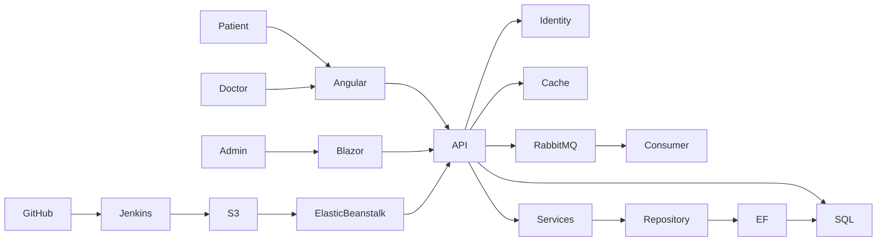
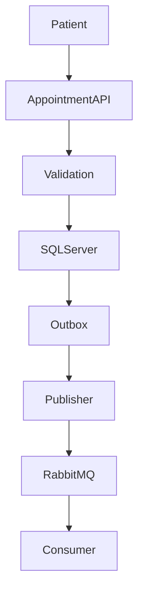
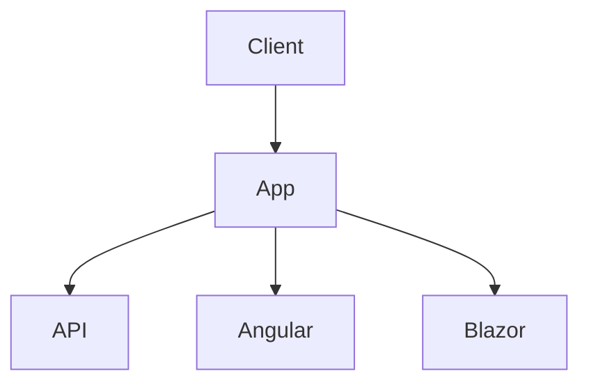
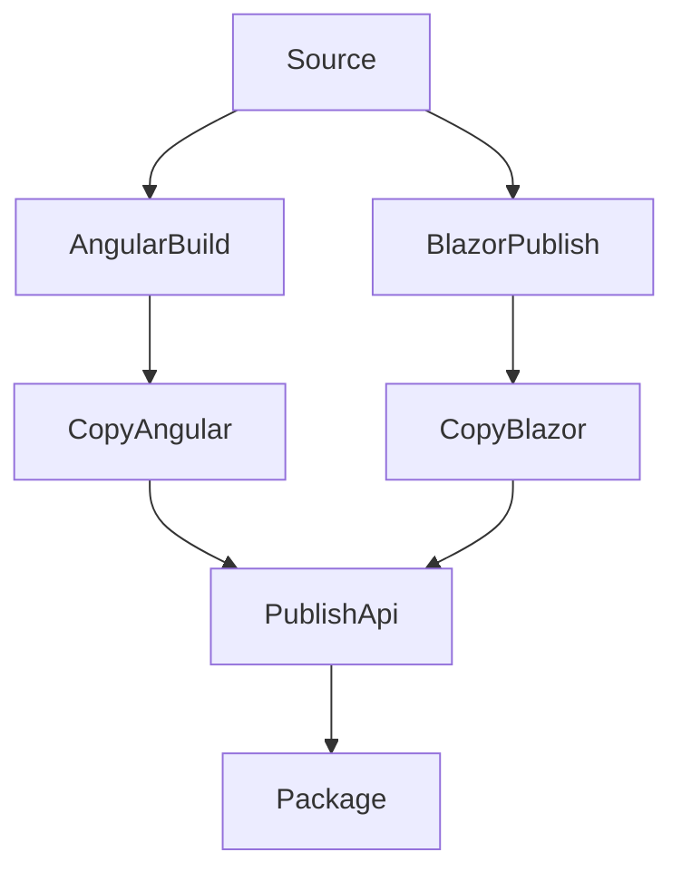
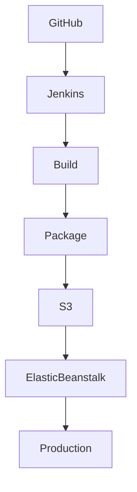
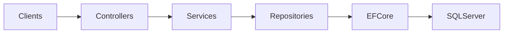

\# HealthAxis


> Full-Stack Healthcare Management and Appointment Platform built with ASP.NET Core, Angular, Blazor WebAssembly, SQL Server, RabbitMQ, AWS, and Jenkins CI/CD.


\---


\## Security Notice


⚠️ \*\*Do not commit secrets to source control.\*\*


All sensitive values such as:


\- Database passwords

\- JWT signing keys

\- RabbitMQ passwords

\- AWS credentials

\- Elastic Beanstalk environment settings


must be stored in:


\- Environment Variables

\- ASP.NET User Secrets

\- Jenkins Credentials

\- AWS Elastic Beanstalk Environment Properties


Never store secrets in Git, README files, or committed configuration files.


\---


\# Table of Contents


\- Quick Start

\- #overview

\- #problem-statement

\- Solution

\- #key-features

\- User Roles

\- #architecture

\- #flow-diagrams

\- Technology Stack

\- #repository-structure

\- #authentication-and-authorization

\- #routing-and-frontend-hosting

\- \[Database and-persistence

\- \[Messaging and Background-processing

\- \[caching

\- \[Error Handling and Logging

\- \[Prerequisites](#prerequisitesn

\- \[Local Setup](#local-and-publish

\- \[Testing- #cicd-pipeline

\- \[AWS Deployment](#aws-deployment)

\- Security

\- #known-limitations

\- \[Roadmap](#\[Repository Hygiene](#repository-hg

\- \[License- #project-status


\---


\# Quick Start


```powershell

git clone <REPLACE\_WITH\_REPOSITORY\_URL>

cd UST-Live-01


git checkout Feature/Sprint5\_Pod4\_NandanaLinson


dotnet restore .\\HealthAxisApi\\HealthAxisCore\_Api.csproj


powershell.exe -NoProfile -ExecutionPolicy Bypass -File .\\build-frontends.ps1


dotnet run --project .\\HealthAxisApi\\HealthAxisCore\_Api.csproj

```


Open:


```text

/

&#x20;/angular/

&#x20;/blazor/

&#x20;/swagger

```


(Development environment only)


\---


\# Overview


HealthAxis is a healthcare management platform that combines:


\- Angular patient and doctor portal

\- Blazor WebAssembly administrator portal

\- ASP.NET Core Web API backend

\- SQL Server persistence

\- JWT authentication

\- ASP.NET Core Identity

\- RabbitMQ messaging

\- Structured logging

\- AWS deployment

\- Jenkins CI/CD automation


The platform is designed to centralize healthcare workflows while supporting multiple user roles from a unified backend.


\---


\# Problem Statement


Healthcare workflows are frequently fragmented across multiple disconnected systems.


Common challenges include:


\- Inefficient appointment booking processes

\- Lack of centralized patient records

\- Limited operational visibility for administrators

\- Difficulty managing doctors and schedules

\- Complex deployment and operational maintenance


HealthAxis addresses these issues through a unified healthcare management platform supporting patients, doctors, and administrators.


\---


\# Solution


HealthAxis delivers:


\- Angular frontend for Patients and Doctors

\- Blazor WebAssembly Admin Portal

\- ASP.NET Core Web API

\- Shared DTO and contract library

\- SQL Server data storage

\- ASP.NET Identity authentication

\- JWT token-based authorization

\- RabbitMQ messaging

\- Background processing services

\- AWS Elastic Beanstalk hosting

\- Jenkins-based CI/CD deployment


\---


\# Key Features


\## Administrator Portal


\### Dashboard


\- Total Doctors

\- Total Patients

\- Total Appointments

\- Today's Appointments

\- Daily Appointment Statistics


\### Doctor Management


\- Create doctor accounts

\- Edit doctor information

\- View doctor details

\- Activate/deactivate accounts

\- Temporary password generation

\- Clipboard copy integration


\### Patient Management


\- View patient directory

\- Browse patient information

\- Search and filter records


\### Appointment Management


\- Appointment directory

\- Appointment details

\- Daily appointment summary

\- Search

\- Status filtering

\- Date filtering

\- Pagination

\- Appointment monitoring


\---


\## Patient Experience


\### Authentication


\- Registration

\- Login

\- JWT authentication

\- Password management


\### Doctor Discovery


\- Browse active doctors

\- View doctor profiles

\- Filter by specialization

\- View doctor availability


\### Appointment Management


\- Book appointments

\- View upcoming appointments

\- View pending appointments

\- Cancel eligible appointments

\- View appointment history


\### Health Records


\- View personal health records


\---


\## Doctor Experience


\### Doctor Dashboard


\- Upcoming appointments

\- Pending appointments

\- Confirmed visits

\- Completed consultations

\- Health record overview


\### Appointment Actions


\- Confirm appointments

\- Complete appointments

\- Add health records

\- View patient appointments


\### Health Records


\- Create records

\- View records

\- Update records

\- Manage consultation data


\### Profile


\- View profile

\- Update account information

\- Change temporary password


\---


\## Backend Features


\### Authentication


\- ASP.NET Core Identity

\- JWT token generation

\- Role authorization


\### Persistence


\- Entity Framework Core

\- Repository Pattern

\- Service Layer Pattern


\### API Services


\- Doctor Management

\- Patient Management

\- Appointment Management

\- Health Records

\- Dashboard Reporting


\### Reliability


\- Global Exception Handling

\- Domain-specific validation

\- Structured logging


\### DevOps


\- AWS deployment

\- Jenkins CI/CD

\- Automated packaging

\- Automated deployment


\---


\# User Roles


| Role | Capabilities |

|--------|--------|

| Admin | Manage doctors, patients, appointments, dashboard |

| Doctor | Manage appointments, health records, profile |

| Patient | Book appointments, view doctors, health records |


\---


\# Architecture


\## High-Level Architecture





\---


\# Flow Diagrams


\## System Architecture


```mermaid

flowchart LR

&#x20;   U\[Patient or Doctor] --> A\[Angular Application]

&#x20;   AD\[Administrator] --> B\[Blazor Admin Portal]

&#x20;   A --> API\[ASP.NET Core API]

&#x20;   B --> API

&#x20;   API --> ID\[Identity and JWT]

&#x20;   API --> DB\[(SQL Server)]

&#x20;   API --> CACHE\[In-Memory Cache]

&#x20;   API --> MT\[MassTransit]

&#x20;   MT --> RMQ\[(RabbitMQ)]

```


\---


\## Authentication Flow


```mermaid

flowchart TD

&#x20;   Login --> Identity

&#x20;   Identity --> JWT

&#x20;   JWT --> Role

&#x20;   Role --> Admin

&#x20;   Role --> Doctor

&#x20;   Role --> Patient

```


\---


\## Appointment Workflow





\---


\## Request Routing





\---


\## Build Flow





\---


\## Jenkins Deployment Flow





\---


\## Backend Layering





\---


\# Technology Stack


\## Backend


\- C#

\- .NET 10

\- ASP.NET Core Web API

\- Entity Framework Core

\- SQL Server

\- ASP.NET Identity

\- JWT Authentication

\- AutoMapper

\- Serilog

\- Swagger


\## Frontend


\### Angular


\- Angular

\- TypeScript

\- HTML

\- CSS


\### Blazor


\- Blazor WebAssembly

\- Razor Components

\- JavaScript Interop


\## Messaging


\- RabbitMQ

\- MassTransit

\- AppointmentBookedConsumer

\- OutboxPublisherBackgroundService


\## Caching


\- IDistributedCache

\- Distributed Memory Cache


\## DevOps


\- Git

\- GitHub

\- Jenkins

\- AWS S3

\- AWS Elastic Beanstalk

\- AWS CLI


\---


\# Repository Structure


```text

HealthAxisApi/

HealthAxis\_AngularProj/

HealthAxisAdminLayout/

HealthAxis\_Shared/

HealthAxisCore\_Api.Tests/

build-frontends.ps1

Jenkinsfile

HealthAxisApi.slnx

```


\## HealthAxisApi


\- Controllers

\- Services

\- Repositories

\- EF Core Context

\- Middleware

\- Models

\- Background Services


\## HealthAxis\_AngularProj


Patient and Doctor Portal.


\## HealthAxisAdminLayout


Blazor WebAssembly Admin Portal.


\## HealthAxis\_Shared


Shared DTOs, Contracts and Enums.


\---


\# Authentication and Authorization


HealthAxis uses:


\- ASP.NET Core Identity

\- JWT Bearer Authentication

\- Role-Based Authorization


Roles:


\- Admin

\- Doctor

\- Patient


Role seeding is handled through:


\- RoleSeeder

\- AdminSeeder


Production JWT keys should always be provided externally.


\---


\# Routing and Frontend Hosting


The API hosts both frontends.


```text

/api/

/angular/

/blazor/

```


Root path:


```text

/ -> /angular/

```


Angular Build Output:


```text

HealthAxisApi/wwwroot/angular

```


Blazor Build Output:


```text

HealthAxisApi/wwwroot/blazor

```


\---


\# Database and Persistence


Database:


```text

SQL Server

```


Context:


```text

HealthAxisDbContext

```


Connection String Example:


```text

ConnectionStrings\_\_DefaultConnection=Server=<SQL\_SERVER\_HOST>,1433;Database=<DATABASE\_NAME>;User Id=<DATABASE\_USER>;Password=<DATABASE\_PASSWORD>;Encrypt=True;TrustServerCertificate=True

```


The platform uses:


\- Generic Repository

\- Domain Repositories

\- Entity Framework Core

\- Identity Database Integration


\---


\# Messaging and Background Processing


RabbitMQ Configuration


```text

RabbitMQ\_\_Host=<RABBITMQ\_HOST>

RabbitMQ\_\_Username=<RABBITMQ\_USERNAME>

RabbitMQ\_\_Password=<RABBITMQ\_PASSWORD>

```


Components:


\- RabbitMQ

\- MassTransit

\- AppointmentBookedConsumer

\- OutboxPublisherBackgroundService

\- HeartbeatService

\- NotificationCleanupService

\- DoctorAvailabilityMonitorService


\---


\# Caching


Current implementation:


```csharp

AddDistributedMemoryCache()

```


Important:


\- Cache is process-local.

\- Suitable for single-instance deployment.

\- Multi-instance deployments should move to Redis-compatible caching.


\---


\# Error Handling and Logging


Implemented:


\- GlobalExceptionHandler

\- Serilog Logging

\- Structured Logging

\- Request Logging

\- Error Logging


Swagger is enabled in Development environments.


\---


\# Prerequisites


\- .NET 10 SDK

\- Node.js

\- npm

\- Git

\- SQL Server

\- RabbitMQ

\- PowerShell


Optional:


\- AWS CLI

\- Jenkins

\- JDK


\---


\# Configuration


| Setting | Required |

|-----------|---------|

| ASPNETCORE\_ENVIRONMENT | Yes |

| Jwt\_\_Key | Yes |

| Jwt\_\_Issuer | Yes |

| Jwt\_\_Audience | Yes |

| ConnectionStrings\_\_DefaultConnection | Yes |

| RabbitMQ\_\_Host | Yes |

| RabbitMQ\_\_Username | Yes |

| RabbitMQ\_\_Password | Yes |


\---


\# Local Setup


```powershell

git clone <REPLACE\_WITH\_REPOSITORY\_URL>


cd UST-Live-01


git checkout Feature/Sprint5\_Pod4\_NandanaLinson

```


Restore:


```powershell

dotnet restore .\\HealthAxisApi\\HealthAxisCore\_Api.csproj

```


Build Frontends:


```powershell

powershell.exe -NoProfile -ExecutionPolicy Bypass -File .\\build-frontends.ps1

```


Run:


```powershell

dotnet run --project .\\HealthAxisApi\\HealthAxisCore\_Api.csproj

```


\---


\# Build and Publish


Production sequence:


1\. Clean outputs

2\. npm ci

3\. Angular Build

4\. Blazor Publish

5\. Copy Assets

6\. Publish API

7\. Verify Artifacts

8\. Create Procfile

9\. Create Deployment ZIP


Procfile


```text

web: dotnet HealthAxisCore\_Api.dll

```


\---


\# Testing


Run:


```powershell

dotnet test .\\HealthAxisCore\_Api.Tests\\HealthAxisCore\_Api.Tests.csproj

```


Verified test details require inspection of the test project.


\---


\# CI/CD Pipeline


The Jenkins pipeline performs:


1\. Workspace Cleanup

2\. GitHub Checkout

3\. Tool Validation

4\. .NET Restore

5\. Angular Build

6\. Blazor Publish

7\. API Publish

8\. Artifact Verification

9\. ZIP Packaging

10\. S3 Upload

11\. Elastic Beanstalk Version Creation

12\. Environment Update

13\. Deployment Monitoring


\## Automated Deployment Flow


```text

GitHub Push

&#x20;     ↓

Jenkins Trigger

&#x20;     ↓

Build

&#x20;     ↓

Package

&#x20;     ↓

AWS S3

&#x20;     ↓

Elastic Beanstalk

&#x20;     ↓

Production Deployment

```


\---


\# AWS Deployment


Region:


```text

ap-southeast-2

```


Application:


```text

HealthAxis-app

```


Environment:


```text

HealthAxis-app-dev

```


Deployment Package:


```text

ZIP bundle

```


Requirements:


\- Procfile

\- API DLL

\- Angular Assets

\- Blazor Assets


\---


\# Security


Security Practices:


\- JWT Authentication

\- ASP.NET Identity

\- Password Hashing

\- Role Authorization

\- Structured Exception Handling

\- Secret Rotation

\- Least Privilege Access

\- Environment-Based Configuration

\- Secure Database Access

\- Secure RabbitMQ Access


Never commit:


\- Passwords

\- Tokens

\- Keys

\- Access Credentials


\---


\# Troubleshooting


\## Angular Build Failure


Cause:


```text

package.json and package-lock.json mismatch

```


Resolution:


```powershell

npm install

commit package-lock.json

```


\## SQL Connection Failure


Verify:


\- Firewall

\- TCP 1433

\- Security Groups

\- Connection Strings


\## RabbitMQ Connection Failure


Verify:


\- Host

\- Credentials

\- TCP 5672


\## AWS Deployment Healthy But Not Working


Check:


\- Events

\- Logs

\- Procfile

\- Database Connectivity

\- RabbitMQ Connectivity


\---


\# Known Limitations


\- Distributed Memory Cache is process-local.

\- Multi-instance deployments require shared cache.

\- Poll SCM is slower than webhooks.

\- Background services may require separation in large-scale deployments.

\- AWS networking dependencies affect service availability.

\- Dedicated health endpoint is a recommended future enhancement.


\---


\# Roadmap


Future Enhancements:


\- Redis-compatible distributed caching

\- Dedicated health checks

\- GitHub webhook triggering

\- Integration tests

\- End-to-end tests

\- AWS Secrets Manager integration

\- Automated rollback support

\- Centralized observability dashboards

\- Alerting and monitoring


\---


\# Repository Hygiene


Do Not Commit:


```text

.vs

bin

obj

node\_modules

dist

.angular

artifacts

publish

testpublish

logs

coverage

.zip packages

.env

local settings

```


Commit:


```text

Jenkinsfile

build-frontends.ps1

Solution Files

API Source

Angular Source

Blazor Source

Shared Contracts

package-lock.json

```


\---


\# Contributing


Workflow:


1\. Pull latest changes

2\. Create feature branch

3\. Implement changes

4\. Run builds

5\. Run tests

6\. Commit focused changes

7\. Push branch

8\. Open Pull Request


After merge:


\- Update Jenkins branch configuration if required.


\---


\# License


<REPLACE\_WITH\_LICENSE>


\---


\# Project Status


HealthAxis is actively developed and currently includes a production deployment workflow on AWS Elastic Beanstalk, automated Jenkins CI/CD integration, Angular patient and doctor experiences, a Blazor administrator portal, and an ASP.NET Core backend supporting healthcare appointment and health-record management.

