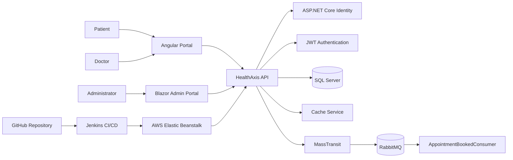
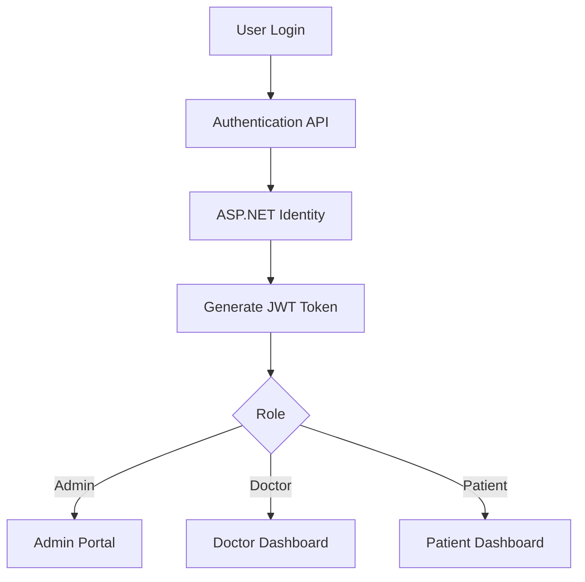
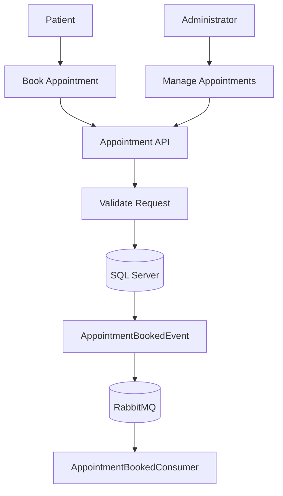
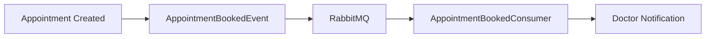
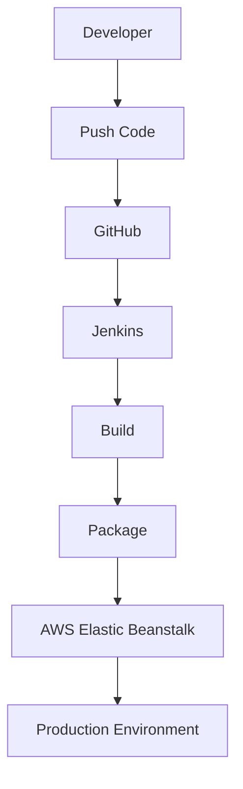

# HealthAxis

> A Full-Stack Healthcare Management and Appointment Platform built with ASP.NET Core Web API, Angular, Blazor WebAssembly, SQL Server, RabbitMQ, AWS Elastic Beanstalk, and Jenkins CI/CD.

---

# Quick Start

```powershell
git clone https://github.com/bootcamp-hackerearth/UST-Live-01.git

cd UST-Live-01

git checkout Feature/Sprint5_Pod4_NandanaLinson

dotnet restore .\HealthAxis.Api\HealthAxis.Api.csproj

powershell.exe -NoProfile -ExecutionPolicy Bypass -File .\build-frontends.ps1

dotnet run --project .\HealthAxis.Api\HealthAxis.Api.csproj
```

---

# Security Notice

⚠️ Never commit secrets to source control.

Store the following securely:

- Database connection strings
- JWT signing keys
- RabbitMQ credentials
- AWS credentials
- API secrets

Use:

- Environment Variables
- ASP.NET User Secrets
- Jenkins Credentials
- AWS Elastic Beanstalk Environment Variables

---

# Overview

HealthAxis is a healthcare management platform that provides a complete digital healthcare experience for:

- Patients
- Doctors
- Administrators

The platform centralizes:

- Appointment booking
- Consultation management
- Digital health records
- Doctor administration
- Patient administration
- Authentication and authorization
- Notifications and messaging
- Cloud deployment workflows

---

# Problem Statement

Healthcare operations are often spread across disconnected systems, making it difficult to:

- Manage appointments efficiently
- Maintain patient records
- Provide doctors with consultation workflows
- Offer centralized administration
- Maintain secure access control
- Deploy updates reliably

HealthAxis addresses these challenges through a unified healthcare ecosystem.

---

# Solution

HealthAxis combines:

- Angular Patient Portal
- Angular Doctor Portal
- Blazor WebAssembly Admin Portal
- ASP.NET Core REST API
- SQL Server Database
- ASP.NET Identity
- JWT Authentication
- RabbitMQ Messaging
- MassTransit Integration
- Distributed Caching
- AWS Cloud Deployment
- Jenkins CI/CD Automation

---

# Key Features

## Authentication & Authorization

- ASP.NET Core Identity
- JWT Authentication
- Role-Based Authorization
- Session Management
- Secure Password Management
- Change Password Workflow
- Temporary Password Enforcement
- Authentication Guards
- Role Guards
- JWT HTTP Interceptor

---

## Patient Portal

### Patient Dashboard

- Appointment overview
- Upcoming appointments
- Pending appointments
- Completed appointments
- Health record statistics
- Latest health record preview
- Quick actions

### Appointment Booking

- Select specialization
- Select doctor
- Select appointment date
- Select available slot
- Booking validation
- Appointment confirmation

### Appointment Management

- View appointments
- Search appointments
- Filter appointments
- Paginated appointment list
- Cancel appointments
- View cancellation reasons

### Health Records

- View diagnosis
- View prescriptions
- View consultation notes
- Search records
- Filter records
- View appointment-linked records

### Profile Management

- Update profile
- View healthcare information
- Change password
- Manage insurance information

---

## Doctor Portal

### Doctor Dashboard

- Appointment statistics
- Upcoming appointments
- Confirmed appointments
- Pending appointments
- Completed appointments
- Health record statistics

### Appointment Management

- Confirm appointments
- Complete appointments
- Cancel appointments
- Search appointments
- Filter appointments
- Pagination support

### Health Records

- Create health records
- View health records
- Search records
- Filter records
- Manage consultations

### Profile

- View profile information
- View specialization
- View consultation fee
- View experience
- Change password

---

## Administrator Portal

### Dashboard

- Total Doctors
- Total Patients
- Total Appointments
- Today's Appointments
- Pending Appointments
- Completed Appointments
- Cancelled Appointments

### Doctor Management

- Add Doctor
- Edit Doctor
- Activate Doctor
- Deactivate Doctor
- Search Doctors
- Filter Doctors
- Pagination
- Temporary Password Generation

### Patient Management

- Add Patient
- Edit Patient
- View Patient Details
- Search Patients
- Filter Patients
- Pagination

### Appointment Management

- View Appointments
- Add Appointments
- Edit Appointments
- Delete Appointments
- Search Appointments
- Filter by Status
- Filter by Date
- Pagination

---

# User Roles

| Role | Responsibilities |
|--------|--------|
| Admin | Manage doctors, patients, appointments, administration |
| Doctor | Manage appointments and health records |
| Patient | Book appointments and access healthcare information |

---

# Architecture

## High-Level Architecture



---

# Authentication Flow



---

# Appointment Workflow



---

# Technology Stack

## Backend

- C#
- ASP.NET Core Web API
- Entity Framework Core
- ASP.NET Core Identity
- JWT Authentication
- AutoMapper
- SQL Server
- Serilog

## Frontend

### Angular

- Angular
- TypeScript
- HTML
- CSS

### Blazor

- Blazor WebAssembly
- Razor Components

## Messaging

- RabbitMQ
- MassTransit
- AppointmentBookedConsumer

## Caching

- Distributed Cache
- Cache Service

## DevOps

- Git
- GitHub
- Jenkins
- AWS Elastic Beanstalk
- AWS S3
- AWS CLI

---

# Repository Structure

```text
HealthAxis.Api/
│
├── Controllers
├── Services
├── Repositories
├── Models
├── DTOs
├── Middleware
├── Consumers
├── Data
└── BackgroundServices

HealthAxis_AngularProj/
│
├── Patient Portal
├── Doctor Portal
├── Services
├── Guards
├── Interceptors

HealthAxisAdminLayout/
│
├── Dashboard
├── Doctors
├── Patients
├── Appointments
└── Services

HealthAxis_Shared/
│
├── DTOs
├── Contracts
└── Enums

HealthAxisCore_Api.Tests/

build-frontends.ps1
Jenkinsfile
```

---

# Database & Persistence

## Database

```text
SQL Server
```

## ORM

```text
Entity Framework Core
```

## Patterns

- Repository Pattern
- Service Layer Pattern
- AutoMapper Mapping

### Example Configuration

```text
ConnectionStrings__DefaultConnection=Server=<SQL_SERVER_HOST>,1433;Database=<DATABASE_NAME>;User Id=<DATABASE_USER>;Password=<DATABASE_PASSWORD>;Encrypt=True;TrustServerCertificate=True
```

---

# Messaging & Background Processing

HealthAxis uses RabbitMQ and MassTransit for asynchronous communication.

### Components

- RabbitMQ
- MassTransit
- AppointmentBookedConsumer
- HeartbeatBackgroundService

### Messaging Flow



---

# Error Handling & Logging

## Logging

- Serilog Console Logging
- File Logging
- Structured Logging

## Error Handling

- Global Exception Handler
- Validation Handling
- Authorization Handling
- Custom Exceptions

## API Documentation

Swagger/OpenAPI enabled during development.

---

# Sprint Progress

## Sprint 1

- Requirement gathering
- Solution architecture
- Database design

## Sprint 2

- Authentication
- JWT Implementation
- Role Management
- Repository Pattern

## Sprint 3

- Patient Workflows
- Doctor Workflows
- Appointment Management
- Health Records

## Sprint 4

- Blazor Admin Portal
- Dashboard
- Doctor Management
- Patient Management
- Appointment Administration

## Sprint 5

### AWS Deployment

- Deployed application to AWS Elastic Beanstalk
- Configured deployment environment
- Hosted Angular, Blazor, and API together

### Jenkins CI/CD Pipeline

- Implemented Jenkins Pipeline
- Connected GitHub Repository
- Automated build process
- Automated deployment process
- AWS deployment automation

### Deployment Flow

```text
GitHub Push
    ↓
Jenkins Build
    ↓
Angular Build
    ↓
Blazor Publish
    ↓
API Publish
    ↓
Create Deployment Package
    ↓
AWS Elastic Beanstalk Deployment
```

---

# Configuration

## Required Environment Variables

```text
ASPNETCORE_ENVIRONMENT

Jwt__Key
Jwt__Issuer
Jwt__Audience

ConnectionStrings__DefaultConnection

RabbitMQ__Host
RabbitMQ__Username
RabbitMQ__Password
```

---

# Local Setup

## Restore Dependencies

```powershell
dotnet restore
```

## Build Frontends

```powershell
powershell.exe -NoProfile -ExecutionPolicy Bypass -File .\build-frontends.ps1
```

## Run Application

```powershell
dotnet run --project .\HealthAxis.Api\HealthAxis.Api.csproj
```

---

# Testing

Run tests:

```powershell
dotnet test
```

Testing areas include:

- Services
- Repositories
- Business Logic
- API Components

---

# Jenkins CI/CD Pipeline

### Pipeline Stages

1. Checkout Source
2. Validate Build Environment
3. Restore Packages
4. Build Angular
5. Publish Blazor
6. Publish API
7. Create Deployment Package
8. Deploy to AWS
9. Verify Deployment

### Deployment Architecture



---

# AWS Deployment

| Configuration | Value |
|--------------|--------|
| Region | ap-southeast-2 |
| Application | HealthAxis-app |
| Environment | HealthAxis-app-dev |
| Hosting Platform | Elastic Beanstalk |

### Deployment Package

Contains:

- ASP.NET Core API
- Angular Build Assets
- Blazor Build Assets
- Procfile

---

# Security

## Best Practices

- JWT Authentication
- Password Hashing
- Secure Password Policies
- Role-Based Authorization
- Environment-Based Secrets
- RabbitMQ Security
- SQL Server Security

### Never Commit

```text
Passwords
JWT Keys
AWS Secrets
Connection Strings
RabbitMQ Credentials
Environment Files
```

---

# Known Limitations

- Scaling may require distributed cache optimization.
- RabbitMQ requires proper network accessibility.
- Cloud deployments depend on infrastructure configuration.
- Additional monitoring can improve observability.

---

# Roadmap

Future Enhancements:

- Dedicated Health Checks
- Redis-Based Distributed Cache
- GitHub Webhooks
- Integration Testing
- End-to-End Testing
- AWS Secrets Manager
- Rollback Strategy
- Monitoring and Alerting

---

# Repository Hygiene

Do Not Commit:

```text
.vs
bin
obj
node_modules
dist
.angular
publish
artifacts
logs
coverage
.env
```

Commit:

```text
Source Code
Project Files
build-frontends.ps1
Jenkinsfile
package-lock.json
README.md
```

---

# Contributing

1. Pull latest changes.
2. Create a feature branch.
3. Implement changes.
4. Run builds and tests.
5. Commit changes.
6. Push changes.
7. Create a Pull Request.

Current Feature Branch:

```text
Feature/Sprint5_Pod4_NandanaLinson
```

---

# License

<REPLACE_WITH_LICENSE>

---

# Project Status

HealthAxis is an actively developed healthcare management platform featuring patient, doctor, and administrator experiences, secure authentication, digital health records, appointment management, RabbitMQ integration, AWS deployment, and Jenkins-powered CI/CD automation.
